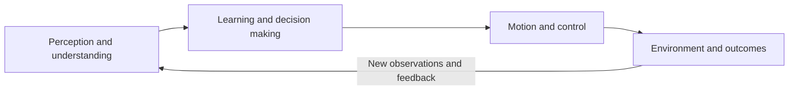

# Embodied AI learning map

[中文](LEARNING_MAP.md) · **English**

See the big picture, then find your first step. This guide connects concepts, knowledge modules, a beginner’s path, and project directions.

[Understand embodied AI](#understand-embodied-ai) · [Knowledge map](#knowledge-map) · [Start from scratch](#start-from-scratch) · [Choose a project direction](#choose-a-project-direction)

Open the [interactive learning map](https://datawhalechina.github.io/dive-into-embodied-ai/en/learning-map) to switch between robot tasks and explore the [3D robot soccer demo](https://datawhalechina.github.io/dive-into-embodied-ai/en/learning-map#what-is-embodied-ai), with camera rotation and playback-speed controls.

> The learning map and introduction are available in English. Other linked tutorial chapters and standalone playgrounds are currently in Chinese.

## Understand embodied AI

Embodied AI studies how agents use a body to interact with the environment and complete tasks through a **closed loop of perception, decision making, and action**. This project focuses on physical systems such as robots, connecting concepts, algorithms, and engineering practice.

Robots are an important platform for embodied AI. Robotics studies their design, construction, and control; embodied AI emphasizes the interaction of intelligence, body, and environment.

For a robot playing soccer, the goal is to score while keeping its body balanced:

| Stage | Key question | What happens in robot soccer |
| :--- | :--- | :--- |
| Perception | What is the state of the world and the robot? | Detect the ball, goal, and goalkeeper; estimate positions and body pose. |
| Decision | What should the robot do next? | Observe the defense, choose an opening, and plan the approach and kick. |
| Action | How can the robot act accurately and stably? | Adjust stance and center of mass, coordinate joints, and kick. |
| Feedback | What happened after the action? | Track the ball, check the result, and use new observations to adjust the next move. |

This is a functional view of the system. A real system may use several collaborating modules or a single model with multiple roles.

For a systematic overview of the concepts, history, tasks and platforms, system paradigms, and key challenges, read the [introduction to embodied AI](i18n/en/docusaurus-plugin-content-docs/current/introduction/intro.md).

## Knowledge map

The first three modules form the action loop. The other three support development, training, and validation of the whole system.

| Module | Core knowledge | Where to start |
| :--- | :--- | :--- |
| **Perception and understanding** | Vision and 3D geometry, state estimation, vision-language models (VLM) | [Sensors, frames, and calibration](docs/foundations/perception/1.sensor-calibration-sim2real.md), [VLM foundations](docs/foundations/vlm/0.intro.md) |
| **Learning and decision making** | Imitation learning, reinforcement learning, vision-language-action models (VLA), world models | [Imitation learning](docs/foundations/rl-for-robotics/12.imitation-learning.md), [reinforcement learning](docs/foundations/rl-for-robotics/1.intro.md), [VLA](docs/foundations/vla/vla-intro.md), [world models](docs/foundations/world-model/0.intro.md) |
| **Motion and control** | Kinematics and dynamics, motion planning, feedback control | [Coordinate transforms and FK/IK](docs/foundations/robotics-and-ros2/2.kinematics_transform.md), [PID to MPC](docs/foundations/controllers/intro.md), [MoveIt 2](docs/foundations/robotics-and-ros2/10.moveit2_basics.md) |
| **Simulation and evaluation** | Physics simulation, benchmarks, simulation to reality (Sim2Real) | [Simulation tools](docs/foundations/simulation/1.intro.md), [datasets and benchmarks](i18n/en/docusaurus-plugin-content-docs/current/introduction/resources/datasets.md) |
| **Data and training** | Teleoperation, demonstrations, data quality, policy training and validation | [LeRobot data and toolchains](docs/practices/robot-arm/data-collection/lerobot-course/index.md), [learning actions from demonstrations](docs/foundations/rl-for-robotics/12.imitation-learning.md) |
| **Hardware and systems** | Mechanical design, sensors and motors, ROS2, embedded systems | [Robotics system overview](docs/foundations/robotics-and-ros2/1.course_introduction.md), [connecting and debugging SO-101](docs/practices/robot-arm/data-collection/so101-lerobot-real/index.md) |

Where the algorithms fit: **imitation learning (IL)** learns actions from demonstrations; **reinforcement learning (RL)** improves policies using rewards; **VLA** connects vision and language to actions; **world models** predict action outcomes. Planning and control can solve tasks independently or combine with learning methods.

## Start from scratch

Try an experiment, learn the foundations, then complete a project. Each step produces something you can check.

| Step | Learning entry point | Completion goal |
| :--- | :--- | :--- |
| **1. Understand the system** | Read the [introduction to embodied AI](i18n/en/docusaurus-plugin-content-docs/current/introduction/1.what-is-embodied-ai.md). No hardware is required. | Explain observations, actions, goals, and feedback using soccer, cup picking, or walking. |
| **2. Try a principle yourself** | Open the [PD control experiment](https://datawhalechina.github.io/dive-into-embodied-ai/en/cs123/pd-playground) and adjust parameters in your browser. | Explain how response, overshoot, and stability change with the parameters. |
| **3. Run a minimal simulation** | Follow the [MuJoCo tutorial](docs/foundations/simulation/3.mujoco.md) to load a model, step the simulation, and apply control. | Save a simulation experiment you can run and modify yourself. |
| **4. Complete a project along one path** | Follow [Build a quadruped from scratch](docs/practices/quadruped/cs123/0.intro.md), from single-joint control to gaits and policy training. | Record conditions, results, and failure causes to complete a reproducible project. |

When you start coding, fill in **Python, Linux / Git, and linear algebra** as needed. Add **PyTorch, probability, and deep learning** when you begin training models. If you already know the basics, jump to the relevant stage.

## Choose a project direction

Robot form, task, and algorithm are different dimensions. One robot can combine several capabilities. Adjust the suggested sequences below to match your background.

| Direction and task | Suggested learning sequence | Project entry point |
| :--- | :--- | :--- |
| **Grasping and manipulation:** grasp, push, pull, assemble, or coordinate two arms | Kinematics → Demonstrations → Imitation learning → ACT → VLA | [ACT bimanual experiment](docs/practices/vla/act/index.md); basic Python / PyTorch knowledge is recommended. |
| **Legged locomotion:** balance, walk, turn, and stand up | Feedback control → Kinematics → Simulation → RL → Transfer validation | [Quadruped course](docs/practices/quadruped/cs123/0.intro.md), followed by standalone robot projects. |
| **Navigation and mobile manipulation:** reach a goal, avoid obstacles, then manipulate objects | Localization and mapping → Path planning → Navigation → Mobile manipulation | [Robotics and ROS2 path](docs/overview/robotics-and-ros2-roadmap.md); full navigation and mobile manipulation projects are still planned. |

Before going deeper, define what the robot observes, what actions it outputs, and what counts as success. See the [advanced learning paths](docs/overview/learning-path.md) for background and direction choices, and the [README course outline](README.en.md#course-outline) for all chapters.

## References

1. [NVIDIA: What is embodied AI?](https://www.nvidia.cn/glossary/embodied-ai/)
