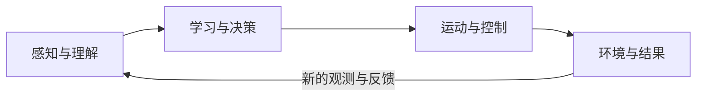

# 具身智能学习地图

**中文** · [English](LEARNING_MAP.en.md)

先看全局，再找到你的第一步。下面按「概念 → 知识模块 → 入门路线 → 实践方向」组织学习入口。

[认识具身智能](#认识具身智能) · [知识全景](#知识全景) · [从零开始](#从零开始) · [选择实践方向](#选择实践方向)

也可以打开 [交互版学习地图](https://datawhalechina.github.io/dive-into-embodied-ai/learning-map)，切换机器人任务，或观看可旋转、可调速的 [3D 机器人足球演示](https://datawhalechina.github.io/dive-into-embodied-ai/learning-map#what-is-embodied-ai)。

## 认识具身智能

具身智能（Embodied AI）关注智能体如何依托身体，通过 **感知、决策与行动闭环** 与环境交互并完成任务。本项目以机器人等物理系统为主线，连接概念、算法和工程实践。

机器人是具身智能的重要载体。机器人学研究机器人的设计、构建与控制；具身智能强调智能、身体与环境之间的协同。

以机器人踢足球为例，目标是把球踢进球门，同时保持身体平衡：

| 环节 | 要回答的问题 | 踢足球时发生了什么 |
| :--- | :--- | :--- |
| 感知 | 世界和自己，现在是什么状态？ | 识别足球、球门和守门员，估计位置与身体姿态。 |
| 决策 | 为了完成任务，下一步做什么？ | 观察防守位置，选择射门空当，安排靠近和踢球动作。 |
| 行动 | 怎样把动作准确、稳定地做出来？ | 调整站位与重心，协调关节，驱动腿部踢球。 |
| 反馈 | 行动之后发生了什么？ | 跟踪球的运动、检查射门结果，用新的观测调整下一步。 |

这是按功能理解系统的方式。实际系统可以由多个模块协作，也可以用一个模型承担多种功能。

## 知识全景

前三个模块串起行动闭环，后三个模块支撑整个系统的开发、训练与验证。

| 模块 | 核心知识 | 从哪里开始 |
| :--- | :--- | :--- |
| **感知与理解** | 视觉与三维几何、状态估计、视觉语言模型（VLM） | [传感器、坐标系与标定](docs/foundations/perception/1.sensor-calibration-sim2real.md)、[VLM 基础](docs/foundations/vlm/0.intro.md) |
| **学习与决策** | 模仿学习、强化学习、视觉语言动作模型（VLA）、世界模型 | [模仿学习](docs/foundations/rl-for-robotics/12.imitation-learning.md)、[强化学习](docs/foundations/rl-for-robotics/1.intro.md)、[VLA](docs/foundations/vla/vla-intro.md)、[世界模型](docs/foundations/world-model/0.intro.md) |
| **运动与控制** | 运动学与动力学、运动规划、反馈控制 | [坐标变换与正逆运动学](docs/foundations/robotics-and-ros2/2.kinematics_transform.md)、[PID 到 MPC](docs/foundations/controllers/intro.md)、[MoveIt 2](docs/foundations/robotics-and-ros2/10.moveit2_basics.md) |
| **仿真与评测** | 物理仿真、评测基准、仿真到真实（Sim2Real） | [仿真工具](docs/foundations/simulation/1.intro.md)、[数据集与评测基准](docs/information/datasets.md) |
| **数据与训练** | 遥操作、示教数据、数据质量、策略训练与验证 | [LeRobot 数据与工具链](docs/practices/robot-arm/data-collection/lerobot-course/index.md)、[从示范中学习动作](docs/foundations/rl-for-robotics/12.imitation-learning.md) |
| **本体与系统** | 机械结构、传感器与电机、ROS2、嵌入式 | [机器人系统全景](docs/foundations/robotics-and-ros2/1.course_introduction.md)、[SO-101 真机连接与调试](docs/practices/robot-arm/data-collection/so101-lerobot-real/index.md) |

算法在地图里的位置：**模仿学习（IL）** 从示范中学动作，**强化学习（RL）** 用奖励改进策略，**VLA** 把视觉与语言连接到动作，**世界模型** 预测动作的后果。规划与控制也可以独立解决任务，或与学习方法组合。

## 从零开始

先体验，再补基础，再完成一个项目。每一步都留下一份可以检查的学习成果。

| 步骤 | 学习入口 | 完成标志 |
| :--- | :--- | :--- |
| **1. 建立系统概念** | 阅读 [机器人系统全景](docs/foundations/robotics-and-ros2/1.course_introduction.md)，无需设备。 | 能用踢球、拿杯子或行走的例子，说明观测、动作、目标和反馈。 |
| **2. 亲手体验一个原理** | 打开 [PD 控制实验](https://datawhalechina.github.io/dive-into-embodied-ai/cs123/pd-playground)，在浏览器中调整参数。 | 能解释响应、超调和稳定性怎样随参数变化。 |
| **3. 跑通最小仿真** | 按 [MuJoCo 教程](docs/foundations/simulation/3.mujoco.md) 加载模型、推进仿真并施加控制。 | 保存一份自己能运行、能修改的仿真实验。 |
| **4. 沿一条主线完成项目** | 跟随 [从零到一搭建四足机器人](docs/practices/quadruped/cs123/0.intro.md)，从单关节控制走到步态与策略训练。 | 记录实验条件、结果与失败原因，完成一次可复现的项目实践。 |

准备写代码时，按需补 **Python、Linux / Git、线性代数**；进入模型训练后，再补 **PyTorch、概率与深度学习**。已有基础可以直接跳到对应阶段。

## 选择实践方向

机器人形态、任务和算法是不同维度，同一台机器人可以组合多种能力。下面是建议的学习顺序，可以按已有基础调整。

| 方向与任务 | 建议学习顺序 | 实践入口 |
| :--- | :--- | :--- |
| **抓取与操作**：抓取、推拉、装配或协调双臂 | 运动学 → 示教数据 → 模仿学习 → ACT → VLA | [ACT 双臂实验](docs/practices/vla/act/index.md)，建议先有 Python / PyTorch 基础。 |
| **足式运动**：保持平衡，行走、转向与起身 | 反馈控制 → 运动学 → 仿真 → 强化学习 → 迁移验证 | [四足机器人课程](docs/practices/quadruped/cs123/0.intro.md)，再进入独立机器人项目。 |
| **导航与移动操作**：到达目标、绕开障碍，再完成操作 | 定位与建图 → 路径规划 → 导航 → 移动与操作协同 | [机器人学与 ROS2 路线](docs/overview/robotics-and-ros2-roadmap.md)；完整导航与移动操作项目仍待补充。 |

继续深入前，先写清楚：机器人看到什么、输出什么动作、什么条件下算成功。更多背景与方向选择见 [进阶学习路径](docs/overview/learning-path.md)，完整章节见 [README 的内容大纲](README.md#内容大纲)。

## 参考

1. [NVIDIA：什么是具身智能？](https://www.nvidia.cn/glossary/embodied-ai/)
