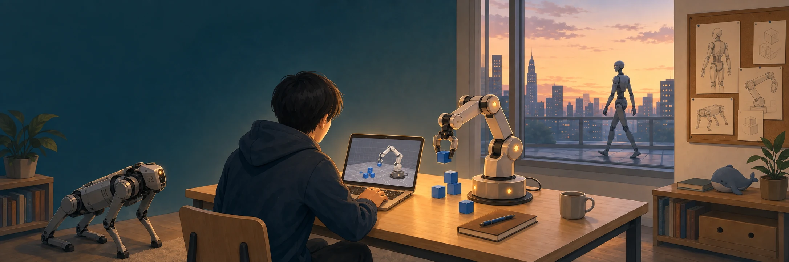
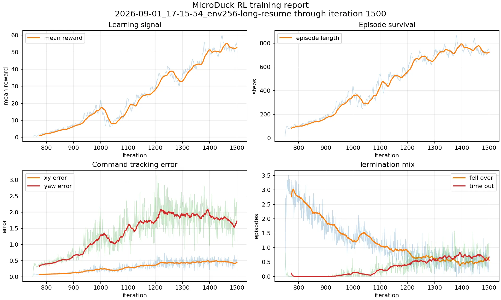
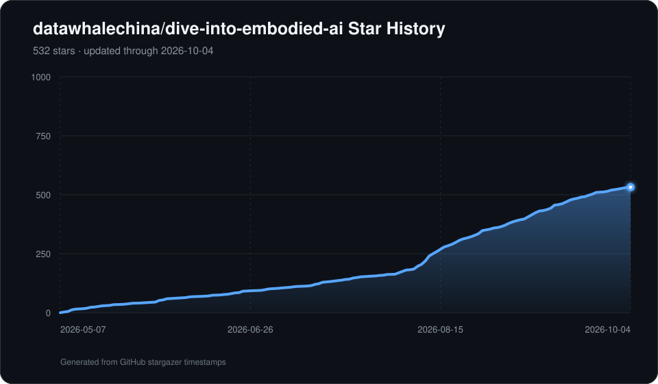

<div align="center"></div>

<h1 align="center">Dive into Embodied AI</h1>
<p align="center"><b>Un curso abierto para aprender IA corporizada con proyectos prácticos</b></p>
<p align="center"><a href="README.md" lang="zh-Hans">中文</a> · <a href="README.en.md" lang="en">English</a> · <b>Español</b> · <a href="README.it.md" lang="it">Italiano</a></p>

> [!TIP]
> **📖 [Abre el curso en español →](https://datawhalechina.github.io/dive-into-embodied-ai/es/)**
>
> Búsqueda de texto completo, navegación por capítulos y demos interactivas. **[Empieza por la introducción →](https://datawhalechina.github.io/dive-into-embodied-ai/es/docs/introduction/intro)**.
>
> Usa **Copiar como Markdown** al principio de los tutoriales y experimentos o abre su vista previa. Conserva código, tablas y ecuaciones LaTeX, junto con un enlace al original para las demos interactivas.
>
> README, inicio y navegación, introducción con demos y recursos, mapa de aprendizaje y resumen de proyectos están disponibles en inglés, español e italiano. Los demás capítulos y experimentos independientes siguen en chino, con avisos sobre la traducción. El menú permite cambiar entre 中文, English, Español e Italiano en la misma página.

<p align="center">
  <a href="http://creativecommons.org/licenses/by-nc-sa/4.0/"></a>
  
</p>

### 🤝 Con el apoyo de

<p align="center">
  <a href="docs/practices/amd/intro.md">
    <picture>
      <source media="(prefers-color-scheme: dark)" srcset="assets/logo/logo_amd_wht.svg" />
      <source media="(prefers-color-scheme: light)" srcset="assets/logo/logo_amd.svg" />
      
    </picture>
  </a>
</p>

> [!CAUTION]
> **Versión alfa:** la migración y reorganización continúan y algunos capítulos están pendientes. Comparte problemas o sugerencias mediante una incidencia.

## 🎯 Sobre el proyecto

Construye un robot de IA corporizada desde cero. Explora aprendizaje por refuerzo, modelos del mundo y modelos de visión, lenguaje y acción (VLA), junto con simulación, controladores, planificación y percepción. Conecta decisión, control y percepción en proyectos reales.

🧭 **[Introducción](i18n/es/docusaurus-plugin-content-docs/current/introduction/intro.md)**: conceptos, tareas, plataformas y métodos.

<a id="course-outline"></a>

## 🗂️ Contenido del curso

Tres secciones: **Introducción**, **Fundamentos** y **Proyectos**. La introducción ofrece una visión general y recursos; los fundamentos explican principios; los proyectos incluyen recorridos por capítulos, demos y reproducciones. Se agrupan en AMD, simulación y robots reales.

<a id="introduction"></a>

### 🧭 Introducción

Empieza por la [introducción](i18n/es/docusaurus-plugin-content-docs/current/introduction/intro.md) y continúa con fundamentos y proyectos para técnicas específicas.

| Capítulo | Contenido |
| --- | --- |
| [1. Qué es la IA corporizada](i18n/es/docusaurus-plugin-content-docs/current/introduction/1.what-is-embodied-ai.md) | Definición, ciclo de percepción, decisión y acción, e importancia del cuerpo |
| [2. Breve historia](i18n/es/docusaurus-plugin-content-docs/current/introduction/2.history.md) | Reglas, control basado en modelos, refuerzo profundo y modelos fundacionales |
| [3. Habilidades robóticas](i18n/es/docusaurus-plugin-content-docs/current/introduction/3.tasks-and-skills.md) | Definir tareas; agarre, manipulación, locomoción y navegación |
| [4. Plataformas](i18n/es/docusaurus-plugin-content-docs/current/introduction/4.embodiments.md) | Humanoides, brazos, ruedas, patas, manipulación móvil y simulación |
| [5. Retos principales](i18n/es/docusaurus-plugin-content-docs/current/introduction/5.challenges.md) | Datos, sim-to-real, generalización, tiempo real, seguridad y evaluación |
| [6. Tecnologías y módulos](i18n/es/docusaurus-plugin-content-docs/current/introduction/6.tech-stack.md) | VLM, VLA, modelos del mundo, manipulación, control, navegación e ingeniería |
| [7. Perfiles profesionales](i18n/es/docusaurus-plugin-content-docs/current/introduction/7.careers.md) | Responsabilidades y preparación de entrevistas en algoritmos, control, percepción, plataformas y hardware |

Los [recursos](i18n/es/docusaurus-plugin-content-docs/current/introduction/resources/index.md) reúnen:

- [Artículos e investigación](i18n/es/docusaurus-plugin-content-docs/current/introduction/resources/papers.md): fuentes originales y explicaciones.
- [Conjuntos de datos](i18n/es/docusaurus-plugin-content-docs/current/introduction/resources/datasets.md): demostraciones y benchmarks.
- [Proyectos abiertos](i18n/es/docusaurus-plugin-content-docs/current/introduction/resources/open-source.md): modelos y marcos de entrenamiento.
- [Simulación y herramientas](i18n/es/docusaurus-plugin-content-docs/current/introduction/resources/tools.md): motores, entornos y documentación.

### 🛠️ Proyectos

El [resumen de proyectos](i18n/es/docusaurus-plugin-content-docs/current/practices/intro.md) ayuda a elegir entre un recorrido completo y un experimento independiente.

| Categoría | Proyecto | Descripción |
| --- | --- | --- |
| AMD | [AUP Learning Cloud](docs/practices/amd/aup-learning-cloud.md) | APU Ryzen AI, ROCm, JupyterHub y Code Server |
| AMD | [MicroDuck RL · AMD ROCm](docs/practices/amd/microduck-rl/index.md) | R9700, ROCm MuJoCo Warp, pruebas de contactos dinámicos y PPO bípedo |
| AMD | [Explora Pupper](docs/practices/amd/pupper-control/intro.md) | Políticas de locomoción RL y experimentos VLA |
| Simulación | [Cuadrúpedo desde cero](docs/practices/quadruped/cs123/0.intro.md) | MuJoCo, PD, cinemática, políticas, control lingüístico y percepción |
| Simulación | [MicroDuck RL](docs/practices/humanoid/microduck-rl/index.md) | mjlab + MuJoCo Warp, PPO paralelo y marcha bípeda en GPU |
| Simulación | [MuJoCo y DDPG](docs/practices/robot-arm/mujoco-arm-pick-place/index.md) | Entornos y experimentos de control continuo |
| Simulación | [ACT bimanual](docs/practices/vla/act/index.md) | ACT + ALOHA: entrenamiento, evaluación y reproducción |
| Robots reales | [LeRobot en chino](docs/practices/robot-arm/data-collection/lerobot-course/index.md) | Unidades 0–2: aprendizaje, datos, herramientas y robótica clásica |
| Robots reales | [SO-101 + LeRobot](docs/practices/robot-arm/data-collection/so101-lerobot-real/index.md) | Conectividad, pruebas de seguridad y reproducción de acciones |

### 🦆 Demo reciente: MicroDuck RL

<p align="center">
  <a href="docs/practices/humanoid/microduck-rl/index.md">
    
  </a>
  <br/>
  <sub><b><a href="docs/practices/humanoid/microduck-rl/index.md">MicroDuck RL · Locomoción bípeda estable</a></b><br/>mjlab + MuJoCo Warp · Entrenamiento PPO paralelo en GPU (iteración 1500)</sub>
</p>

<table align="center">
  <tr>
    <td align="center" width="33%">
      <a href="https://datawhalechina.github.io/dive-into-embodied-ai/es/docs/practices/quadruped/cs123/intro">
        
      </a>
      <br/><sub><b><a href="https://datawhalechina.github.io/dive-into-embodied-ai/es/docs/practices/quadruped/cs123/intro">Construye un cuadrúpedo desde cero</a></b><br/>Curso de simulación CS123 · MuJoCo + PPO + control LLM</sub>
    </td>
    <td align="center" width="33%">
      
      <br/><sub><b>ReBot-Act · Resultados del entrenamiento ACT</b><br/>Imitación visual en hardware · Recoger y colocar bloques</sub>
    </td>
    <td align="center" width="33%">
      <a href="docs/practices/vla/act/index.md">
        
      </a>
      <br/><sub><b><a href="docs/practices/vla/act/index.md">ACT · Transferencia bimanual ALOHA</a></b><br/>Entrenamiento 50k · 50 % de éxito en 20 episodios MuJoCo</sub>
    </td>
  </tr>
</table>

### 📐 Fundamentos

Las cuatro áreas coinciden con la navegación del sitio.

#### Toma de decisiones

| Tema | Descripción |
| --- | --- |
| [Refuerzo para decisiones](docs/foundations/rl-for-robotics/1.intro.md) | MDP, DQN, PPO, SAC, DDPG/TD3 e imitación |
| [VLA](docs/foundations/vla/vla-intro.md) | RT-1/RT-2, OpenVLA, ACT, Diffusion Policy y familia π |
| [Modelos del mundo](docs/foundations/world-model/0.intro.md) | Aplicaciones a tareas corporizadas |

#### Control del movimiento

| Tema | Descripción |
| --- | --- |
| [Refuerzo para control](docs/foundations/rl-for-robotics/10.ppo.md) | Políticas, control continuo y robótica |
| [Controladores](docs/foundations/controllers/intro.md) | PID, LQR, MPC, impedancia e integración |
| [Planificación](docs/foundations/robotics-and-ros2/10.moveit2_basics.md) | Movimiento y planificación en lazo cerrado con MoveIt 2 |

#### Percepción

El robot estima posición, orientación, velocidad y estabilidad con cámaras, LiDAR, tacto, corrientes de motor, IMU, contactos de pies, postura y posición del efector.

| Tema | Descripción |
| --- | --- |
| [Percepción visual y VLM](docs/foundations/vlm/0.intro.md) | Transformers, ViT, codificadores visuales y fusión multimodal |
| [Calibración y sim2real](docs/foundations/perception/1.sensor-calibration-sim2real.md) | Referencias, sincronización, amplificación de errores extrínsecos y supervisión de calibración |

#### Bases de ingeniería

| Tema | Descripción |
| --- | --- |
| [Simulación](docs/foundations/simulation/1.intro.md) | Isaac Sim, MuJoCo, Gymnasium y PyBullet |
| [ROS2](docs/foundations/robotics-and-ros2/0.intro.md) | Transformaciones, FK/IK, tf2, URDF y MoveIt 2 |
| [Datos e imitación](docs/foundations/rl-for-robotics/12.imitation-learning.md) | Teleoperación, imitación, herramientas LeRobot y políticas |

## 👥 Grupos de estudio

Datawhale organiza grupos alrededor del curso. Los planes se recopilarán en `docs/team-learning/` (en preparación), con rutas, requisitos de seguimiento e introducciones.

- Inscripción al próximo grupo: en preparación.
- Material de grupos anteriores: en preparación.

## 💻 Vista previa local

El desarrollo local y CI usan **Node.js 26.11.1**, fijado en `.nvmrc`, con su npm incluido; los requisitos están en `package.json`. Con [nvm](https://github.com/nvm-sh/nvm#installing-and-updating), ejecuta `nvm install` y `nvm use` en el repositorio; otros métodos deben instalar la misma versión. `.npmrc` comprueba las versiones al instalar y desactiva Web Storage experimental de Node en los scripts npm para evitar avisos de `localStorage` durante la compilación estática. El almacenamiento del navegador no cambia.

Los vídeos y GIF usan **Git LFS**. Instala `git-lfs` y ejecuta `git lfs pull` tras clonar; de lo contrario solo tendrás punteros de texto. Consulta [CONTRIBUTING.md](CONTRIBUTING.md#首次克隆必读), en chino.

```bash
# Instala Git LFS una vez: brew install git-lfs (macOS)
# Ubuntu/Debian: sudo apt install git-lfs; Windows: choco install git-lfs
git lfs install
git lfs pull
# Selecciona la versión de .nvmrc (requiere nvm)
nvm install
nvm use
npm ci
# Sitio chino por defecto
npm run dev
# Un idioma por servidor de desarrollo
npm run start -- --locale es
npm run start -- --locale en
npm run start -- --locale it
# Construye los cuatro idiomas y comprueba el cambio entre ellos
npm run build
npm run check:i18n
npm run serve
```

El chino está en `/dive-into-embodied-ai/`; los demás usan `/en/`, `/es/` e `/it/`. Las traducciones de interfaz están en `i18n/<locale>/code.json`, y navegación y pie en `i18n/<locale>/docusaurus-theme-classic/`, con `<locale>` igual a `en`, `es` o `it`.

Añade capítulos traducidos a `i18n/<locale>/docusaurus-plugin-content-docs/current/`, conservando estructura, ID, slug y anclas explícitas. Sin traducción, Docusaurus muestra el original chino con aviso localizado y enlace al original. `npm run check:i18n` comprueba textos, variables, rutas y anclas compartidas.

## ⭐ Historial de estrellas

<p align="center"><a href="assets/star-history.svg"></a><br /><sub>Actualizado automáticamente por GitHub Actions</sub></p>

## 🤝 Colaboradores

| Nombre | Función | Trayectoria |
| --- | --- | --- |
| Jiang Ji (江季) | Responsable del proyecto | Autor de [Easy RL](https://github.com/datawhalechina/easy-rl), investigador de aprendizaje por refuerzo |
| Kang Bo (康博) | Responsable del proyecto | Cofundador de nobl.ai y profesor visitante en la Universidad de Gante, Bélgica |
| Huang Xiao (黄潇) | Responsable del proyecto | Graduado de Tongji, ingeniero de algoritmos de conducción inteligente |
| Luo Ruyi (罗如意) | Responsable del proyecto | Premio nacional en competición de vehículos inteligentes y responsable de FunRec |

## 📣 Síguenos

<div align="center"><p>Escanea el código QR para seguir a Datawhale en WeChat.</p></div>

## 📄 Licencia

Esta obra se distribuye bajo [Creative Commons Atribución-NoComercial-CompartirIgual 4.0 Internacional](http://creativecommons.org/licenses/by-nc-sa/4.0/).
