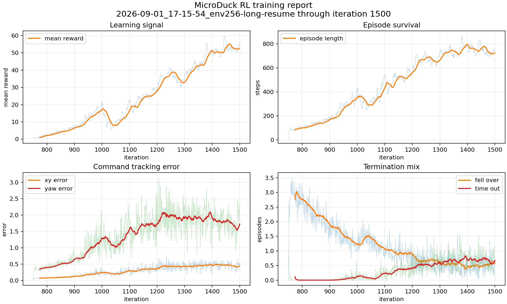

<div align="center">
    
</div>

<h1 align="center">Dive into Embodied AI</h1>
<p align="center"><b>具身智能入门与实践开源教程</b></p>

<p align="center"><b>中文</b> · <a href="README.en.md" lang="en">English</a></p>

> [!TIP]
> **📖 在线阅读：[点击进入完整教程 →](https://datawhalechina.github.io/dive-into-embodied-ai/)**
>
> 推荐使用网页版，支持全文搜索、章节导航和交互演示。初次学习可从 **[新手入门：具身导论 →](https://datawhalechina.github.io/dive-into-embodied-ai/docs/introduction/intro)** 开始。
>
> 教程和交互页上方的「复制为 Markdown」可复制正文，下拉菜单可预览 Markdown。支持代码、表格和 LaTeX 公式，文末附有原网页链接，方便继续查看交互演示。

<p align="center">
  <a href="http://creativecommons.org/licenses/by-nc-sa/4.0/"></a>
  
</p>

<h3 align="center">🤝 合作支持</h3>

<p align="center">
  <a href="docs/practices/amd/intro.md">
    <picture>
      <source media="(prefers-color-scheme: dark)" srcset="assets/logo/logo_amd_wht.svg" />
      <source media="(prefers-color-scheme: light)" srcset="assets/logo/logo_amd.svg" />
      
    </picture>
  </a>
</p>

> [!CAUTION]
> **Alpha 内测版本**:仍在迁移和重构中,部分章节是占位页,欢迎提 Issue 反馈问题或建议。

<a id="项目定位"></a>

## 🎯 项目定位

从零到一搭建一台具身智能机器人：深入强化学习、World-Model、VLA 等智能决策方法的工程落地，贯穿仿真环境、控制器、运动规划、感知系统等技能树模块,并在真实项目中跑通"决策—控制—感知"完整链路。

🧭 **新手入门：[具身导论](docs/introduction/intro.md)** — 了解具身智能的概念、任务、载体与方法。

<a id="内容大纲"></a>

## 🗂️ 内容大纲

网站分为「具身导论、理论基础、项目实战」三个栏目：具身导论介绍领域全貌，并整理论文、数据集、开源项目和工具；理论基础讲解原理；项目实战包含分章项目、独立 Demo 与复现案例，按「AMD 专区、仿真实战、真机实战」归类。

<a id="具身导论"></a>

### 🧭 具身导论

从 [具身导论](docs/introduction/intro.md) 建立对具身智能的全局认识，再进入理论基础与项目实战学习具体技术：

| 章节 | 内容 |
| :--- | :--- |
| [1. 什么是具身智能](docs/introduction/1.what-is-embodied-ai.md) | 定义、感知—决策—行动闭环，以及身体为什么重要 |
| [2. 发展脉络](docs/introduction/2.history.md) | 规则编程、模型控制、深度强化学习和大模型四个时期 |
| [3. 机器人的技能](docs/introduction/3.tasks-and-skills.md) | 定义任务，认识抓取、操作、运动与导航 |
| [4. 具身智能的载体](docs/introduction/4.embodiments.md) | 人形、机械臂、轮式、四足、移动操作与仿真载体 |
| [5. 核心挑战](docs/introduction/5.challenges.md) | 数据、仿真到真实、泛化、实时性、安全与评测 |
| [6. 技术栈](docs/introduction/6.tech-stack.md) | VLM、VLA、世界模型与操作、运控、导航等模块的介绍和学习入口 |
| [7. 就业岗位](docs/introduction/7.careers.md) | 大脑类算法、小脑类算法、感知导航、工程平台与硬件岗位的职责和面试准备 |

导论中的 [领域资源](docs/introduction/resources/index.md) 整理公开的学习与研究资源：

- [论文与研究](docs/introduction/resources/papers.md)：原论文、项目主页与站内解读。
- [具身数据集](docs/introduction/resources/datasets.md)：机器人示教数据与评测基准。
- [开源项目](docs/introduction/resources/open-source.md)：模型代码与训练框架。
- [仿真与工具](docs/introduction/resources/tools.md)：仿真引擎、学习环境与官方文档。

<a id="项目实战"></a>

### 🛠️ 项目实战

从 [项目实战总览](docs/practices/intro.md) 选择分章项目或独立实验，按步骤完成实现与评测。

| 分类 | 章节 | 简介 |
| :--- | :--- | :--- |
| AMD 专区 | [AUP Learning Cloud 云算力](docs/practices/amd/aup-learning-cloud.md) | Ryzen AI APU、ROCm、JupyterHub 与 Code Server |
| AMD 专区 | [MicroDuck RL｜AMD ROCm](docs/practices/amd/microduck-rl/index.md) | R9700、ROCm MuJoCo Warp、动态接触回归与双足 PPO |
| AMD 专区 | [玩转 Pupper 四足机器人](docs/practices/amd/pupper-control/intro.md) | AMD 平台上的强化学习运动策略与 VLA 实验 |
| 仿真实战 | [从零到一搭建四足机器人](docs/practices/quadruped/cs123/0.intro.md) | MuJoCo、PD、运动学、策略训练、语言控制与感知 |
| 仿真实战 | [MicroDuck RL 小黄鸭双足机器人](docs/practices/humanoid/microduck-rl/index.md) | mjlab + MuJoCo Warp：GPU 并行 PPO 与双足步态训练 |
| 仿真实战 | [MuJoCo 机械臂与 DDPG](docs/practices/robot-arm/mujoco-arm-pick-place/index.md) | MuJoCo 环境与连续控制实验 |
| 仿真实战 | [ACT 双臂操作训练](docs/practices/vla/act/index.md) | ACT + ALOHA：训练、评估与结果复现 |
| 真机实战 | [LeRobot 中文课程讲义](docs/practices/robot-arm/data-collection/lerobot-course/index.md) | Unit 0–2：机器人学习、数据集、工具链与经典机器人学，为真机实践做准备 |
| 真机实战 | [SO-101 + LeRobot 真机教程](docs/practices/robot-arm/data-collection/so101-lerobot-real/index.md) | 硬件连通、安全测试与动作回放 |

<a id="最新-demomicroduck-rl-小黄鸭"></a>

### 🦆 最新 Demo：MicroDuck RL 小黄鸭

<p align="center">
  <a href="docs/practices/humanoid/microduck-rl/index.md">
    
  </a>
  <br/>
  <sub><b><a href="docs/practices/humanoid/microduck-rl/index.md">MicroDuck RL · 小黄鸭双足稳定步态</a></b><br/>mjlab + MuJoCo Warp · PPO GPU 并行训练（iteration 1500）</sub>
</p>

<table align="center">
  <tr>
    <td align="center" width="33%">
      <a href="https://datawhalechina.github.io/dive-into-embodied-ai/docs/practices/quadruped/cs123/intro">
        
      </a>
      <br/><sub><b><a href="https://datawhalechina.github.io/dive-into-embodied-ai/docs/practices/quadruped/cs123/intro">从 0 到 1 搭建四足机器人</a></b><br/>CS123 仿真版 · MuJoCo + PPO + LLM 控制</sub>
    </td>
    <td align="center" width="33%">
      
      <br/><sub><b>ReBot-Act · ACT 训练效果</b><br/>真机视觉模仿学习 · 方块抓取与放置</sub>
    </td>
    <td align="center" width="33%">
      <a href="docs/practices/vla/act/index.md">
        
      </a>
      <br/><sub><b><a href="docs/practices/vla/act/index.md">ACT · ALOHA 双臂交接</a></b><br/>50k 训练 · MuJoCo 20 回合成功率 50%</sub>
    </td>
  </tr>
</table>

<a id="理论基础"></a>

### 📐 理论基础

理论基础按当前导航的四列组织：大脑、小脑、感知系统、工程底座。

#### 大脑：智能决策

| 章节 | 简介 |
| :--- | :--- |
| [强化学习决策](docs/foundations/rl-for-robotics/1.intro.md) | MDP、DQN、PPO、SAC、DDPG/TD3 与模仿学习 |
| [视觉-语言-动作大模型(VLA)](docs/foundations/vla/vla-intro.md) | RT-1/RT-2、OpenVLA、ACT、Diffusion Policy、π 系列 |
| [World-Model](docs/foundations/world-model/0.intro.md) | 世界模型在具身场景下的落地路径 |

#### 小脑：运动控制

| 章节 | 简介 |
| :--- | :--- |
| [强化学习控制](docs/foundations/rl-for-robotics/10.ppo.md) | 把策略学习接到连续控制和机器人任务上 |
| [控制器](docs/foundations/controllers/intro.md) | PID、LQR、MPC、阻抗控制与系统集成教程 |
| [运动规划](docs/foundations/robotics-and-ros2/10.moveit2_basics.md) | Motion Planning 与 MoveIt 2 规划闭环 |

#### 感官：感知系统

本体感知：机器人必须知道自己在哪里、姿态如何、速度如何、是否失稳。

外部感知：相机、雷达、触觉、电机电流、IMU、足端接触、机身姿态、末端位置。

| 章节 | 简介 |
| :--- | :--- |
| [视觉感知与 VLM](docs/foundations/vlm/0.intro.md) | Transformer、ViT、视觉编码器与多模态融合 |
| [传感器标定与 sim2real](docs/foundations/perception/1.sensor-calibration-sim2real.md) | 坐标系、时间同步、外参误差放大和在线标定监控 |

#### 工程底座

| 章节 | 简介 |
| :--- | :--- |
| [仿真工具](docs/foundations/simulation/1.intro.md) | Isaac Sim、MuJoCo、Gymnasium、PyBullet 快速上手 |
| [ROS2](docs/foundations/robotics-and-ros2/0.intro.md) | 坐标变换、FK/IK、tf2、URDF 与 MoveIt 2 |
| [数据工程与模仿学习](docs/foundations/rl-for-robotics/12.imitation-learning.md) | 从遥操作数据到模仿学习、LeRobot 工具链和策略训练 |

<a id="组队学习"></a>

## 👥 组队学习

Datawhale 会围绕本教程组织组队学习。历史与在筹备中的组队学习计划文档会集中放在 `docs/team-learning/`(施工中),包括每期的学习路线、打卡要求和对应章节的导读。

- 最新一期报名入口:施工中
- 往期学习资料归档:施工中

<a id="本地预览"></a>

## 💻 本地预览

仓库使用 **Git LFS** 存放视频和 GIF。clone 之后必须先装 `git-lfs` 再 `git lfs pull`,否则本地看到的图/视频是 pointer 文本而不是真内容。完整步骤见 [CONTRIBUTING.md](CONTRIBUTING.md#首次克隆必读)。

```bash
# 1. 装 git-lfs(每台机器只需一次)
# brew install git-lfs        # macOS
# sudo apt install git-lfs    # Ubuntu / Debian
# choco install git-lfs       # Windows

# 2. 初始化并拉取 LFS 文件
git lfs install
git lfs pull

# 3. 装依赖、起本地预览
npm install
npm run dev
```

网站默认中文，可通过导航栏的语言菜单切换为 English。英文版目前覆盖 README、首页导航与[具身导论](https://datawhalechina.github.io/dive-into-embodied-ai/en/docs/introduction/intro)，其他教程正文与独立实验页暂时显示中文，并标注翻译状态。

```bash
# 单独启动英文开发环境（开发服务器一次只运行一种语言）
npm run start -- --locale en

# 构建并预览两种语言，检查跨语言切换
npm run build
npm run serve
```

界面译文保存在 `i18n/en/code.json`，导航和页脚译文位于 `i18n/en/docusaurus-theme-classic/`。后续章节的英文 Markdown 可按原目录结构放入 `i18n/en/docusaurus-plugin-content-docs/current/`，保留原文的文档 ID 和 slug。缺少英文稿时，Docusaurus 会显示中文原文。

<a id="star-history"></a>

## ⭐ Star 曲线

<p align="center">
  <a href="assets/star-history.svg">
    
  </a>
  <br />
  <sub>由 GitHub Actions 自动更新</sub>
</p>

<a id="贡献者名单"></a>

## 🤝 贡献者名单

| 姓名 | 职责 | 简介 |
| :--- | :--- | :--- |
| 江季  | 项目负责人 | [蘑菇书](https://github.com/datawhalechina/easy-rl)作者，强化学习算法研究员 |
| 康博 | 项目负责人 | nobl.ai 联合创始人 & 比利时根特大学访问教授|
| 黄潇 | 项目负责人 | 同济大学毕业，智驾算法工程师 |
| 罗如意 | 项目负责人 | 智能汽车竞赛国奖&FunRec开源项目负责人 |

<a id="关注我们"></a>

## 📣 关注我们

<div align=center>
<p>扫描下方二维码关注公众号:Datawhale</p>

</div>

<a id="license"></a>

## 📄 LICENSE

<a rel="license" href="http://creativecommons.org/licenses/by-nc-sa/4.0/"></a><br />本作品采用<a rel="license" href="http://creativecommons.org/licenses/by-nc-sa/4.0/">知识共享署名-非商业性使用-相同方式共享 4.0 国际许可协议</a>进行许可。
