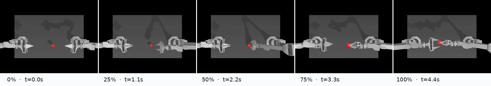

# AMD ROCm ACT 完整训练与评测报告

## 结论

在 AMD Radeon AI PRO R9700 上，ACT 使用 BF16、batch 32 训练 10,001 optimizer
steps 后，在 ALOHA `Transfer Cube` 的 20 回合固定种子闭环评测中成功 10 次，成功率
**50%**，达到本示例教程的停止条件。完整训练约 0.84 小时，评测约 3.08 分钟。

[下载 H.264 MP4](reports/act_aloha_transfer_demo.mp4)

## 实验配置

| 类别 | 配置 |
| --- | --- |
| GPU | AMD Radeon AI PRO R9700，32 GiB |
| PyTorch | 2.10.0+rocm7.0 |
| HIP runtime | 7.0.51831 |
| LeRobot | 0.6.1 |
| 数据集 | `lerobot/aloha_sim_transfer_cube_human@v3.0` |
| 数据规模 | 50 episodes，20,000 frames，50 FPS |
| 策略 | ACT，ResNet-18，CVAE 开启 |
| 动作 chunk | 100 |
| batch size | 32 |
| 精度 | BF16 autocast |
| 学习率 | 2e-5（主网络和视觉 backbone） |
| KL 权重 | 10.0 |
| weight decay | 1e-4 |
| gradient clipping | L2 norm 10.0 |
| 随机种子 | 训练 42；评测 1000 |

## 训练结果

| 指标 | 数值 |
| --- | ---: |
| optimizer steps | 10,001 |
| 记录的指标点 | 1,002 |
| 初始 loss | 99.2145 |
| 最终 loss | 0.1214 |
| 最低 loss | 0.0860 |
| 最终 L1 loss | 0.0792 |
| 最终 KL loss | 0.00421 |
| 累计训练时间 | 3,028.2 秒（0.841 小时） |
| 后 20% 日志点吞吐中位数 | 3.349 step/s |
| 估算样本吞吐 | 107.2 sample/s |
| PyTorch 峰值显存 | 6.101 GiB |

前几百步的 KL 项快速下降；约 4k 步后目标函数进入缓慢下降区间。梯度范数也从初始
1,197 降到裁剪阈值以下，后半程没有出现发散。吞吐图开头包含 MIOpen 首次编译和数据
worker 预热，稳定后约为 3.35 step/s。

## 评测结果

评测任务为 `AlohaTransferCube-v0`，episode 最长 400 步。20 回合使用从 1000 开始的
固定种子，batch size 为 4；环境到达最高奖励 4 时计为成功并允许提前结束。

| 指标 | 数值 |
| --- | ---: |
| 成功回合 | 10 / 20 |
| 成功率 | **50.0%** |
| 平均累计奖励 | 138.75 |
| 平均最高奖励 | 2.70 / 4 |
| 总评测时间 | 185.0 秒 |
| 摊销每回合时间 | 9.25 秒 |

逐回合结果：

| Episode | 0 | 1 | 2 | 3 | 4 | 5 | 6 | 7 | 8 | 9 |
| --- | ---: | ---: | ---: | ---: | ---: | ---: | ---: | ---: | ---: | ---: |
| 最高奖励 | 2 | **4** | 1 | 2 | **4** | 2 | 1 | **4** | **4** | **4** |
| 成功 | 否 | 是 | 否 | 否 | 是 | 否 | 否 | 是 | 是 | 是 |

| Episode | 10 | 11 | 12 | 13 | 14 | 15 | 16 | 17 | 18 | 19 |
| --- | ---: | ---: | ---: | ---: | ---: | ---: | ---: | ---: | ---: | ---: |
| 最高奖励 | **4** | 2 | **4** | 1 | **4** | 1 | 2 | **4** | **4** | 0 |
| 成功 | 是 | 否 | 是 | 否 | 是 | 否 | 否 | 是 | 是 | 否 |

原始机器可读数据位于 [reports/eval_info.json](reports/eval_info.json)，摘要位于
[reports/evaluation_summary.json](reports/evaluation_summary.json)。

## 演示样例选择

LeRobot 默认录制前 10 个评测回合，其中 episode 1、4、7、8、9 成功。素材生成脚本
自动比较成功视频的实际帧数，选择完成最快的 episode 1：222 帧、50 FPS、4.44 秒，
最高奖励 4。这样避免根据画面手工挑选“看起来最好”的回合。

## 可复现文件

- [train_act.py](train_act.py)：AMD ROCm 训练、CSV 日志和断点续训；
- [plot_training.py](plot_training.py)：从 CSV 生成训练曲线；
- [make_eval_artifacts.py](make_eval_artifacts.py)：从评测 JSON/MP4 生成教程素材；
- [pyproject.toml](pyproject.toml) 与 [uv.lock](uv.lock)：锁定 Python/ROCm 依赖；
- `outputs/act_aloha_transfer_rocm_full/`：本地模型和训练状态（被 Git 忽略）；
- `outputs/eval_act_aloha_transfer_rocm_10k/`：本地完整评测输出（被 Git 忽略）；
- `reports/`：可提交到教程的轻量图像、视频和 JSON 结果。

这份报告记录的是一次真实训练，不把训练 loss 当作任务成功率。验收以独立 MuJoCo
闭环评测为准；若目标提高到 70% 或 80%，可从 `training_state.pt` 继续训练，并保持同一
组评测种子比较 checkpoint。
