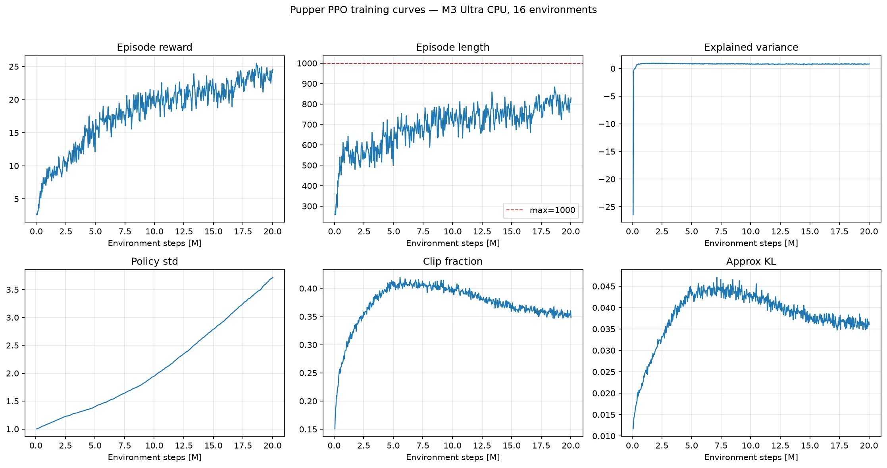
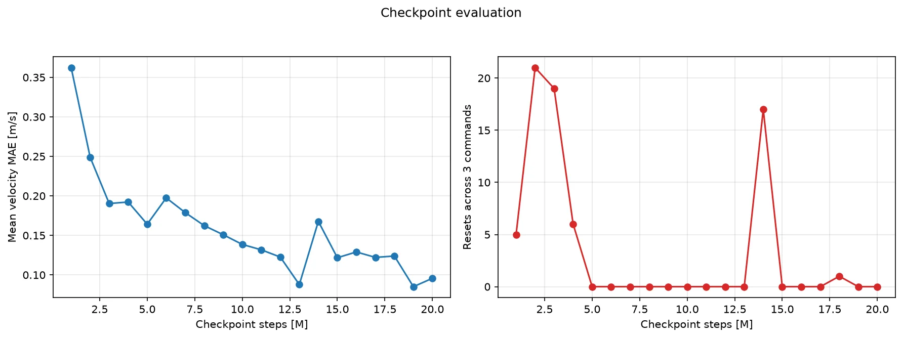
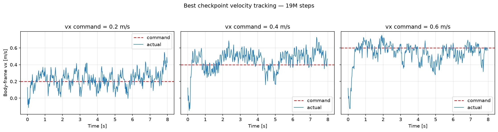

# Pupper PPO 本机训练报告

## 任务目标

训练一个**速度指令条件化的四足低层控制策略**。使用者向策略指定机身坐标系下的目标速度：

| 指令 | 含义 | 示例 |
| --- | --- | --- |
| `vx` | 前后速度，正值前进、负值后退 | `vx=0.5` 表示以 0.5 m/s 前进 |
| `vy` | 左右横移速度 | `vy=0.2` 表示横向移动 |
| `wz` | 绕竖直轴的转向角速度 | `wz=0.5` 表示以 0.5 rad/s 左转 |

PPO 策略的输入是 `vx、vy、wz` 指令以及 IMU、关节状态和上一时刻动作，共 45 维；输出是 12 个关节位置残差，再由 PD 控制器执行。它不要求复现预先定义的 `walk` 或 `trot` 轨迹，四条腿的协调方式由奖励函数自行学习。

训练时每个回合随机采样一组 `vx ∈ [-0.75, 0.75]`、`vy ∈ [-0.5, 0.5]`、`wz ∈ [-2, 2]`，目标是在不摔倒、不过度用力且动作平滑的前提下，使实际速度跟踪指定速度。成功判据依次是：

1. `ep_len_mean` 接近 1000，说明可以稳定完成 20 秒回合。
2. 实际 `vx、vy、wz` 接近目标指令，而不是只会以固定速度移动。
3. 前进、后退、转向和站立命令都能执行，命令切换时不摔倒。

当前精简环境在单个训练回合内不会切换命令，因此第 3 项中的动态切换属于额外泛化测试。

## 结论

在 Apple M3 Ultra 上使用 16 个 CPU MuJoCo 环境完成 20,021,248 步 PPO 训练，耗时约 49.0 分钟。策略从频繁摔倒发展为可稳定前进，并开始区分速度命令；但低速命令仍明显超调，尚未达到准确速度跟踪。

按三档速度平均 MAE 加摔倒惩罚选择的最佳 checkpoint 是 **[19M 步](raw/checkpoints/pupper_ppo_19000000_steps.zip)**，平均 MAE 为 0.085 m/s，评估重置次数为 0。

## 训练机器

- 芯片：Apple M3 Ultra
- CPU 逻辑核心：28
- 统一内存：96 GiB
- 架构：arm64
- PyTorch：2.13.0
- Stable Baselines3：2.9.0
- MuJoCo：3.7.0
- 训练设备：CPU，16 个 `SubprocVecEnv`

## 训练参数

- 总步数：20,000,000
- PPO rollout：`n_steps=2048`，`batch_size=256`，`n_epochs=4`
- 学习率：0.0003
- 折扣：`gamma=0.97`，`gae_lambda=0.95`
- 裁剪：`clip_range=0.2`
- 熵系数：`ent_coef=0.01`
- 网络：[256, 256]
- 单回合最大步数：1000

完整配置见 [`raw/run_config.yaml`](raw/run_config.yaml)。

## 训练曲线

- `ep_rew_mean`：2.61 → 24.58，峰值 25.49
- `ep_len_mean`：258 → 830，峰值 884，未稳定饱和到 1000
- 探索标准差持续上升，表明 `ent_coef=0.01` 对该精简环境可能偏强

## Checkpoint 对比

下表是在 0.2、0.4、0.6 m/s 三档命令下各运行 8 秒的结果。三列为去掉首秒热身后的实际平均速度。

| Checkpoint | cmd 0.2 | cmd 0.4 | cmd 0.6 | 平均 MAE | 重置次数 |
| ---: | ---: | ---: | ---: | ---: | ---: |
| 1M | -0.002 | 0.002 | 0.113 | 0.362 | 5 |
| 2M | 0.006 | 0.200 | 0.280 | 0.249 | 21 |
| 5M | 0.187 | 0.280 | 0.324 | 0.164 | 0 |
| 10M | 0.375 | 0.447 | 0.430 | 0.139 | 0 |
| 15M | 0.396 | 0.483 | 0.537 | 0.122 | 0 |
| 20M | 0.281 | 0.497 | 0.544 | 0.096 | 0 |

## 最佳策略

完整命令切换序列的均值：

| 命令 | 目标 | 实际均值 |
| --- | ---: | ---: |
| 站立 | `vx=0, wz=0` | `vx=-0.042, wz=0.020` |
| 前进 | `vx=0.5` | `vx=0.530` |
| 左转 | `wz=0.5` | `wz=0.526` |
| 后退 | `vx=-0.3` | `vx=-0.292` |

固定速度评估中最佳策略没有摔倒，但完整命令切换演示发生 1 次终止（t=4.16s）。它已经学会“稳定前进、转向、后退和粗粒度变速”，尚未学会高精度低速控制和完全稳定的命令切换。

## 原始数据

- [`raw/training_metrics.csv`](raw/training_metrics.csv)：全部 TensorBoard scalar，长表格式
- [`raw/velocity_tracking.csv`](raw/velocity_tracking.csv)：全部 1M–20M checkpoints 的逐时刻速度、回报和终止记录
- [`raw/checkpoint_summary.csv`](raw/checkpoint_summary.csv)：每个 checkpoint、每档命令的 MAE、RMSE 和重置次数
- [`raw/command_demo.csv`](raw/command_demo.csv)：GIF 对应的逐时刻命令和实际状态
- [`raw/tensorboard/`](raw/tensorboard/)：原始 TensorBoard event 文件
- [`raw/checkpoints/pupper_ppo_19000000_steps.zip`](raw/checkpoints/pupper_ppo_19000000_steps.zip)：仓库归档的最佳 checkpoint；其余中间 checkpoint 保留在本机训练输出中
- [`raw/machine.json`](raw/machine.json)：机器和软件环境
- [`raw/run_config.yaml`](raw/run_config.yaml)：本次实际运行配置

## 局限与下一步

1. 策略观测没有机身线速度，只能从关节状态间接推断速度，增加了速度闭环控制难度。
2. `ent_coef=0.01` 使策略标准差持续增大；下一轮应尝试 `0.001` 或线性衰减。
3. 低速超调说明单一指数速度奖励不足，可提高 tracking 权重或加入低速/静止专门约束。
4. 当前模型只在平地仿真验证，没有做域随机化和真机部署。
