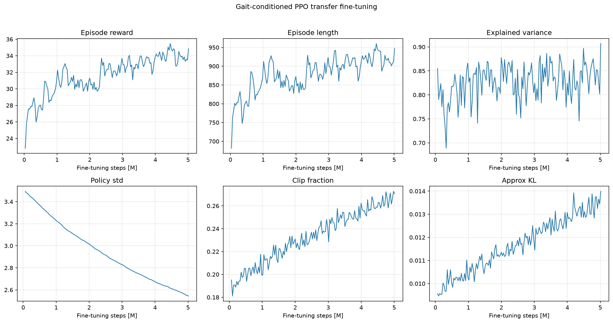
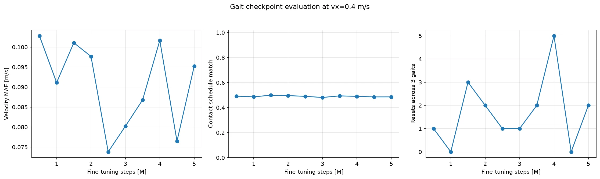
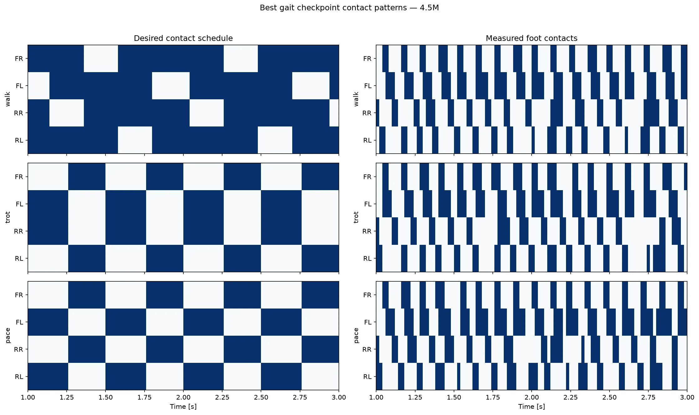

# Pupper gait 条件迁移训练报告

## 任务目标

实验一只给策略目标速度 `(vx, vy, wz)`。速度决定“机身怎么移动”，却不能唯一决定“四只脚按什么顺序接触地面”：同样以 0.4 m/s 前进，可以采用 walk、trot 或 pace。因此实验二把控制目标扩展为：

> 在跟踪 `(vx, vy, wz)` 的同时，按指定 `gait_id` 和周期相位执行对应的足端接触时序。

策略输入由 45 维扩为 50 维。原 45 维顺序不变，末尾追加 `walk/trot/pace` 三维 one-hot 与 `sin(phase)、cos(phase)`。动作仍是 12 个关节位置残差。新增奖励比较 FR、FL、RR、RL 的实际接触与目标接触序列，`gait_id` 因而不仅改变输入，也改变每个时刻的正确行为。

## 实验性质

这是从实验一 **19M 步 checkpoint 迁移后的 5M 步微调**，用于尽快验证 gait 条件链路，不是带 gait 与不带 gait 的公平消融实验。迁移时复制旧策略的全部兼容参数，两个首层网络的前 45 列原样保留，新 5 列置零后学习。

公平对照已另存为 `configs/train_no_gait.yaml` 与 `configs/train_gait.yaml`：二者随机种子、20M 训练预算和 PPO 超参数一致，并都从零训练。

## 结论

Apple M3 Ultra CPU 使用 16 个并行 MuJoCo 环境完成 5,013,504 步微调，TensorBoard 记录跨度约 12.3 分钟。按速度 MAE、接触匹配率和摔倒次数的组合分数，最佳 checkpoint 为 **[4.5M](raw/checkpoints/pupper_gait_finetune_4500000_steps.zip)**。

最佳 checkpoint 在三种 gait 上的平均速度 MAE 为 0.076 m/s，接触时序逐足匹配率为 0.485，共重置 0 次。速度与稳定性得到保留，但 0.5 左右的接触匹配接近“未按相位区分触地”的基准水平；接触图中的实际触地频率也明显高于目标周期。因此本次迁移**没有成功形成标准 walk、trot 和 pace**，只能证明 gait 输入、相位、奖励、迁移和评估链路已经跑通。

## 训练机器与参数

- 芯片：Apple M3 Ultra
- CPU 逻辑核心：28
- 统一内存：96 GiB
- 训练设备：CPU，16 个 `SubprocVecEnv`
- 微调步数：5,000,000
- 学习率：0.0001
- 熵系数：0.001
- 裁剪范围：0.15
- gait 接触奖励权重：0.5
- gait 切换间隔：500 控制步，即 10 秒

完整参数见 [`raw/run_config.yaml`](raw/run_config.yaml)。

## 训练曲线



- `ep_rew_mean`：22.82 → 34.86，峰值 35.47
- `ep_len_mean`：682 → 947，峰值 960



## 最佳策略评估

三种 gait 均固定 `vx=0.4 m/s`，每种运行 8 秒，去掉首秒热身：

| gait | 平均 vx | 速度 MAE | 接触匹配率 | 重置 |
| --- | ---: | ---: | ---: | ---: |
| walk | 0.358 | 0.076 | 0.455 | 0 |
| trot | 0.360 | 0.077 | 0.501 | 0 |
| pace | 0.415 | 0.076 | 0.499 | 0 |




GIF 依次输入 walk、trot、pace，每段 3 秒，速度命令始终为 0.4 m/s，以隔离 gait 条件。当前视觉差异和接触时序都不足以把三段认定为标准步态。

## 原始数据

- [`raw/training_metrics.csv`](raw/training_metrics.csv)：全部 TensorBoard scalar
- [`raw/gait_evaluation.csv`](raw/gait_evaluation.csv)：全部 checkpoint、三种 gait 的逐控制步状态与四足接触
- [`raw/checkpoint_summary.csv`](raw/checkpoint_summary.csv)：每个 checkpoint 和 gait 的汇总指标
- [`raw/checkpoint_aggregate.csv`](raw/checkpoint_aggregate.csv)：checkpoint 选择分数
- [`raw/gait_demo.csv`](raw/gait_demo.csv)：GIF 对应逐时刻数据
- [`raw/tensorboard/`](raw/tensorboard/)：原始 TensorBoard event
- [`raw/checkpoints/pupper_gait_finetune_4500000_steps.zip`](raw/checkpoints/pupper_gait_finetune_4500000_steps.zip)：仓库归档的最佳 checkpoint；其余中间 checkpoint 保留在本机训练输出中
- [`../raw/checkpoints/pupper_ppo_19000000_steps.zip`](../raw/checkpoints/pupper_ppo_19000000_steps.zip)：迁移源模型
- [`raw/machine.json`](raw/machine.json)：机器与软件环境
- [`raw/run_config.yaml`](raw/run_config.yaml)：实际训练配置

## 后续公平对照

不能用本次 5M 迁移结果直接断言 gait 方案优于原模型。正式报告的消融实验应分别执行：

```bash
uv run python 6.rl_pupper/train.py --config 6.rl_pupper/configs/train_no_gait.yaml
uv run python 6.rl_pupper/train.py --config 6.rl_pupper/configs/train_gait.yaml
```

两组都从零训练 20M 步，再以相同速度跟踪、稳定性和接触时序指标评估。`train_gait.yaml` 已根据本次 0.5 权重不足的结果，将接触奖励权重提高到 4.0；PPO 超参数和训练预算仍与无 gait 组一致。
