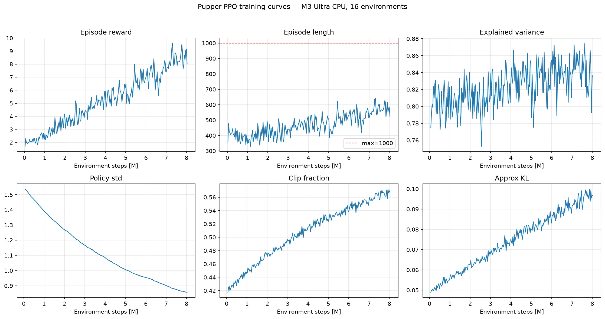
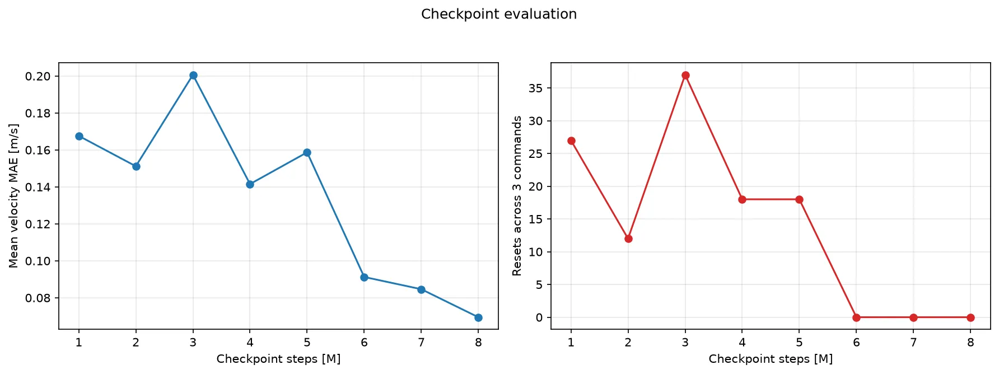
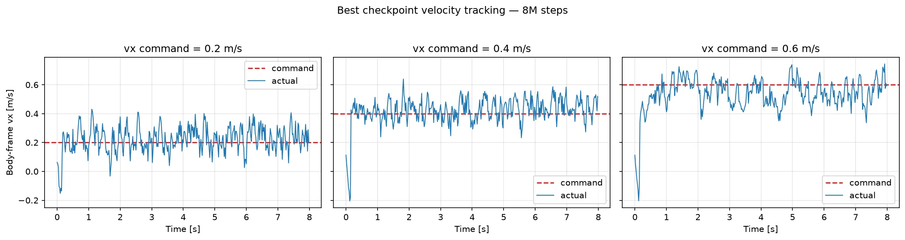

# Pupper PPO 本机训练报告

## 任务目标

训练一个**速度指令条件化的四足低层控制策略**。使用者向策略指定机身坐标系下的目标速度：

| 指令 | 含义 | 示例 |
| --- | --- | --- |
| `vx` | 前后速度，正值前进、负值后退 | `vx=0.5` 表示以 0.5 m/s 前进 |
| `vy` | 左右横移速度 | `vy=0.2` 表示横向移动 |
| `wz` | 绕竖直轴的转向角速度 | `wz=0.5` 表示以 0.5 rad/s 左转 |

PPO 策略的输入是 `vx、vy、wz` 指令以及 IMU、关节状态、上一时刻动作和机身线速度，共 48 维；输出是 12 个关节位置残差，再由 PD 控制器执行。它不要求复现预先定义的 `walk` 或 `trot` 轨迹，四条腿的协调方式由奖励函数自行学习。

训练时命令从 `vx ∈ [-0.75, 0.75]`、`vy ∈ [-0.5, 0.5]`、`wz ∈ [-2, 2]` 随机采样，回合内每 250 步（5 秒）重采样一次，并以 10% 概率采样零命令。目标是在不摔倒、不过度用力且动作平滑的前提下，使实际速度跟踪指定速度。成功判据依次是：

1. `ep_len_mean` 接近 1000，说明可以稳定完成 20 秒回合。
2. 实际 `vx、vy、wz` 接近目标指令，而不是只会以固定速度移动。
3. 前进、后退、转向和站立命令都能执行，命令切换时不摔倒。

## 相对上一版的改动

上一版（20M 步，45 维观测）的演示步态抖动明显：站立时原地踏步、偏航晃动大，命令切换时摔倒 1 次。本版针对性做了四类修改：

- **观测**：追加机身线速度 3 维（45 → 48 维），速度跟踪从开环推断变为闭环控制。
- **奖励**：补充完整版实验环境的防抖项——竖直速度、横滚俯仰角速度、关节加速度、足端打滑、外展角、零命令下的站立静止约束；新增 `dont_wait` 惩罚（命令非零却站着不动）并把跟踪 sigma 从 0.25 收紧到 0.15，铲除"站桩领残余跟踪分"的局部最优；终止高度线从 0.10 抬到 0.12 排除蜷伏姿态。
- **命令与扰动**：回合内每 5 秒重采样命令（上一版整回合固定命令，从未训练过命令切换）；零命令概率 1% → 10%；开局随机初速度和偶发 kick 扰动，迫使策略学会迈步与恢复。
- **训练流程**：两阶段课程。平滑惩罚全额生效时，20M 步预算下"学步期交税摔跤"不如"站桩保本"（总奖励下限裁剪为 0），策略会收敛到站着不动；因此先用轻惩罚 bootstrap 学会行走，再恢复全额惩罚微调打磨步态。熵系数在两阶段内各自线性衰减（0.01 → 0.004、0.002 → 0.0005），兼顾探索与末期平滑。

## 结论

在 Apple M3 Ultra 上使用 16 个 CPU MuJoCo 环境完成两阶段训练：轻惩罚 bootstrap 8M 步 + 全额平滑惩罚微调 8,028,160 步（微调阶段耗时约 18.2 分钟）。

按三档速度平均 MAE 加摔倒惩罚选择的最佳微调 checkpoint 是 **[8M 步](raw/checkpoints/pupper_ppo_8000000_steps.zip)**，平均 MAE 为 0.069 m/s，评估重置次数为 0。

## 训练机器

- 芯片：Apple M3 Ultra
- CPU 逻辑核心：28
- 统一内存：96 GiB
- 架构：arm64
- PyTorch：2.13.0
- Stable Baselines3：2.9.0
- MuJoCo：3.7.0
- 训练设备：CPU，16 个 `SubprocVecEnv`

## 训练参数

- 阶段一 bootstrap：8M 步，削弱平滑惩罚（配置见 [`raw/bootstrap_walk.yaml`](raw/bootstrap_walk.yaml)）
- 阶段二微调：8,000,000 步，全额平滑惩罚，从阶段一终点续训（配置见 [`raw/smooth_finetune.yaml`](raw/smooth_finetune.yaml)）
- PPO rollout：`n_steps=2048`，`batch_size=256`，`n_epochs=4`
- 学习率：0.0003
- 折扣：`gamma=0.97`，`gae_lambda=0.95`
- 裁剪：`clip_range=0.2`
- 熵系数：阶段内线性衰减，见上文
- 网络：[256, 256]
- 单回合最大步数：1000

## 训练曲线

以下为微调阶段的曲线。

- `ep_rew_mean`：1.70 → 8.05，峰值 9.62
- `ep_len_mean`：362 → 523，峰值 643（训练环境开启随机初速度和 kick 扰动，回合长度含受扰摔倒；关闭扰动的评估中最佳策略 0 摔倒）
- 策略标准差：1.54 → 0.86

## Checkpoint 对比

下表是微调阶段各 checkpoint 在 0.2、0.4、0.6 m/s 三档命令下各运行 8 秒的结果。三列为去掉首秒热身后的实际平均速度。

| Checkpoint | cmd 0.2 | cmd 0.4 | cmd 0.6 | 平均 MAE | 重置次数 |
| ---: | ---: | ---: | ---: | ---: | ---: |
| 1M | 0.265 | 0.318 | 0.322 | 0.168 | 27 |
| 2M | 0.280 | 0.435 | 0.304 | 0.151 | 12 |
| 4M | 0.273 | 0.287 | 0.462 | 0.142 | 18 |
| 6M | 0.239 | 0.384 | 0.471 | 0.091 | 0 |
| 8M | 0.228 | 0.432 | 0.554 | 0.069 | 0 |

## 最佳策略

命令切换演示逐阶段对比上一版（每段去掉前 0.5 秒过渡期；波动为标准差）：

| 阶段 | 指标 | 上一版 | 本版 |
| --- | --- | ---: | ---: |
| 站立 | `vx` 均值 | -0.027 | -0.024 |
| 站立 | `vx` / `wz` 波动 | ±0.067 / ±0.543 | ±0.065 / ±0.621 |
| 前进 `vx=0.5` | `vx` 均值 | +0.530 | +0.517 |
| 前进 `vx=0.5` | `vx` / `wz` 波动 | ±0.190 / ±0.735 | ±0.069 / ±0.781 |
| 左转 `wz=0.5` | `wz` 均值 | +0.526 | +0.301 |
| 左转 `wz=0.5` | `vx` / `wz` 波动 | ±0.077 / ±0.551 | ±0.063 / ±0.554 |
| 后退 `vx=-0.3` | `vx` 均值 | -0.292 | -0.303 |
| 后退 `vx=-0.3` | `vx` / `wz` 波动 | ±0.069 / ±0.524 | ±0.055 / ±0.575 |
| 前进 `vx=0.5` | 机身高度波动 | ±0.0217 | ±0.0045 |
| 演示全程 | 终止次数 | 1 | 0 |

完整命令切换演示发生 0 次终止（无）。

## 原始数据

- [`raw/training_metrics.csv`](raw/training_metrics.csv)：全部 TensorBoard scalar，长表格式
- [`raw/velocity_tracking.csv`](raw/velocity_tracking.csv)：微调阶段全部 checkpoints 的逐时刻速度、回报和终止记录
- [`raw/checkpoint_summary.csv`](raw/checkpoint_summary.csv)：每个 checkpoint、每档命令的 MAE、RMSE 和重置次数
- [`raw/command_demo.csv`](raw/command_demo.csv)：GIF 对应的逐时刻命令和实际状态
- [`raw/tensorboard/`](raw/tensorboard/)：原始 TensorBoard event 文件
- [`raw/checkpoints/pupper_ppo_8000000_steps.zip`](raw/checkpoints/pupper_ppo_8000000_steps.zip)：仓库归档的最佳 checkpoint；其余中间 checkpoint 保留在本机训练输出中
- [`raw/machine.json`](raw/machine.json)：机器和软件环境
- [`raw/run_config.yaml`](raw/run_config.yaml)：本次实际运行配置

## 局限与下一步

1. 转向跟踪偏保守（演示中 `wz` 实际约为目标的六成），且运动中的偏航角速度仍有明显波动；下一步可提高 `tracking_ang_vel` 权重或在微调阶段延长训练。
2. 机身线速度观测在仿真中直接读取；部署到真机需要状态估计器提供等价量，或改用完整版实验环境的帧堆叠方案。
3. 当前模型只在平地仿真验证，域随机化仅有初速度和 kick 扰动，没有观测噪声、延迟随机化和真机部署。
4. 步态模式由奖励自行涌现；若需要指定 walk/trot/pace 接触时序，参见 v1 的 gait 条件化实验（`../6.rl_pupper/reports/gait_finetune/`）。
