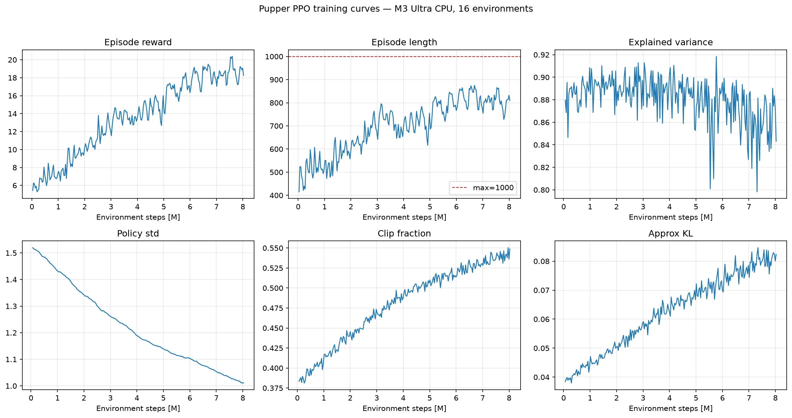
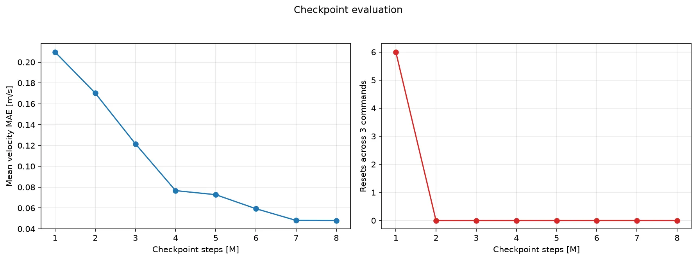
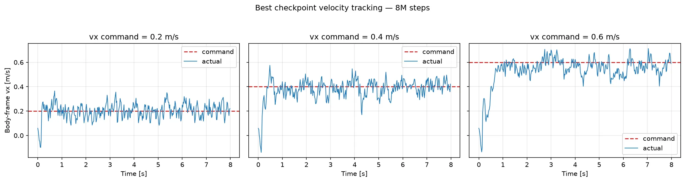

# Pupper PPO 本机训练报告（v2.2）

## 任务目标

训练一个**速度指令条件化的四足低层控制策略**。使用者向策略指定机身坐标系下的目标速度：

| 指令 | 含义 | 示例 |
| --- | --- | --- |
| `vx` | 前后速度，正值前进、负值后退 | `vx=0.5` 表示以 0.5 m/s 前进 |
| `vy` | 左右横移速度 | `vy=0.2` 表示横向移动 |
| `wz` | 绕竖直轴的转向角速度 | `wz=0.5` 表示以 0.5 rad/s 左转 |

PPO 策略的输入是 `vx、vy、wz` 指令以及 IMU、关节状态、上一时刻动作和机身线速度，共 48 维；输出是 12 个关节位置残差，再由 PD 控制器执行。它不要求复现预先定义的 `walk` 或 `trot` 轨迹，四条腿的协调方式由奖励函数自行学习。

训练时命令从 `vx ∈ [-0.75, 0.75]`、`vy ∈ [-0.5, 0.5]`、`wz ∈ [-2, 2]` 随机采样，回合内每 250 步（5 秒）重采样一次，并以 10% 概率采样零命令。目标是在不摔倒、不过度用力且动作平滑的前提下，使实际速度跟踪指定速度。成功判据依次是：

1. `ep_len_mean` 接近 1000，说明可以稳定完成 20 秒回合。
2. 实际 `vx、vy、wz` 接近目标指令，而不是只会以固定速度移动。
3. 前进、后退、转向和站立命令都能执行，命令切换时不摔倒。

## 相对 v2.1 的改动

本版（v2.2）在 [`6.rl_pupper_v2_1`](../../6.rl_pupper_v2_1/) 基础上**仅新增动作低通滤波**：策略输出的关节位置残差先过一阶 EMA 滤波（α=0.5，50 Hz 下截止约 5.5 Hz）再进 PD 伺服，训练与评估同样经过滤波。其余观测、奖励、命令分布、扰动与两阶段课程全部与 v2.1 相同。

动机：v2.1 的残余抖动来自网络每 20 ms 输出一次新目标、且奖励惩罚无法完全约束高频分量；而手写开环步态（`5.gait-control`）"天然平滑"的本质是动作频带受限的周期轨迹。滤波把同样的频带先验加给 RL：保留步态基频与摆动相（1–5 Hz），滤掉高频抖动，同时保住 RL 的闭环平衡、速度跟踪与抗扰能力。这也是真机部署的标准做法。

版本脉络：v1 基线 → v2（观测 48 维 + 防抖奖励组 + 两阶段课程，见 [v2 报告](../../6.rl_pupper_v2/reports/README.md)）→ v2.1（钉腿惩罚修三腿跛行，见 [v2.1 报告](../../6.rl_pupper_v2_1/reports/README.md)）→ 本版。

## 结论

在 Apple M3 Ultra 上使用 16 个 CPU MuJoCo 环境完成两阶段训练：轻惩罚 bootstrap 8M 步 + 全额平滑惩罚微调 8,028,160 步（微调阶段耗时约 20.3 分钟）。

按三档速度平均 MAE 加摔倒惩罚选择的最佳微调 checkpoint 是 **[8M 步](raw/checkpoints/pupper_ppo_8000000_steps.zip)**，平均 MAE 为 0.048 m/s，评估重置次数为 0。

## 训练机器

- 芯片：Apple M3 Ultra
- CPU 逻辑核心：28
- 统一内存：96 GiB
- 架构：arm64
- PyTorch：2.13.0
- Stable Baselines3：2.9.0
- MuJoCo：3.7.0
- 训练设备：CPU，16 个 `SubprocVecEnv`

## 训练参数

- 阶段一 bootstrap：8M 步，削弱平滑惩罚（配置见 [`raw/bootstrap_walk.yaml`](raw/bootstrap_walk.yaml)）
- 阶段二微调：8,000,000 步，全额平滑惩罚，从阶段一终点续训（配置见 [`raw/smooth_finetune.yaml`](raw/smooth_finetune.yaml)）
- PPO rollout：`n_steps=2048`，`batch_size=256`，`n_epochs=4`
- 学习率：0.0003
- 折扣：`gamma=0.97`，`gae_lambda=0.95`
- 裁剪：`clip_range=0.2`
- 熵系数：阶段内线性衰减，见上文
- 网络：[256, 256]
- 单回合最大步数：1000

## 训练曲线

以下为微调阶段的曲线。

- `ep_rew_mean`：5.44 → 18.26，峰值 20.37
- `ep_len_mean`：415 → 810，峰值 875（训练环境开启随机初速度和 kick 扰动，回合长度含受扰摔倒；关闭扰动的评估中最佳策略 0 摔倒）
- 策略标准差：1.52 → 1.01

## Checkpoint 对比

下表是微调阶段各 checkpoint 在 0.2、0.4、0.6 m/s 三档命令下各运行 8 秒的结果。三列为去掉首秒热身后的实际平均速度。

| Checkpoint | cmd 0.2 | cmd 0.4 | cmd 0.6 | 平均 MAE | 重置次数 |
| ---: | ---: | ---: | ---: | ---: | ---: |
| 1M | 0.124 | 0.202 | 0.259 | 0.210 | 6 |
| 2M | 0.152 | 0.264 | 0.290 | 0.170 | 0 |
| 4M | 0.204 | 0.349 | 0.496 | 0.077 | 0 |
| 6M | 0.219 | 0.400 | 0.541 | 0.059 | 0 |
| 8M | 0.202 | 0.389 | 0.564 | 0.048 | 0 |

## 最佳策略

命令切换演示逐阶段对比 v1 与 v2.1（每段去掉前 0.5 秒过渡期；波动为标准差）：

| 阶段 | 指标 | v1 | v2.1 | 本版 v2.2 |
| --- | --- | ---: | ---: | ---: |
| 站立 | `vx` 均值 | -0.027 | -0.001 | -0.002 |
| 站立 | `vx` / `wz` 波动 | ±0.067 / ±0.543 | ±0.080 / ±0.578 | ±0.051 / ±0.385 |
| 前进 `vx=0.5` | `vx` 均值 | +0.530 | +0.521 | +0.479 |
| 前进 `vx=0.5` | `vx` / `wz` 波动 | ±0.190 / ±0.735 | ±0.082 / ±0.711 | ±0.049 / ±0.391 |
| 左转 `wz=0.5` | `wz` 均值 | +0.526 | +0.385 | +0.512 |
| 左转 `wz=0.5` | `vx` / `wz` 波动 | ±0.077 / ±0.551 | ±0.080 / ±0.642 | ±0.048 / ±0.367 |
| 后退 `vx=-0.3` | `vx` 均值 | -0.292 | -0.307 | -0.363 |
| 后退 `vx=-0.3` | `vx` / `wz` 波动 | ±0.069 / ±0.524 | ±0.064 / ±0.612 | ±0.038 / ±0.276 |
| 前进 `vx=0.5` | 机身高度波动 | ±0.0217 | ±0.0048 | ±0.0034 |
| 演示全程 | 终止次数 | 1 | 0 | 0 |

完整命令切换演示发生 0 次终止（无）。

## 步态对称性

前进 `vx=0.5` 命令下运行 6 秒的四脚接触统计（触地占比 / 抬脚次数）。v2 的后左腿
92% 时间触地形成三腿跛行，v2.1 的钉腿惩罚将其修复；本版检验动作滤波未破坏对称性：

| 足 | v2 | v2.1 | 本版 v2.2 |
| --- | ---: | ---: | ---: |
| 前右 FR | 46.9% / 27 | 42.5% / 31 | 45.8% / 29 |
| 前左 FL | 52.0% / 24 | 58.9% / 28 | 50.2% / 29 |
| 后右 RR | 57.8% / 38 | 48.7% / 37 | 57.8% / 28 |
| 后左 RL | 91.6% / 9 | 81.1% / 24 | 64.4% / 32 |

## 原始数据

- [`raw/training_metrics.csv`](raw/training_metrics.csv)：全部 TensorBoard scalar，长表格式
- [`raw/velocity_tracking.csv`](raw/velocity_tracking.csv)：微调阶段全部 checkpoints 的逐时刻速度、回报和终止记录
- [`raw/checkpoint_summary.csv`](raw/checkpoint_summary.csv)：每个 checkpoint、每档命令的 MAE、RMSE 和重置次数
- [`raw/command_demo.csv`](raw/command_demo.csv)：GIF 对应的逐时刻命令和实际状态
- [`raw/tensorboard/`](raw/tensorboard/)：原始 TensorBoard event 文件
- [`raw/checkpoints/pupper_ppo_8000000_steps.zip`](raw/checkpoints/pupper_ppo_8000000_steps.zip)：仓库归档的最佳 checkpoint；其余中间 checkpoint 保留在本机训练输出中
- [`raw/machine.json`](raw/machine.json)：机器和软件环境
- [`raw/run_config.yaml`](raw/run_config.yaml)：本次实际运行配置

## 局限与下一步

1. 滤波带来的相位滞后使跟踪略趋保守：前进实际 0.479（目标 0.5），后退过冲到 -0.363（目标 -0.3）；转向已基本精准（0.512 / 目标 0.5）。可微调 `tracking_lin_vel` 权重或滤波系数换取更快的响应。
2. 四脚占空比进一步均衡（后左腿 92% → 81% → 64%，抬脚 9 → 24 → 32 次），但仍未达到严格对称的 trot 时序；需要的话走 gait 条件化路径（`configs/finetune_gait.yaml`）。
3. 机身线速度观测在仿真中直接读取；部署到真机需要状态估计器提供等价量，或改用完整版实验环境的帧堆叠方案。
4. 当前模型只在平地仿真验证，域随机化仅有初速度和 kick 扰动，没有观测噪声、延迟随机化和真机部署。
5. 步态模式由奖励自行涌现；若需要指定 walk/trot/pace 接触时序，参见 v1 的 gait 条件化实验（`../../6.rl_pupper/reports/gait_finetune/`）。
