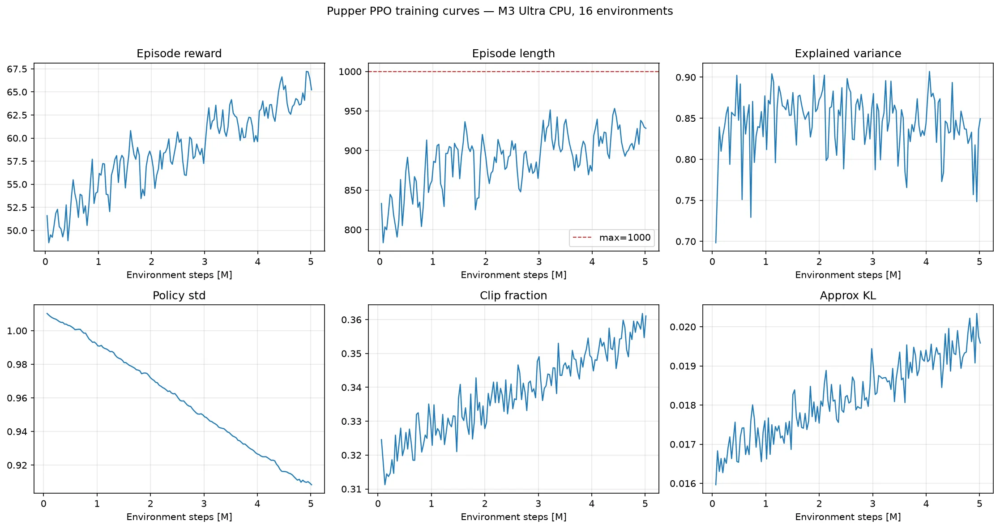
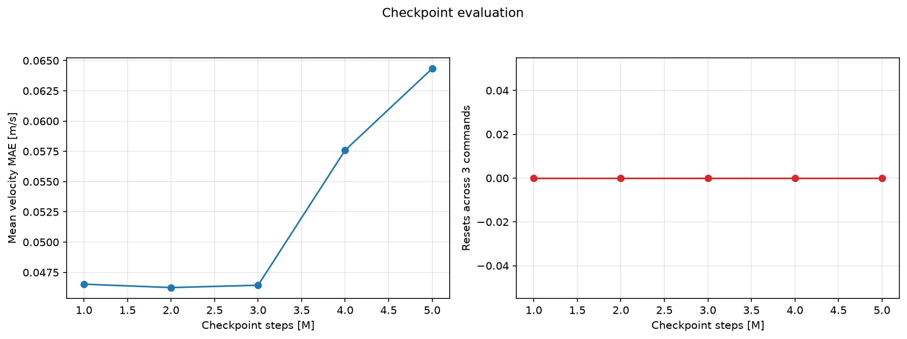
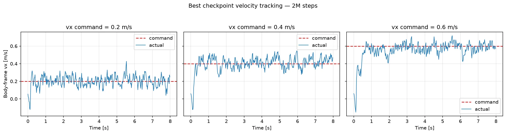

# Pupper PPO 本机训练报告（v2.3）

## 任务目标

训练一个**速度指令条件化的四足低层控制策略**。使用者向策略指定机身坐标系下的目标速度：

| 指令 | 含义 | 示例 |
| --- | --- | --- |
| `vx` | 前后速度，正值前进、负值后退 | `vx=0.5` 表示以 0.5 m/s 前进 |
| `vy` | 左右横移速度 | `vy=0.2` 表示横向移动 |
| `wz` | 绕竖直轴的转向角速度 | `wz=0.5` 表示以 0.5 rad/s 左转 |

PPO 策略的输入是 `vx、vy、wz` 指令以及 IMU、关节状态、上一时刻动作和机身线速度，共 48 维；输出是 12 个关节位置残差，再由 PD 控制器执行。它不要求复现预先定义的 `walk` 或 `trot` 轨迹，四条腿的协调方式由奖励函数自行学习。

训练时命令从 `vx ∈ [-0.75, 0.75]`、`vy ∈ [-0.5, 0.5]`、`wz ∈ [-2, 2]` 随机采样，回合内每 250 步（5 秒）重采样一次，并以 10% 概率采样零命令。目标是在不摔倒、不过度用力且动作平滑的前提下，使实际速度跟踪指定速度。成功判据依次是：

1. `ep_len_mean` 接近 1000，说明可以稳定完成 20 秒回合。
2. 实际 `vx、vy、wz` 接近目标指令，而不是只会以固定速度移动。
3. 前进、后退、转向和站立命令都能执行，命令切换时不摔倒。

## 相对 v2.2 的改动

本版（v2.3）在 [`6.rl_pupper_v2_2`](../../6.rl_pupper_v2_2/) 基础上增加**第三阶段：trot 步态条件化微调**——把 v2.2 的 48 维策略迁移到 53 维（追加 trot one-hot 与相位 sin/cos，新增输入权重置零），用对角接触时序奖励（权重 4.0）训练 5M 步，给涌现步态加上"节拍器"先验。环境与前两阶段唯一区别是开启 gait 特征；观测、奖励、滤波、扰动均不变。

动机：v2.2 消除了高频抖动后，与手写开环步态的观感差距主要剩**节律不规整**——涌现步态没有固定周期和相位关系，人眼对节律不齐极其敏感。trot 条件化直接监督四脚按对角同步的固定时序触地。v1 的对照实验（`../../6.rl_pupper/reports/gait_finetune/`）已证明接触奖励权重 0.5 不足以改变时序，因此本版用 4.0。

另外两处只影响演示渲染、不影响策略与指标：GIF 帧率 12 → 20 fps，相机跟随加一阶平滑（机身微晃不再被相机放大成画面抖动）。下方所有对比表都来自 CSV 数据，与渲染无关；观感对比 GIF 时请留意这一差异。

版本脉络：v1 基线 → v2（48 维观测 + 防抖奖励组 + 两阶段课程）→ v2.1（钉腿惩罚修三腿跛行）→ v2.2（动作滤波治高频抖动，见 [v2.2 报告](../../6.rl_pupper_v2_2/reports/README.md)）→ 本版。

## 结论

在 Apple M3 Ultra 上使用 16 个 CPU MuJoCo 环境，在 v2.2 两阶段产物之上完成第三阶段 trot 条件化微调 5,013,504 步（耗时约 11.6 分钟）。

按三档速度平均 MAE 加摔倒惩罚选择的最佳微调 checkpoint 是 **[2M 步](raw/checkpoints/pupper_ppo_2000000_steps.zip)**，平均 MAE 为 0.046 m/s，评估重置次数为 0。

## 训练机器

- 芯片：Apple M3 Ultra
- CPU 逻辑核心：28
- 统一内存：96 GiB
- 架构：arm64
- PyTorch：2.13.0
- Stable Baselines3：2.9.0
- MuJoCo：3.7.0
- 训练设备：CPU，16 个 `SubprocVecEnv`

## 训练参数

- 阶段一 bootstrap：8M 步，削弱平滑惩罚（配置见 [`raw/bootstrap_walk.yaml`](raw/bootstrap_walk.yaml)；本版直接复用 v2.2 的产物）
- 阶段二平滑微调：8M 步，全额平滑惩罚（配置见 [`raw/smooth_finetune.yaml`](raw/smooth_finetune.yaml)；同上复用 v2.2 产物）
- 阶段三 trot 条件化：5,000,000 步，48 → 53 维迁移 + 接触时序奖励 4.0（配置见 [`raw/finetune_gait.yaml`](raw/finetune_gait.yaml)）
- PPO rollout：`n_steps=2048`，`batch_size=256`，`n_epochs=4`
- 学习率：0.0001
- 折扣：`gamma=0.97`，`gae_lambda=0.95`
- 裁剪：`clip_range=0.15`
- 熵系数：阶段内线性衰减，见上文
- 网络：[256, 256]
- 单回合最大步数：1000

## 训练曲线

以下为 trot 条件化微调阶段的曲线。

- `ep_rew_mean`：51.60 → 65.22，峰值 67.22
- `ep_len_mean`：833 → 928，峰值 953（训练环境开启随机初速度和 kick 扰动，回合长度含受扰摔倒；关闭扰动的评估中最佳策略 0 摔倒）
- 策略标准差：1.01 → 0.91

## Checkpoint 对比

下表是 trot 微调阶段各 checkpoint 在 0.2、0.4、0.6 m/s 三档命令下各运行 8 秒的结果。三列为去掉首秒热身后的实际平均速度。

| Checkpoint | cmd 0.2 | cmd 0.4 | cmd 0.6 | 平均 MAE | 重置次数 |
| ---: | ---: | ---: | ---: | ---: | ---: |
| 1M | 0.204 | 0.379 | 0.571 | 0.047 | 0 |
| 2M | 0.206 | 0.414 | 0.578 | 0.046 | 0 |
| 3M | 0.211 | 0.398 | 0.571 | 0.046 | 0 |
| 4M | 0.184 | 0.385 | 0.551 | 0.058 | 0 |
| 5M | 0.191 | 0.365 | 0.542 | 0.064 | 0 |

## 最佳策略

命令切换演示逐阶段对比 v1 与 v2.2（每段去掉前 0.5 秒过渡期；波动为标准差）：

| 阶段 | 指标 | v1 | v2.2 | 本版 v2.3 |
| --- | --- | ---: | ---: | ---: |
| 站立 | `vx` 均值 | -0.027 | -0.002 | -0.009 |
| 站立 | `vx` / `wz` 波动 | ±0.067 / ±0.543 | ±0.051 / ±0.385 | ±0.050 / ±0.336 |
| 前进 `vx=0.5` | `vx` 均值 | +0.530 | +0.479 | +0.525 |
| 前进 `vx=0.5` | `vx` / `wz` 波动 | ±0.190 / ±0.735 | ±0.049 / ±0.391 | ±0.047 / ±0.406 |
| 左转 `wz=0.5` | `wz` 均值 | +0.526 | +0.512 | +0.460 |
| 左转 `wz=0.5` | `vx` / `wz` 波动 | ±0.077 / ±0.551 | ±0.048 / ±0.367 | ±0.048 / ±0.400 |
| 后退 `vx=-0.3` | `vx` 均值 | -0.292 | -0.363 | -0.322 |
| 后退 `vx=-0.3` | `vx` / `wz` 波动 | ±0.069 / ±0.524 | ±0.038 / ±0.276 | ±0.034 / ±0.336 |
| 前进 `vx=0.5` | 机身高度波动 | ±0.0217 | ±0.0034 | ±0.0035 |
| 演示全程 | 终止次数 | 1 | 0 | 0 |

完整命令切换演示发生 0 次终止（无）。

## 步态对称性

前进 `vx=0.5` 命令下运行 6 秒的四脚接触统计（触地占比 / 抬脚次数）。v2 后左腿
92% 触地形成三腿跛行，v2.1 钉腿惩罚初步修复，v2.2 进一步均衡；本版用 trot
时序奖励直接监督对角同步，理想 trot 占空比为 50%：

| 足 | v2 | v2.2 | 本版 v2.3 |
| --- | ---: | ---: | ---: |
| 前右 FR | 46.9% / 27 | 45.8% / 29 | 50.9% / 26 |
| 前左 FL | 52.0% / 24 | 50.2% / 29 | 49.1% / 29 |
| 后右 RR | 57.8% / 38 | 57.8% / 28 | 57.1% / 28 |
| 后左 RL | 91.6% / 9 | 64.4% / 32 | 62.2% / 27 |

演示前进段的 trot 接触匹配率（实际触地组合与期望时序逐足对比的均值）为
**55.7%**（随机步态基线约 50%）。

## 原始数据

- [`raw/training_metrics.csv`](raw/training_metrics.csv)：全部 TensorBoard scalar，长表格式
- [`raw/velocity_tracking.csv`](raw/velocity_tracking.csv)：微调阶段全部 checkpoints 的逐时刻速度、回报和终止记录
- [`raw/checkpoint_summary.csv`](raw/checkpoint_summary.csv)：每个 checkpoint、每档命令的 MAE、RMSE 和重置次数
- [`raw/command_demo.csv`](raw/command_demo.csv)：GIF 对应的逐时刻命令和实际状态
- [`raw/tensorboard/`](raw/tensorboard/)：原始 TensorBoard event 文件
- [`raw/checkpoints/pupper_ppo_2000000_steps.zip`](raw/checkpoints/pupper_ppo_2000000_steps.zip)：仓库归档的最佳 checkpoint；其余中间 checkpoint 保留在本机训练输出中
- [`raw/machine.json`](raw/machine.json)：机器和软件环境
- [`raw/run_config.yaml`](raw/run_config.yaml)：本次实际运行配置

## 局限与下一步

1. trot 相位同步仍不完整：最佳 checkpoint（2M）接触匹配率 55.7%，训练到 5M 可达 62.2%（该 checkpoint 也已归档）但三档速度 MAE 会从 0.046 升到 0.064——节律服从度与跟踪精度存在权衡。要逼近节拍器级 trot，可提高接触奖励权重、延长条件化训练，或改用残差 RL（在 `5.gait-control` 的开环轨迹上学残差）。
2. 后左腿占空比 62%（理想 50%）仍是四腿中最高；转向跟踪 0.460（目标 0.5）比 v2.2 的 0.512 略保守。
3. 机身线速度观测在仿真中直接读取；部署到真机需要状态估计器提供等价量，或改用完整版实验环境的帧堆叠方案。
4. 当前模型只在平地仿真验证，域随机化仅有初速度和 kick 扰动，没有观测噪声、延迟随机化和真机部署。
5. 本版只训练了 trot；如需 walk / pace 多步态条件化，把 `gait.types` 扩回三种并按 v1 的 gait 对照实验（`../../6.rl_pupper/reports/gait_finetune/`）设置切换间隔。
