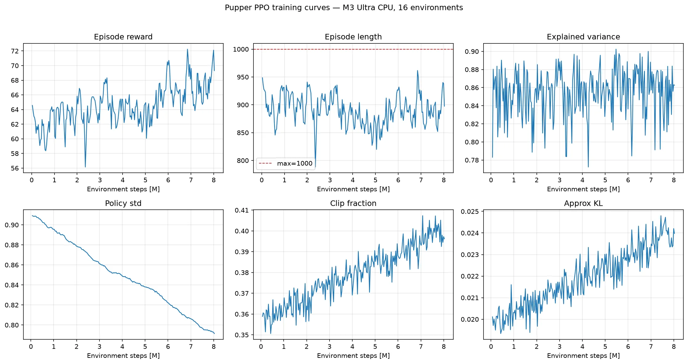
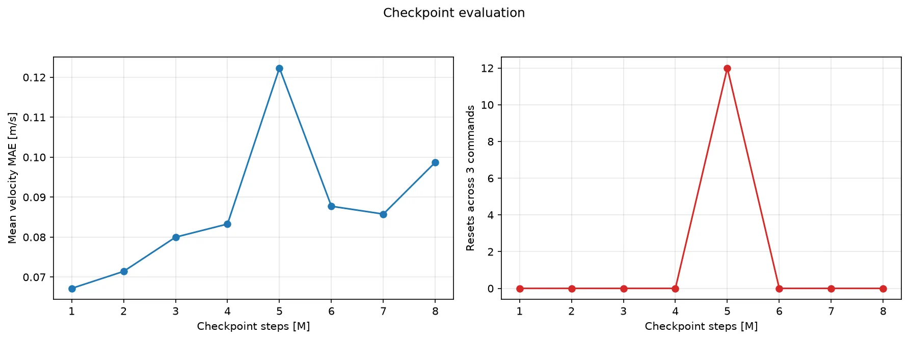
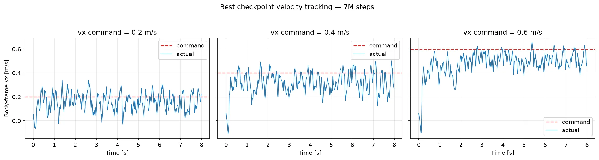

# Pupper PPO 本机训练报告（v2.4）

## 任务目标

训练一个**速度指令条件化的四足低层控制策略**。使用者向策略指定机身坐标系下的目标速度：

| 指令 | 含义 | 示例 |
| --- | --- | --- |
| `vx` | 前后速度，正值前进、负值后退 | `vx=0.5` 表示以 0.5 m/s 前进 |
| `vy` | 左右横移速度 | `vy=0.2` 表示横向移动 |
| `wz` | 绕竖直轴的转向角速度 | `wz=0.5` 表示以 0.5 rad/s 左转 |

PPO 策略的输入是 `vx、vy、wz` 指令以及 IMU、关节状态、上一时刻动作和机身线速度，共 48 维；输出是 12 个关节位置残差，再由 PD 控制器执行。它不要求复现预先定义的 `walk` 或 `trot` 轨迹，四条腿的协调方式由奖励函数自行学习。

训练时命令从 `vx ∈ [-0.75, 0.75]`、`vy ∈ [-0.5, 0.5]`、`wz ∈ [-2, 2]` 随机采样，回合内每 250 步（5 秒）重采样一次，并以 10% 概率采样零命令。目标是在不摔倒、不过度用力且动作平滑的前提下，使实际速度跟踪指定速度。成功判据依次是：

1. `ep_len_mean` 接近 1000，说明可以稳定完成 20 秒回合。
2. 实际 `vx、vy、wz` 接近目标指令，而不是只会以固定速度移动。
3. 前进、后退、转向和站立命令都能执行，命令切换时不摔倒。

## 相对 v2.3 的改动

本版（v2.4）针对"步频太快、看不到抬腿"两点观感做摆动整形，其余与 v2.3 相同：

- **AIR_TIME_TARGET 0.1 → 0.25 秒**：0.1 秒的腾空目标等于给 5 Hz 高频小碎步发许可证；提高到 0.25 秒后，短促点地在触地时被扣分，步频落向 trot 时钟的 2 Hz。
- **新增 foot_clearance 奖励（权重 -100）**：摆动相足端目标离地 3.5cm（对齐 `5.gait-control` 的 step_height 设计值）。此前贴地几毫米掠过是能量最优解（v2.2 实测摆动高度仅 1.3cm），抬腿在奖励里一分钱不值；该项让"抬大腿"有利可图，真实地形部署也依赖它。
- **新增慢速巡航演示**（0.15 m/s，见下文）：手写演示的前进速度只有 0.04–0.1 m/s，而标准演示命令 0.5 m/s——快 5 倍以上。对腿长受限的小型四足，高速下步频物理上必须高（步幅≈10cm 上限）；同速对比才公平。

训练从 v2.3 的 5M checkpoint（节律最佳，接触匹配率 62.2%）同结构续训 8M 步。

版本脉络：v1 基线 → v2（48 维观测 + 防抖奖励组）→ v2.1（钉腿惩罚）→ v2.2（动作滤波）→ v2.3（trot 节拍，见 [v2.3 报告](../../6.rl_pupper_v2_3/reports/README.md)）→ 本版。

## 结论

在 Apple M3 Ultra 上使用 16 个 CPU MuJoCo 环境，在 v2.3 产物之上完成第四阶段摆动整形微调 8,028,160 步（耗时约 21.6 分钟）。

在摆动整形收敛（≥6M）的 checkpoint 中按三档速度平均 MAE 加摔倒惩罚选择，最佳为 **[7M 步](raw/checkpoints/pupper_ppo_7000000_steps.zip)**，平均 MAE 为 0.086 m/s，评估重置次数为 0。

## 训练机器

- 芯片：Apple M3 Ultra
- CPU 逻辑核心：28
- 统一内存：96 GiB
- 架构：arm64
- PyTorch：2.13.0
- Stable Baselines3：2.9.0
- MuJoCo：3.7.0
- 训练设备：CPU，16 个 `SubprocVecEnv`

## 训练参数

- 阶段一 bootstrap 与阶段二平滑微调：各 8M 步，复用 v2.2 产物（配置见 [`raw/bootstrap_walk.yaml`](raw/bootstrap_walk.yaml)、[`raw/smooth_finetune.yaml`](raw/smooth_finetune.yaml)）
- 阶段三 trot 条件化：5M 步，复用 v2.3 产物
- 阶段四摆动整形：8,000,000 步，从 v2.3 的 5M checkpoint 续训，新奖励生效（配置见 [`raw/finetune_gait.yaml`](raw/finetune_gait.yaml)）
- PPO rollout：`n_steps=2048`，`batch_size=256`，`n_epochs=4`
- 学习率：0.0001
- 折扣：`gamma=0.97`，`gae_lambda=0.95`
- 裁剪：`clip_range=0.15`
- 熵系数：阶段内线性衰减，见上文
- 网络：[256, 256]
- 单回合最大步数：1000

## 训练曲线

以下为摆动整形微调阶段的曲线。

- `ep_rew_mean`：64.56 → 69.31，峰值 72.24
- `ep_len_mean`：949 → 898，峰值 962（训练环境开启随机初速度和 kick 扰动，回合长度含受扰摔倒；关闭扰动的评估中最佳策略 0 摔倒）
- 策略标准差：0.91 → 0.79

## Checkpoint 对比

下表是摆动整形微调阶段各 checkpoint 在 0.2、0.4、0.6 m/s 三档命令下各运行 8 秒的结果。三列为去掉首秒热身后的实际平均速度。

| Checkpoint | cmd 0.2 | cmd 0.4 | cmd 0.6 | 平均 MAE | 重置次数 |
| ---: | ---: | ---: | ---: | ---: | ---: |
| 1M | 0.176 | 0.371 | 0.530 | 0.067 | 0 |
| 2M | 0.184 | 0.348 | 0.516 | 0.071 | 0 |
| 3M | 0.160 | 0.354 | 0.502 | 0.080 | 0 |
| 4M | 0.180 | 0.353 | 0.490 | 0.083 | 0 |
| 5M | 0.185 | 0.203 | 0.499 | 0.122 | 12 |
| 6M | 0.170 | 0.340 | 0.476 | 0.088 | 0 |
| 7M | 0.160 | 0.324 | 0.499 | 0.086 | 0 |
| 8M | 0.161 | 0.312 | 0.478 | 0.099 | 0 |

## 最佳策略

命令切换演示逐阶段对比 v1 与 v2.3（每段去掉前 0.5 秒过渡期；波动为标准差）：

| 阶段 | 指标 | v1 | v2.3 | 本版 v2.4 |
| --- | --- | ---: | ---: | ---: |
| 站立 | `vx` 均值 | -0.027 | -0.009 | -0.027 |
| 站立 | `vx` / `wz` 波动 | ±0.067 / ±0.543 | ±0.050 / ±0.336 | ±0.057 / ±0.349 |
| 前进 `vx=0.5` | `vx` 均值 | +0.530 | +0.525 | +0.434 |
| 前进 `vx=0.5` | `vx` / `wz` 波动 | ±0.190 / ±0.735 | ±0.047 / ±0.406 | ±0.080 / ±0.423 |
| 左转 `wz=0.5` | `wz` 均值 | +0.526 | +0.460 | +0.493 |
| 左转 `wz=0.5` | `vx` / `wz` 波动 | ±0.077 / ±0.551 | ±0.048 / ±0.400 | ±0.063 / ±0.399 |
| 后退 `vx=-0.3` | `vx` 均值 | -0.292 | -0.322 | -0.280 |
| 后退 `vx=-0.3` | `vx` / `wz` 波动 | ±0.069 / ±0.524 | ±0.034 / ±0.336 | ±0.062 / ±0.344 |
| 前进 `vx=0.5` | 机身高度波动 | ±0.0217 | ±0.0035 | ±0.0057 |
| 演示全程 | 终止次数 | 1 | 0 | 0 |

完整命令切换演示发生 0 次终止（无）。

## 步态对称性

前进 `vx=0.5` 命令下运行 6 秒的四脚接触统计（触地占比 / 抬脚次数）。v2 后左腿
92% 触地形成三腿跛行，v2.1 钉腿惩罚初步修复，v2.2 进一步均衡；本版用 trot
时序奖励直接监督对角同步，理想 trot 占空比为 50%：

| 足 | v2 | v2.3 | 本版 v2.4 |
| --- | ---: | ---: | ---: |
| 前右 FR | 46.9% / 27 | 50.9% / 26 | 60.0% / 22 |
| 前左 FL | 52.0% / 24 | 49.1% / 29 | 54.2% / 20 |
| 后右 RR | 57.8% / 38 | 57.1% / 28 | 61.1% / 23 |
| 后左 RL | 91.6% / 9 | 62.2% / 27 | 60.4% / 21 |

摆动整形效果（前进 `vx=0.5`，6 秒窗口）：

- trot 接触匹配率 **74.9%**（随机步态基线约 50%；v2.3 最佳为 55.7%）
- 平均步频 **3.9 Hz**（v2.3 约 4.9 Hz；trot 时钟为 2 Hz）
- 摆动相足端离地高度：均值 **1.8cm** / P90 **4.0cm**（v2.2 基线 1.3 / 2.1cm；目标 3.5cm）

## 慢速巡航演示

手写开环演示（`5.gait-control`）的前进速度仅 0.04–0.1 m/s；小型四足在 0.5 m/s
高速下步频物理上必须高（步幅受腿长限制约 10cm）。下图为与其同速档的
0.15 m/s 巡航，观感对比更公平：

## 原始数据

- [`raw/training_metrics.csv`](raw/training_metrics.csv)：全部 TensorBoard scalar，长表格式
- [`raw/velocity_tracking.csv`](raw/velocity_tracking.csv)：微调阶段全部 checkpoints 的逐时刻速度、回报和终止记录
- [`raw/checkpoint_summary.csv`](raw/checkpoint_summary.csv)：每个 checkpoint、每档命令的 MAE、RMSE 和重置次数
- [`raw/command_demo.csv`](raw/command_demo.csv)：GIF 对应的逐时刻命令和实际状态
- [`raw/tensorboard/`](raw/tensorboard/)：原始 TensorBoard event 文件
- [`raw/checkpoints/pupper_ppo_7000000_steps.zip`](raw/checkpoints/pupper_ppo_7000000_steps.zip)：仓库归档的最佳 checkpoint；其余中间 checkpoint 保留在本机训练输出中
- [`raw/machine.json`](raw/machine.json)：机器和软件环境
- [`raw/run_config.yaml`](raw/run_config.yaml)：本次实际运行配置

## 局限与下一步

1. 摆动整形与高速跟踪存在权衡：前进 0.5 m/s 实测 0.434（v2.3 为 0.525），因为步频降到 3.9 Hz 后步幅顶到腿长上限（约 10cm），物理上到不了 0.5 m/s 的从容步态——固定 2 Hz 的 trot 时钟对高速命令本就不可满足。改进方向是让 gait 周期随命令速度缩放（cycle_time ∝ 1/|vx|），或改用残差 RL（在 `5.gait-control` 的开环轨迹上学残差）。
2. 摆动高度 P90 达 4.0cm（目标 3.5cm）但均值 1.8cm——抬腿高度在步与步之间还不均匀；巡航态（0.15 m/s）匹配率 81%、步频 3.2 Hz，尚未完全锁进 2 Hz 时钟。
3. 机身线速度观测在仿真中直接读取；部署到真机需要状态估计器提供等价量，或改用完整版实验环境的帧堆叠方案。
4. 当前模型只在平地仿真验证，域随机化仅有初速度和 kick 扰动，没有观测噪声、延迟随机化和真机部署。
5. 本版只训练了 trot；如需 walk / pace 多步态条件化，把 `gait.types` 扩回三种并按 v1 的 gait 对照实验（`../../6.rl_pupper/reports/gait_finetune/`）设置切换间隔。
