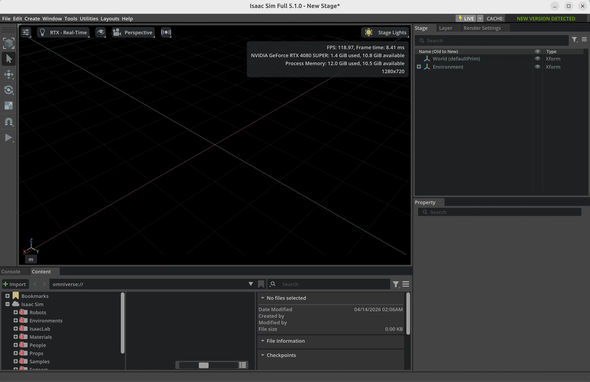

# 2. Isaac Sim 快速上手

Isaac Sim 是 NVIDIA 基于 Omniverse 构建的机器人仿真应用。它的价值不只是“把机器人放进 3D 场景里跑起来”，而是把场景搭建、物理仿真、传感器模拟、资产管理、ROS 2 对接、数据生成和策略训练衔接到了同一套生态里。

如果你是第一次接触 Isaac Sim，这一节的目标很明确：

1. 选对安装方式，把软件装起来。
2. 认识 GUI 的核心区域，不被界面吓住。
3. 在场景里完成一个最小实验。
4. 用 Python 把同样的事情复现出来。

## 2.1 Isaac Sim 是什么

对具身智能和机器人开发来说，Isaac Sim 主要有四个价值：

- 能在接近真实物理和视觉条件的环境里验证算法，而不是一上来就上真机。
- 能直接模拟相机、深度、RTX LiDAR、IMU、接触等传感器。
- 能把 `URDF`、`MJCF`、`USD` 等机器人资产放到同一条工作流里管理。
- 能继续往上接 `ROS 2`、`Replicator`、`Isaac Lab`，把仿真扩展到数据生成和训练。

从底层看，它主要建立在这些能力之上：

- `Omniverse Kit`：应用框架和扩展系统
- `USD`：场景和资产描述格式
- `PhysX`：物理引擎
- `RTX`：渲染与传感器模拟

## 2.2 安装前先做两个判断

正式安装前，建议先判断两件事。

### 1. 你是想先体验 GUI，还是先把它接进 Python 项目

- 想先熟悉界面、看场景、点菜单：优先 `Workstation` 二进制安装。
- 想直接脚本化、做项目集成：优先 `pip` 安装。
- 想跑远程服务器或无头环境：再考虑 `Docker`。

### 2. 你的机器是不是在官方支持范围内

Isaac Sim 对 GPU、显存和 RT Cores 的要求，比很多人直觉里“能跑 3D 软件就行”更高。安装前先看官方要求，能少踩很多坑。

## 2.3 截至 2026-04-14，版本怎么选

这是当前最容易装错的一步。

> 截至 `2026-04-14`，NVIDIA 官方 `latest` 文档首页明确写着 `Isaac Sim 6.0` 仍然是 `Early Developer Release`，文档也标注为不完整；对于第一次上手和稳定使用，仍更建议优先使用 `Isaac Sim 5.1.0`。

这意味着：

- 新手优先装 `Isaac Sim 5.1.0`。
- 不要再按照旧文章把 `Omniverse Launcher` 当成主安装路径。
- `Omniverse Launcher / Nucleus Workstation / Nucleus Cache` 已在 `2025-10-01` 起被官方标记为弃用。

## 2.4 系统要求

`Isaac Sim 5.1` 官方给出的 `x86_64` 最低要求如下：

| 项目 | 官方最低要求 | 更舒服的入门配置 |
| --- | --- | --- |
| 操作系统 | Ubuntu 22.04/24.04 或 Windows 10/11 | Ubuntu 22.04/24.04 或 Windows 11 |
| CPU | Intel i7 7代 / Ryzen 5 | Intel i7 9代以上 / Ryzen 7 以上 |
| 内存 | 32 GB | 64 GB |
| 显卡 | GeForce RTX 4080 | RTX 4080/5080 或更高 |
| 显存 | 16 GB | 16 GB 到 48 GB |
| 存储 | 50 GB SSD | 500 GB SSD 以上 |

额外要注意：

- 没有 RT Cores 的 GPU，比如 `A100`、`H100`，官方明确写了**不支持**。
- 低于官方最低配置的小场景“也许能跑”，但不应该作为稳定开发基线。
- 如果你在 Windows 上新装系统，优先用 `Windows 11`。官方文档已经注明 `Windows 10` 在 `2025-10-14` 之后不再是未来版本的支持重点。

## 2.5 安装方式怎么选

对大多数第一次上手的人，我建议这样选：

- 想最快进入 GUI：`Workstation`
- 想把仿真集成进 Python 项目：`pip`
- 想最短路径先照着官方步骤跑通：先看官方的 `Quick Install`

如果你只是想尽快按官方最短路径装起来，可以先看：

- [NVIDIA 官方：Quick Install](https://docs.isaacsim.omniverse.nvidia.com/latest/installation/quick-install.html)

### 方案 A：Workstation 二进制安装

这是最适合第一次上手的本地 GUI 方案。

#### Windows

```bat
mkdir C:\isaacsim
cd %USERPROFILE%\Downloads
tar -xvzf "isaac-sim-standalone-5.1.0-windows-x86_64.zip" -C C:\isaacsim
cd C:\isaacsim
post_install.bat
isaac-sim.bat
```

#### Ubuntu

```bash
mkdir ~/isaacsim
cd ~/Downloads
unzip "isaac-sim-standalone-5.1.0-linux-x86_64.zip" -d ~/isaacsim
cd ~/isaacsim
./post_install.sh
./isaac-sim.sh
```

第一次启动时别急，官方文档明确提到首轮会进行 shader cache 预热，可能需要 `5-10` 分钟。

如果你怀疑是环境问题，可以先跑兼容性检查：

- 二进制安装：`isaac-sim.compatibility_check.bat` 或 `./isaac-sim.compatibility_check.sh`
- pip 安装：`isaacsim isaacsim.exp.compatibility_check`

### 方案 B：pip 安装

`Isaac Sim 5.1` 的 Python 包要求 `Python 3.11`。

#### Windows

```bat
python3.11 -m venv env_isaacsim
env_isaacsim\Scripts\activate
pip install --upgrade pip
set OMNI_KIT_ACCEPT_EULA=YES
pip install isaacsim[all,extscache]==5.1.0 --extra-index-url https://pypi.nvidia.com
isaacsim
```

#### Ubuntu

```bash
python3.11 -m venv env_isaacsim
source env_isaacsim/bin/activate
pip install --upgrade pip
export OMNI_KIT_ACCEPT_EULA=YES
pip install isaacsim[all,extscache]==5.1.0 --extra-index-url https://pypi.nvidia.com
isaacsim
```

几个实用提醒：

- Windows 上如果用 pip 安装，官方文档提示可能需要开启 long path 支持。
- `extscache` 很有用，可以减少首次运行时的扩展拉取等待。
- 一个具体项目里尽量不要混用二进制安装和 pip 安装作为同一套主环境，否则缓存和配置冲突会很难排查。

## 2.6 第一次打开 Isaac Sim，你在看什么

第一次进 GUI，不要急着点菜单。先认识最核心的几个区域：

- `Viewport`：中间的 3D 视口，大部分观察和交互都在这里完成。
- `Stage`：场景树，本质上是当前 USD 场景的层级结构。
- `Properties`：选中对象后，在这里改位置、旋转、缩放、材质和物理属性。
- `Content Browser`：浏览资产和示例。
- 时间轴与播放区：控制 `Play`、`Pause`、`Stop`。

安装成功后，首次进入 GUI 时大致会看到类似下面的界面：



*Isaac Sim 5.1 成功启动后的默认空场景界面。中间是 Viewport，右侧是 Stage 和 Property，底部是 Content Browser。*

几个最常用的操作：

| 操作 | 快捷键 / 鼠标 |
| --- | --- |
| 移动对象 | `W` |
| 旋转对象 | `E` |
| 缩放对象 | `R` |
| 聚焦选中物体 | `F` |
| 旋转视角 | `Alt + 左键拖动` |
| 平移视角 | `Alt + 中键拖动` |
| 缩放视角 | `Alt + 右键拖动` 或滚轮 |

## 2.7 第一个场景：让一个立方体真正掉下来

这是最值得先做的实验，因为它会直接帮你建立两个关键概念：

- “看得见的物体”不等于“参与物理的物体”
- 碰撞体和刚体属性需要显式添加

按下面步骤来：

1. 打开 Isaac Sim，新建空场景：`File > New`
2. 添加地面：`Create > Physics > Ground Plane`
3. 添加光源：`Create > Lights > Distant Light`
4. 添加立方体：`Create > Shape > Cube`
5. 点击 `Play`，你会发现它什么都不会发生
6. 在 `Stage` 里选中这个立方体
7. 在 `Properties` 里点击 `Add`
8. 选择 `Physics > Rigid Body with Colliders Preset`
9. 再次点击 `Play`，它就会下落并与地面碰撞

这一步背后的直觉非常重要：

- 只有可视网格，没有物理属性，它只是“能看见”
- 只有碰撞，没有刚体，它更像“静态障碍物”
- 同时有刚体和碰撞，才是会掉落、会碰撞的动态物体

如果你想调试碰撞体，可以打开碰撞可视化：

- 视口里的眼睛图标
- `Show By Type > Physics > Colliders > All`

## 2.8 第一个 Python 脚本

当你能在 GUI 里摆出一个最小场景之后，下一步就应该把这个过程写成脚本。这样你才能得到：

- 可复现的实验环境
- 可版本管理的仿真场景
- 更容易批量生成数据和任务

下面是一个最小可运行脚本。它会创建地面和一个蓝色立方体，然后让它在重力作用下掉下来。

```python
from isaacsim import SimulationApp

simulation_app = SimulationApp({"headless": False})

import numpy as np
from isaacsim.core.api import World
from isaacsim.core.api.objects import DynamicCuboid

world = World(stage_units_in_meters=1.0)
world.scene.add_default_ground_plane()

cube = world.scene.add(
    DynamicCuboid(
        prim_path="/World/random_cube",
        name="fancy_cube",
        position=np.array([0.0, 0.0, 1.0]),
        scale=np.array([0.5, 0.5, 0.5]),
        color=np.array([0.1, 0.4, 1.0]),
    )
)

world.reset()

for _ in range(300):
    world.step(render=True)

simulation_app.close()
```

运行方式：

#### 如果你是二进制安装

```bat
cd C:\isaacsim
python.bat path\to\hello_cube.py
```

```bash
cd ~/isaacsim
./python.sh path/to/hello_cube.py
```

#### 如果你是 pip 安装

```bash
python hello_cube.py
```

你需要理解这几个核心对象：

- `SimulationApp`：把 Isaac Sim 应用本体启动起来
- `World`：对场景、物理步进和对象管理的高层封装
- `DynamicCuboid`：一个带刚体属性的动态立方体
- `world.reset()`：把刚加入场景的物理对象真正初始化好
- `world.step(render=True)`：推进一次物理和渲染循环

如果你不想让窗口在 `300` 帧后自动退出，可以改成：

```python
while simulation_app.is_running():
    world.step(render=True)
```

立方体下落演示效果：


*立方体从空中下落并与地面碰撞，对应上面的最小脚本运行结果。*

## 2.9 从立方体到机器人

现在你已经能理解 Isaac Sim 的最小工作原理了，接下来就该把“几何体”换成“机器人”。

最简单的办法是先加载官方内置机器人：

1. 新建场景
2. 选择 `Create > Robots > Franka Emika Panda Arm`
3. 打开 `Tools > Physics > Physics Inspector` 查看关节、限位和驱动参数
4. 点击 `Play`，观察机器人在仿真时间轴中的状态

这一步真正要建立的认知是：

`机器人资产 -> USD 场景中的 articulation -> 关节参数 -> 控制接口`

如果你有自己的机器人模型，常见入口有两个：

- `File > Import > URDF`
- `File > Import > MJCF`

对机器人开发者来说，Isaac Sim 通常不是终点，而是中间站。真实工作流更像这样：

`URDF / CAD / MJCF -> USD -> 调碰撞与关节 -> 加传感器 -> 接控制器 / ROS 2 -> 做任务验证`

## 2.10 Isaac Sim 还能做什么

你可以把 Isaac Sim 看成一个“机器人实验底座”。在这个底座之上，常见的进阶方向主要有四类。

### 1. 机器人仿真与控制

- 机械臂抓取
- 移动机器人导航
- 多机器人协同
- 关节级控制、轨迹跟踪、运动规划

### 2. 传感器仿真

Isaac Sim 的优势之一就是传感器种类全，而且和 RTX 渲染深度绑定：

- RGB 相机
- 深度相机
- RTX LiDAR
- Radar
- IMU
- 接触传感器

### 3. 合成数据生成

如果你做感知、检测、分割，或者 VLM / VLA 前的数据管线，Isaac Sim 的价值会很大：

- 领域随机化
- 自动标注
- 多视角采集
- 大规模批量生成

这一部分主要会和 `Replicator` 联系起来。

### 4. 强化学习与具身训练

NVIDIA 官方文档明确把 `Isaac Lab` 放在 Isaac Sim 的上层工作流里。你可以把两者的关系理解为：

- `Isaac Sim`：负责世界、机器人、传感器、物理和仿真步进
- `Isaac Lab`：负责把这些仿真能力组织成可训练的任务环境

如果你的目标是 locomotion、manipulation、模仿学习或 RL，通常不会只停在 Isaac Sim 本体，而是会继续进入 Isaac Lab。

## 2.11 新手最常踩的坑

### 坑 1：第一次启动很慢，以为程序卡死了

首轮启动预热 shader cache 很正常。第一次启动慢，不等于安装失败。

### 坑 2：物体能看到，但不会掉

这通常不是“重力坏了”，而是你只创建了可视对象，没有给它加 `Rigid Body` 和 `Collider`。

### 坑 3：装了很多套环境，最后不知道哪个在生效

同一台机器上可以同时有二进制版、pip 版、Docker 版，但一个具体项目最好只明确依赖其中一种主工作流。

### 坑 4：显卡能跑游戏，不代表一定适合 Isaac Sim

Isaac Sim 对显存和 RT Cores 的要求比很多“游戏引擎式直觉”更高。旧文章里常见的 `RTX 3070 / 8GB` 级别配置，在当前官方要求下已经不是推荐基线。

### 坑 5：网络没问题，但资产加载依然不完整

访问在线资产和某些扩展需要网络。如果你在公司网络、校园网或受限网络环境下使用，资产加载失败不一定是程序本身的问题。

## 2.12 一条实用的学习路径

如果你准备认真学 Isaac Sim，我建议按这个顺序走：

1. 完成 GUI 基础：会新建场景、加地面、光源、立方体、刚体和碰撞体
2. 完成一个最小 Python 脚本：会用 `SimulationApp`、`World`、`DynamicCuboid`
3. 加入一个内置机器人：比如 `Franka Panda`
4. 学会导入自己的机器人：先从 `URDF` 开始
5. 学会至少一种传感器：相机或 LiDAR
6. 再决定你要走哪条分支

- 做机器人系统集成：继续学 `ROS 2 Bridge`
- 做数据集和感知：继续学 `Replicator`
- 做强化学习和具身训练：继续学 `Isaac Lab`

## 2.13 本节小结

这一节最重要的结论有四个：

- Isaac Sim 不是单一模拟器，而是一整套机器人仿真工作台
- 对新手来说，`Isaac Sim 5.1.0` 仍然是截至 `2026-04-14` 更稳妥的入门版本
- 旧教程里常见的 `Launcher` 安装路径已经过时
- 真正有效的入门顺序是 `GUI 最小场景 -> Python 最小脚本 -> 机器人 -> 传感器 -> 上层框架`

当你能把“让一个立方体掉下来”同时用 GUI 和 Python 各做一遍时，就已经迈过 Isaac Sim 上手阶段最关键的一道坎了。

## 参考资料

- [NVIDIA 官方：What Is Isaac Sim?](https://docs.isaacsim.omniverse.nvidia.com/5.1.0/index.html)
- [NVIDIA 官方：Download Isaac Sim](https://docs.isaacsim.omniverse.nvidia.com/latest/installation/download.html)
- [NVIDIA 官方：Quick Install](https://docs.isaacsim.omniverse.nvidia.com/latest/installation/quick-install.html)
- [NVIDIA 官方：Workstation Installation](https://docs.isaacsim.omniverse.nvidia.com/latest/installation/install_workstation.html)
- [NVIDIA 官方：Python Environment Installation](https://docs.isaacsim.omniverse.nvidia.com/latest/installation/install_python.html)
- [NVIDIA 官方：Isaac Sim Requirements](https://docs.isaacsim.omniverse.nvidia.com/5.1.0/installation/requirements.html)
- [NVIDIA 官方：Isaac Sim Basic Usage Tutorial](https://docs.isaacsim.omniverse.nvidia.com/latest/introduction/quickstart_isaacsim.html)
- [NVIDIA 官方：Basic Robot Tutorial](https://docs.isaacsim.omniverse.nvidia.com/5.1.0/introduction/quickstart_isaacsim_robot.html)
