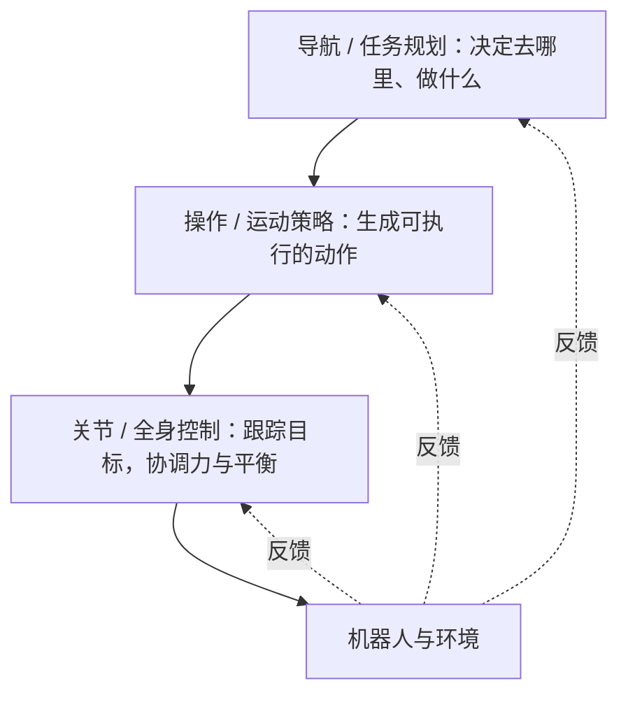

# 5. 系统范式与方法

知道了任务、技能和身体，下一个问题是：系统怎样把观测变成动作？本章介绍组织具身系统的几种方式，以及几条主要方法路线各自负责什么。

## 5.1 一个机器人系统由哪些部分组成 \{#system-layers}

以“把桌上的杯子放进盒子”为例，机器人需要看到杯子，建立杯子与自身的空间关系，规划路径，再把路径变成关节指令，最后由电机执行。按职责划分，可以得到下面的分层：

| 层 | 职责 | 例子 |
| --- | --- | --- |
| 感知层 | 获取环境与自身的信息 | 相机、深度相机、激光雷达、IMU |
| 建模层 | 描述机器人自身与环境的空间关系 | 机器人模型（URDF）、坐标变换、环境地图 |
| 规划层 | 决定做什么、怎么走 | 任务规划、路径规划、运动规划 |
| 控制层 | 把目标变成电机能执行的指令 | 逆运动学、轨迹跟踪、PID |
| 执行层 | 让机器人真正动起来 | 电机驱动器、编码器、夹爪 |
| 系统层 | 让各部分协同工作 | ROS2 的通信、时间与坐标管理、可视化 |

这套分层来自 [ROS2 系统导览](/docs/foundations/robotics-and-ros2/course_introduction)，那一章用一个机械臂例子详细介绍了每一层。学习方法并不会取消这些职责，只是改变了由谁来完成：有的由人工设计的模块完成，有的由从数据中学到的模型完成。

## 5.2 模块化与端到端 \{#modular-vs-end-to-end}

组织一个具身系统，有两种基本思路：

- **模块化流水线**：把系统拆成感知、状态估计、规划、控制等模块，模块之间传递人工设计的中间结果，例如物体位姿、地图和轨迹。
- **端到端学习**：用一个模型直接把观测（图像、本体感知、语言指令）映射为动作，中间表示由模型自己从数据中学习。

| 对比项 | 模块化流水线 | 端到端学习 |
| --- | --- | --- |
| 中间表示 | 人工设计：物体位姿、地图、轨迹 | 模型从数据中学习 |
| 优点 | 可解释，每个模块可以单独测试和替换；能利用物理模型保证精度 | 不受人工接口限制，能学到难以手写的行为；数据越多，效果越好 |
| 缺点 | 接口处会丢失信息，误差逐级传递；新任务常要重新设计模块 | 需要大量数据；失败时难以定位原因，也难以给出安全保证 |
| 例子 | Nav2 导航栈；MoveIt 2 规划配合控制器 | ACT、Diffusion Policy 等视觉运动策略；端到端 VLA |

实际系统通常介于两者之间：用学习方法替换部分模块，或者在学习到的策略下面保留底层控制器。VLA 领域关于“单体式”和“层次式”的讨论，是同一个问题在大模型时代的延续，见 [从 LLM 到机器人策略](/docs/foundations/vla/vla_landscape)。

## 5.3 分层协作 \{#hierarchy}

抓取、操作、运动、导航这些任务的观测类型、动作空间和反馈时限不同。导航或任务规划给出目标，操作或步态策略生成动作，底层控制器跟踪关节与接触状态；新的反馈再回到上层。

越往下，更新越快、越接近硬件；越往上，更新越慢、越接近任务语义：

| 层 | 常见更新频率 | 例子 |
| --- | --- | --- |
| 导航 / 任务规划 | 按需更新，或每秒一次左右 | 语言模型分解任务、全局路径规划 |
| 操作 / 运动策略 | 几赫兹到几十赫兹 | VLA、ACT 等操作策略，强化学习训练的步态策略 |
| 关节 / 全身控制 | 几百赫兹到上千赫兹 | 关节 PD 控制、全身控制器 |

VLA 可以连接视觉、语言与操作动作，强化学习（RL）或模型预测控制（MPC）可以承担运动控制，全身控制器（WBC）可以协调臂、腿与身体。系统也可以学习统一的全身策略。

分层的好处是每一层只处理自己时间尺度上的问题：上层可以慢慢“想”，下层必须快速稳定地“做”。代价是层与层之间的接口需要仔细设计：接口太抽象，下层无法执行；接口太具体，上层又失去灵活性。

## 5.4 几条主要的方法路线 \{#methods}

模仿学习（IL）从示范中学动作，强化学习（RL）用奖励改进策略；VLA 把视觉与语言连接到动作，世界模型预测动作的后果。规划与控制同样可以独立解决任务，也可以与学习方法组合。

| 路线 | 核心思路 | 擅长 | 局限 | 站内学习 |
| --- | --- | --- | --- | --- |
| 规划与控制 | 用运动学、动力学等模型计算动作 | 精确、可解释，行为可预测 | 需要准确的模型；面对新物体和复杂接触时难以适应 | [控制器](/docs/foundations/controllers/intro)、[运动规划](/docs/foundations/robotics-and-ros2/moveit2_basics) |
| 强化学习 | 在仿真或真实环境中试错，用奖励改进策略 | 能在仿真中大规模训练的任务，例如足式运动 | 奖励难以设计；仿真与真实存在差距 | [强化学习](/docs/foundations/rl-for-robotics/intro) |
| 模仿学习 | 从人类示范中学习动作 | 难以写出奖励的精细操作 | 示教采集成本高；偏离示范后容易越错越远 | [模仿学习](/docs/foundations/rl-for-robotics/imitation-learning) |
| VLA | 在视觉语言模型的基础上输出动作 | 理解开放的语言指令，完成多种任务 | 需要大量机器人数据和算力；推理慢，精度与可靠性仍在提升 | [VLA 系列](/docs/foundations/vla/vla-intro) |
| 世界模型 | 学习预测环境随动作怎样变化 | 规划、生成训练数据、评测策略 | 预测误差会累积，难以保证物理一致 | [世界模型](/docs/foundations/world-model/intro) |

这些路线经常组合使用：用模仿学习初始化策略，再用强化学习继续改进；用 VLA 做高层决策，底层交给控制器；用世界模型为策略生成训练数据或评测策略。

## 5.5 本站的知识框架 \{#site-framework}

[理论基础](/docs/foundations/intro) 用“大脑、小脑、感官和工程底座”组织专题。读完导论后，可以按系统中的分工查找具体技术：

| 理论基础 | 包含的专题 |
| --- | --- |
| 大脑：智能决策 | 强化学习决策、VLA、世界模型 |
| 小脑：运动控制 | 强化学习控制、控制器、运动规划 |
| 感官：感知系统 | 视觉语言模型（VLM）、传感器标定与状态估计 |
| 工程底座 | 仿真工具、ROS2、CAN 与 MCU 通信、机械结构、数据工程与模仿学习 |

理论基础把模仿学习和数据工程放在一起，因为它高度依赖示教数据的采集与处理。

“大脑”和“小脑”是便于记忆的比喻：大脑侧重理解任务、做出决策，小脑侧重协调运动、稳定执行。它们不对应严格的生物学分工，也不意味着系统必须拆成这几个模块。

## 5.6 怎样读懂一种方法 \{#reading-a-method}

理解一种方法时，先看它负责哪一层、接收什么观测、输出什么动作，以及由谁处理执行误差。读论文或复现项目时，可以依次回答：

1. 它负责哪一层：任务规划、策略，还是底层控制？
2. 它接收什么观测：图像、本体感知、语言，还是地图？
3. 它输出什么动作，以什么频率输出？
4. 训练数据从哪里来：人类示教、仿真交互，还是互联网数据？
5. 执行误差由谁处理：策略自己闭环修正，还是交给底层控制器？
6. 在什么条件下评测：任务、环境、成功条件和试验次数分别是什么？

## 小结 \{#summary}

- 机器人系统需要完成感知、建模、规划、控制和执行等职责，学习方法改变的是由谁完成这些职责。
- 模块化系统可解释、易调试，端到端学习能从数据中学到难以手写的行为；实际系统常常结合两者，并采用分层协作。
- 规划与控制、强化学习、模仿学习、VLA 和世界模型各有擅长的问题，也经常组合使用。

## 继续阅读 \{#next}

- [6. 核心挑战](./6.challenges.md)：这些方法还面临哪些难题。
- [理论基础](/docs/foundations/intro)：按系统能力进入各个专题。
- [ROS2 系统导览](/docs/foundations/robotics-and-ros2/course_introduction)：用一个机械臂例子理解机器人系统的分层。
