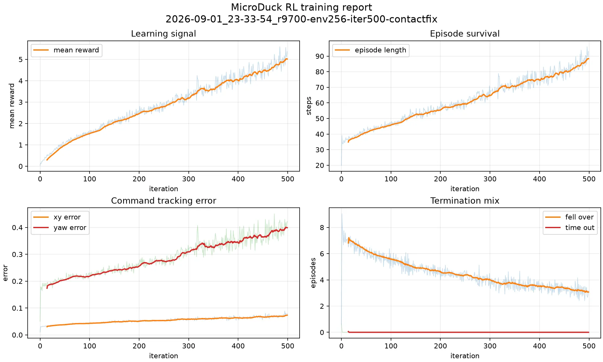
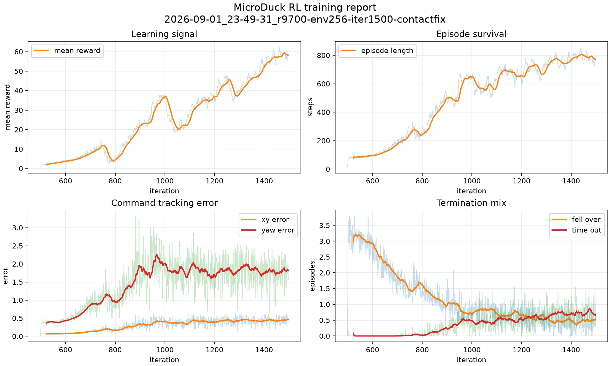
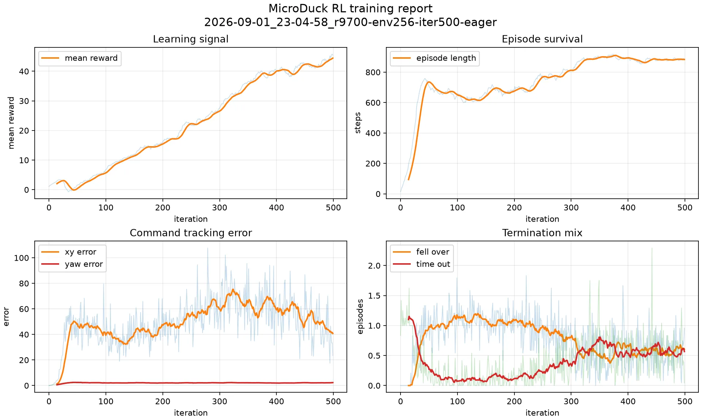

# MicroDuck RL｜AMD ROCm

本章是 [MicroDuck CUDA 教程](/docs/practices/humanoid/microduck-rl)的 AMD 独立版本。代码完整放在 `codes/practices/amd/microduck-rl/`，使用自己的 `.venv-rocm`、ROCm 源码树和训练日志，不与 CUDA 的 `uv.lock` 混装。

:::caution[实验后端]
ROCm Warp 与 MuJoCo Warp 仍是实验分支。这里在 Radeon AI PRO R9700（`gfx1201`）上修复并验证了本任务需要的路径，但这不是 AMD 对所有 Radeon / Instinct 型号的兼容承诺。升级源码 commit、ROCm 或 GPU 后必须重新跑动态接触检查。
:::

## 实测环境

| 组件 | 版本 |
| --- | --- |
| OS / Python | Ubuntu 24.04 / Python 3.12.3 |
| GPU | AMD Radeon AI PRO R9700，`gfx1201`，32 GiB |
| ROCm SDK | 7.2.4 |
| PyTorch | 2.9.1+rocm7.2.1 |
| NumPy | 1.26.4 |
| ROCm Warp | 1.13.0+rocm.0，commit `6530951` |
| ROCm MuJoCo Warp | 3.8.1，commit `9229bb9` |
| mjlab | 1.3.0 |

PyTorch wheel 来自 [AMD ROCm 官方安装说明](https://rocm.docs.amd.com/projects/radeon-ryzen/en/latest/docs/install/installrad/native_linux/install-pytorch.html)；物理后端使用 [`ROCm/warp`](https://github.com/ROCm/warp) 和 [`ROCm/mujoco_warp`](https://github.com/ROCm/mujoco_warp)。

## 安装

前置条件是 x86_64 Linux、Python 3.12、`uv`、`git`、`rocminfo` 和包含 `hipcc` 的完整 ROCm SDK。从仓库根目录执行：

```bash
cd codes/practices/amd/microduck-rl
./scripts/setup_rocm.sh
```

脚本会创建 `.venv-rocm` 与 `.rocm-src`，安装 AMD 官方 wheel，按检测到的第一个 `gfx` 目标编译两个 ROCm 源码分支，并依次检查 Torch HIP、Warp HIP、任务注册和动态接触。多卡或自动检测不正确时可显式传入：

```bash
HIP_VISIBLE_DEVICES=0 ./scripts/setup_rocm.sh gfx1201
```

不要执行 `uv sync`：本项目的 ROCm Warp 需要先运行 `build_lib.py`，不能由普通 PyPI 解析替代。

## 为什么需要三层兼容处理

| 问题 | 未处理时的表现 | 本目录处理 |
| --- | --- | --- |
| Warp 1.13 API 迁移 | mjlab 1.3 找不到 `warp.context` | 仅缺失时补兼容别名 |
| 嵌套 graph capture | stream 同步期间抛出 capture 错误；hipGraph 对照出现非有限状态 | HIP 默认 eager stepping，并关闭 mjlab 外层 capture |
| 静态 broadphase 缓存 | 首帧未接触的物体永远不进入候选对，机器人穿过地面 | 每个 HIP step 重新计算 broadphase，并在躯干低于地面时防御性终止 |

第三项最隐蔽。未修复时，训练可以正常输出 checkpoint，`nan_state` 也保持 0，但策略会利用“保持竖直并穿过地面”的漏洞获得很长 episode。只检查 reward 或退出码会得到错误结论。

安装脚本最后会运行一个 5 cm 半径落球的 200 step 回归。R9700 修复后结果为：

```text
ROCm dynamic contact check passed: final_z=0.049633, max_contacts=1
```

也可以单独复测：

```bash
HIP_VISIBLE_DEVICES=0 \
.venv-rocm/bin/python scripts/check_rocm_contacts.py --device cuda:0
```

## 有效 smoke train

先用 64 个并行环境跑 5 个 iteration：

```bash
HIP_VISIBLE_DEVICES=0 WANDB_MODE=offline \
.venv-rocm/bin/train Mjlab-Velocity-Flat-MicroDuck \
  --env.scene.num-envs 64 \
  --env.seed 42 \
  --agent.seed 42 \
  --agent.max-iterations 5
```

R9700 实测结果：

| 规模 | transitions | 最终吞吐 | `nan_state` | `fell_over` |
| --- | ---: | ---: | ---: | ---: |
| 64 env × 5 | 7,680 | 约 1,033 steps/s | 0 | 1.9583 |
| 256 env × 5 | 30,720 | 约 3,741 steps/s | 0 | 7.3333 |

修复后的吞吐低于错误缓存版本，因为 broadphase 必须随机器人运动重新计算。`fell_over` 恢复为非零也是正确现象：随机初始策略本来就应频繁跌倒。

## 固定 seed 长训

本次从零训练命令：

```bash
HIP_VISIBLE_DEVICES=0 WANDB_MODE=offline \
.venv-rocm/bin/train Mjlab-Velocity-Flat-MicroDuck \
  --env.scene.num-envs 256 \
  --env.seed 42 \
  --agent.seed 42 \
  --agent.max-iterations 500 \
  --agent.save-interval 100 \
  --agent.logger tensorboard \
  --agent.experiment-name velocity_rocm_contactfix \
  --agent.run-name r9700-env256-iter500-contactfix \
  --agent.upload-model False
```

本次从零训练结果：

| 指标 | 500 iteration 实测 |
| --- | ---: |
| transitions | 3,072,000 |
| TensorBoard 首尾 wall time | 803.0 秒 |
| mean reward | 0.0474 → 5.3664，最高 5.5925 |
| mean episode length | 20.00 → 93.06，最高 96.03 |
| 最终 / 最高吞吐 | 3,991 / 4,301 steps/s |
| `nan_state` | 500/500 轮均为 0 |



实际 mjlab/BAM、seed 42、`lin_vel_x=0.15` 的 200 帧回放得到：`done_count=0`、`min_trunk_z=0.1130 m`、`min_upright_proxy=0.9896`、`fell_like_fraction=0`。但 4 秒只前进 `0.0234 m`，平均前向速度 `0.0052 m/s`，平均绝对速度误差 `0.1450 m/s`。因此该 checkpoint 已学会站稳，尚未学会有效跟踪前进指令。

为继续学习步态，从 `model_499.pt` 再续训 1000 iteration（rsl_rl 的 resume 参数表示“额外迭代数”，最终总计 1500）：

```bash
HIP_VISIBLE_DEVICES=0 WANDB_MODE=offline \
.venv-rocm/bin/train Mjlab-Velocity-Flat-MicroDuck \
  --env.scene.num-envs 256 \
  --env.seed 42 \
  --agent.seed 42 \
  --agent.resume True \
  --agent.load-run 2026-09-01_23-33-54_r9700-env256-iter500-contactfix \
  --agent.load-checkpoint model_499.pt \
  --agent.max-iterations 1000 \
  --agent.save-interval 250 \
  --agent.logger tensorboard \
  --agent.experiment-name velocity_rocm_contactfix \
  --agent.run-name r9700-env256-iter1500-contactfix \
  --agent.upload-model False
```

续训从 iteration 499 编号到 1498；加上第一阶段的 500 次 update，实际累计完成 1500 次 PPO update。最终文件名是 `model_1498.pt`，不是少训练了一轮。

| 指标 | 1000 iteration 续训实测 |
| --- | ---: |
| 累计 transitions | 9,216,000（第一阶段 3,072,000 + 续训 6,144,000） |
| TensorBoard 首尾 wall time | 1412.2 秒；两阶段合计 2215.2 秒 |
| mean reward | 0.7702 → 59.0012，最高 62.2754 |
| mean episode length | 13.86 → 764.85，最高 856.74 |
| 最终 / 最高吞吐 | 5,275 / 5,517 steps/s |
| `nan_state` / `below_ground` | 1000/1000 轮均为 0 |

续训启动时 episode 统计重新积累，因此第一条 reward 和 episode length 低于上一阶段末值。曲线横轴沿用 checkpoint iteration 编号 499–1498：



训练 reward 和存活时长总体上升，但 curriculum 同时扩大了速度与偏航指令范围，所以训练分布上的 command error 也会上升。为避免把曲线分数误当成步态质量，我用实际 mjlab/BAM 环境、seed 42、固定 `lin_vel_x=0.15` 对保存的 checkpoint 各回放 200 帧：

| checkpoint | 4 秒位移 | 平均前向速度 | 平均绝对速度误差 | 最低躯干高度 | 最低竖直度 | termination |
| --- | ---: | ---: | ---: | ---: | ---: | ---: |
| `model_499.pt` | 0.0234 m | 0.0052 m/s | 0.1450 m/s | 0.1130 m | 0.9896 | 0 |
| `model_750.pt` | **0.3251 m** | **0.0799 m/s** | **0.0784 m/s** | 0.1046 m | 0.9842 | 0 |
| `model_1000.pt` | 0.2090 m | 0.0515 m/s | 0.1047 m/s | 0.1062 m | 0.9925 | 0 |
| `model_1250.pt` | 0.3015 m | 0.0750 m/s | 0.0936 m/s | 0.1118 m | 0.9891 | 0 |
| `model_1498.pt` | 0.1840 m | 0.0454 m/s | 0.1097 m/s | 0.1114 m | 0.9924 | 0 |

在这组固定验收条件下，`model_750.pt` 是抽样 checkpoint 中的最佳策略；它已产生连续前进步态，但平均速度仍只有目标的约 53%，不能称为完全收敛。最终 checkpoint 保持稳定，却不是速度跟踪最优点，这正是保存中间 checkpoint 并做真实回放的原因。

下面是 `model_750.pt` 的同一段 4 秒回放，也可下载 [MP4](./figs/microduck-amd-r9700-model750.mp4)：


训练产物保留在 `logs/rsl_rl/velocity_rocm_contactfix/`，不提交 checkpoint 或 TensorBoard 日志。发布 checkpoint 前必须同时检查训练指标与实际环境回放，不能仅凭 reward 宣称稳定步态。

## 被丢弃的错误实验

在发现 broadphase 缓存问题前，曾完成 256 env × 500 iteration、307.2 万 transitions 的运行；mean reward 从 1.0781 上升到 45.4360，episode length 达到 886.71，`nan_state=0`。



这组结果已经作废。继续到约 iteration 1000 时，实际 mjlab/BAM 回放的躯干高度降到 `-78.45 m`，说明机器人穿过地面自由落体；修复接触后回放同一 checkpoint，4 秒内出现 2 次 termination。它只能作为“为什么必须做物理回归”的反例，不能用于性能、收敛或步态结论。

## 测试与验收

```bash
.venv-rocm/bin/python -m pytest tests/ -q
.venv-rocm/bin/python -m ruff check \
  src/mjlab_microduck/__init__.py \
  src/mjlab_microduck/tasks/microduck_velocity_env_cfg.py \
  src/mjlab_microduck/train_cli.py \
  scripts/check_rocm_contacts.py \
  scripts/render_mjlab_checkpoint.py \
  tests/test_rocm_compat.py \
  tests/test_rocm_dynamic_contacts.py \
  tests/test_rocm_velocity_guard.py
```

当前 AMD 环境实测为 `152 passed`。Ruff 只检查本 AMD 版本新增和修改的文件；复制自上游的历史风格问题未纳入此次迁移。

验收长训时使用训练环境本身，而不是只用简化 CPU position-actuator 回放：

```bash
MUJOCO_GL=egl PYOPENGL_PLATFORM=egl \
.venv-rocm/bin/python scripts/render_mjlab_checkpoint.py \
  Mjlab-Velocity-Flat-MicroDuck \
  --checkpoint logs/rsl_rl/velocity_rocm_contactfix/<run>/<checkpoint>.pt \
  --mp4 logs/rsl_rl/velocity_rocm_contactfix/<run>/checkpoint.mp4 \
  --frames 200 --lin-vel-x 0.15 --device cuda:0 --seed 42
```

至少记录 `done_count`、`min_trunk_z_m`、`min_upright_proxy` 和 `fell_like_fraction`。固定单一命令 4 秒无 termination 也只属于教程展示级验收，不代表多 seed、rough terrain 或真机安全。
