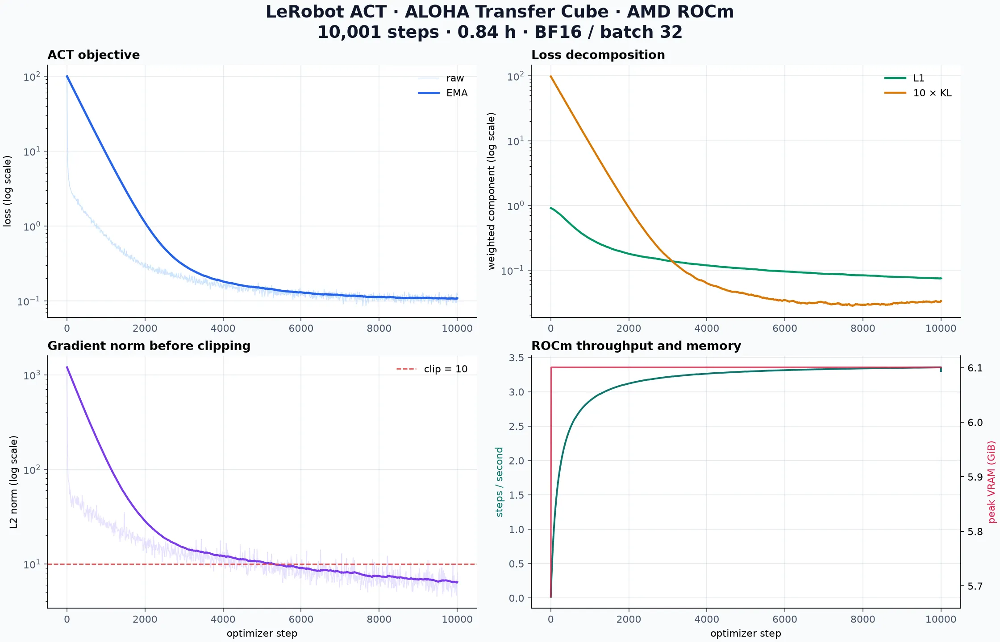
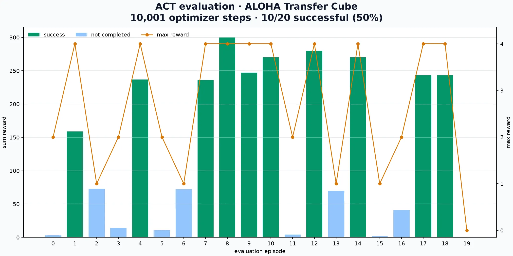
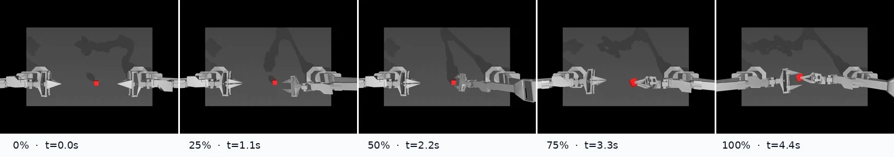

# AMD ROCm 上训练 ACT：10k 步完成 ALOHA 双臂交接

本教程在单张 **AMD Radeon AI PRO R9700** 上，使用 PyTorch 2.10 + ROCm 7.0 和
LeRobot 0.6.1 训练 ACT（Action Chunking with Transformers）。10,001-step
checkpoint 在 20 个 MuJoCo 闭环回合中成功 10 次，实测成功率为 **50%**，达到本次
实验的停止条件。


上图是从固定种子评测中自动选出的最快成功回合：222 帧、50 FPS、4.44 秒，最高
reward 为 4。对应的 [H.264 MP4 视频](./figs/act_rocm_10k_success.mp4) 可以单独下载。

:::info[NVIDIA 版本]

如果使用 NVIDIA GPU，请阅读 [RTX 4080 SUPER 上的 50k 训练教程](/docs/practices/vla/act)。
两页使用相同数据集和任务，但训练步数、batch size、学习率与实现细节不同。
:::

## 你将完成什么

这次实验走通一条完整的 AMD 机器人模仿学习链路：

1. 安装只包含 ROCm wheel 的隔离环境；
2. 从 Hugging Face 下载 50 个 ALOHA 人类示教 episode；
3. 用 ACT 同时预测未来 100 帧，也就是 2 秒动作块；
4. 使用 BF16 在 AMD GPU 上训练 CVAE + Transformer；
5. 保存 CSV 指标、模型、处理器和可恢复训练状态；
6. 在 MuJoCo 中执行 20 个固定种子闭环回合；
7. 自动生成训练曲线、评测图、MP4、GIF 和关键帧。

ACT 不接收语言指令，因此更准确地说，它是一条连续动作模仿学习基线，而不是通用
语言条件 VLA。它仍然很适合用来理解 VLA 动作头、action chunking 与机器人数据管线。

## 实验结果

本页数据来自一次真实本机训练和评测，不是预填示例：

| 项目 | 实测结果 |
| --- | ---: |
| GPU | AMD Radeon AI PRO R9700，32 GiB |
| PyTorch / HIP | 2.10.0+rocm7.0 / 7.0.51831 |
| 数据 | 50 episodes / 20,000 frames / 50Hz |
| 训练步数 | 10,001 optimizer steps |
| Batch size | 32 |
| 动作块长度 | 100 frames |
| 混合精度 | bfloat16 autocast |
| 训练用时 | 3,028 秒，约 50 分 28 秒 |
| 稳定吞吐 | 约 3.35 step/s，107 sample/s |
| PyTorch 峰值分配显存 | 6.10 GiB |
| 最终 / 最低 loss | 0.1214 / 0.0860 |
| 20 回合成功率 | **10/20，50%** |
| 平均最大 reward | 2.7 / 4.0 |
| 平均累计 reward | 138.75 |

与 NVIDIA 页面的结果并列如下。由于超参数和实现不同，这张表用于选择教程入口，不是
严格的硬件 benchmark：

| 教程 | AMD R9700 | NVIDIA RTX 4080 SUPER |
| --- | ---: | ---: |
| 训练步数 | 10,001 | 50,000 |
| Batch size | 32 | 8 |
| 学习率 | 2e-5 | 1e-5 |
| 训练用时 | 50 分 28 秒 | 39 分 14 秒 |
| 20 回合成功率 | 50% | 50% |

## 项目文件

训练代码位于：

```text
codes/practices/amd/vla/act/
├── train_act.py
├── plot_training.py
├── make_eval_artifacts.py
├── pyproject.toml
├── uv.lock
└── README.md
```

核心脚本是 [`train_act.py`](../../../../codes/practices/amd/vla/act/train_act.py)。
它保留了数据特征推导、动作时间窗、预处理、前向/反向传播和 checkpoint 保存过程，
同时增加 AMD GPU 强制检查、BF16、CSV 指标和断点续训。

## 1. 准备 ROCm 环境

目标环境是 Linux x86_64、Python 3.12/3.13、可访问 `/dev/kfd`，并已安装兼容 GPU
的 AMD 驱动。从仓库根目录进入实验目录：

```bash
cd codes/practices/amd/vla/act
uv sync --frozen
```

依赖锁定为：

- `lerobot[aloha,training]==0.6.1`；
- `torch==2.10.0+rocm7.0`；
- `torchvision==0.25.0+rocm7.0`；
- `triton-rocm==3.6.0`；
- TorchCodec 0.10.0 和 Matplotlib。

检查 ROCm 与 GPU：

```bash
uv run python - <<'PY'
import torch

print("PyTorch:", torch.__version__)
print("HIP:", torch.version.hip)
print("GPU available:", torch.cuda.is_available())
print("GPU:", torch.cuda.get_device_name(0))
PY
```

PyTorch 的 ROCm 后端沿用 `torch.cuda` API，因此日志中的 `cuda:0` 在本页仍然表示
AMD GPU，并不代表安装了 NVIDIA CUDA。训练脚本会检查 HIP wheel、可见设备和一次
真实张量计算，失败时直接退出，不会静默回退 CPU。

### TorchCodec 与 FFmpeg

最快配置使用 TorchCodec 解码训练视频，它需要系统中存在完整 FFmpeg shared
libraries。Ubuntu 24.04 可以安装：

```bash
sudo apt update
sudo apt install ffmpeg
uv run python -c "import torchcodec; print(torchcodec.__version__)"
```

如果机器上不能安装系统 FFmpeg，可把训练命令中的 `--video-backend torchcodec`
改为 `--video-backend pyav`。训练逻辑不变，但视频解码会稍慢。

## 2. 先跑一个 step

第一次运行需要下载数据。先只加载第 0 个 episode：

```bash
uv run python train_act.py \
  --episodes 0 \
  --steps 1 \
  --batch-size 2 \
  --precision bf16 \
  --output-dir outputs/act_smoke_rocm
```

这个命令依次验证数据下载、视频解码、LeRobot processor、ROCm 前后向和 checkpoint
保存。一个 step 不会学会任务，成功标准只是正常生成输出并以退出码 0 结束。

## 3. 理解训练配置

脚本从数据集元数据自动得到：

```text
inputs:  observation.images.top, observation.state
outputs: action
```

每个样本包含一路 480×640 顶视 RGB、14 维双臂状态和 14 维动作。`chunk_size=100`
在 50Hz 数据上对应未来 2 秒。CVAE 潜变量吸收示教中的多模态性，优化目标为 L1 动作
重构损失加上 10 倍 KL 损失。

本次实测使用 2e-5 学习率、1e-4 weight decay 和 L2 norm 10.0 梯度裁剪。BF16 通过
`torch.autocast` 启用，而 LeRobot 配置中的 `use_amp` 保持关闭，以避开 0.6.1 对
`cuda:0` 字符串判断不完整的问题。

## 4. 正式训练到 10k

下面是本页结果对应的完整命令：

```bash
uv run python train_act.py \
  --steps 10001 \
  --batch-size 32 \
  --chunk-size 100 \
  --num-workers 4 \
  --video-backend torchcodec \
  --precision bf16 \
  --learning-rate 2e-5 \
  --log-every 250 \
  --metrics-every 10 \
  --save-every 5000 \
  --output-dir outputs/act_aloha_transfer_rocm_full
```

输出目录包含：

```text
outputs/act_aloha_transfer_rocm_full/
├── model.safetensors
├── config.json
├── policy_preprocessor.json
├── policy_postprocessor.json
├── training_metrics.csv
├── training_run.json
├── training_summary.json
└── training_state.pt
```

`training_state.pt` 保存模型、优化器、当前 step 和随机数状态，可以真正续训。
`model.safetensors` 与前后处理器则组成可直接交给 `lerobot-eval` 的策略目录。

## 5. 阅读训练曲线



这次运行有几个清晰阶段：

- 初始总 loss 为 99.21，KL 项和梯度范数在前几百步快速下降；
- 约 4k steps 后进入缓慢下降区间；
- 10,001 steps 的最终 loss 为 0.1214，最低记录值为 0.0860；
- 后 20% 日志点的吞吐中位数为 3.349 step/s；
- 峰值显存稳定在 6.10 GiB。

图中的梯度范数是裁剪前数值。早期高于 10 并不表示优化器真的按该幅度更新。训练
loss 只衡量示教分布上的动作拟合，checkpoint 的最终选择仍需依靠闭环 rollout。

## 6. 中断后继续训练

滚动断点默认位于输出目录的 `training_state.pt`。例如从 10k 继续到 20k：

```bash
uv run python train_act.py \
  --steps 20000 \
  --batch-size 32 \
  --chunk-size 100 \
  --num-workers 4 \
  --video-backend torchcodec \
  --precision bf16 \
  --learning-rate 2e-5 \
  --save-every 5000 \
  --resume \
  --output-dir outputs/act_aloha_transfer_rocm_full
```

`--steps` 表示恢复后的总目标，不是额外训练量。恢复时脚本同时还原优化器和随机数状态，
并继续追加训练指标。

## 7. MuJoCo 闭环评测

无显示器的 Linux 主机使用 EGL。正式报告用 20 个固定种子、4 个同步向量环境：

```bash
MUJOCO_GL=egl uv run lerobot-eval \
  --policy.path=outputs/act_aloha_transfer_rocm_full \
  --env.type=aloha \
  --env.task=AlohaTransferCube-v0 \
  --eval.n_episodes=20 \
  --eval.batch_size=4 \
  --eval.use_async_envs=false \
  --output_dir=outputs/eval_act_aloha_transfer_rocm_10k \
  --seed=1000
```

LeRobot 0.6.1 的异步 worker 可能丢失 `gym_aloha` 注册表，出现
`Namespace gym_aloha not found`。这里显式关闭异步环境，4 个环境仍会组成一个
batch 送入 GPU。也可以使用 `--eval.batch_size=1` 顺序评估。

实测汇总：

```text
avg_sum_reward: 138.75
avg_max_reward: 2.70
pc_success:     50.0
n_episodes:     20
eval_s:         185.0
```

reward 4 表示完成右臂抓取、抬起并交给左臂的完整流程。20 回合中 10 次成功，不能
只靠一个“看起来不错”的视频下结论。



## 8. 生成教程素材

训练和评测完成后运行：

```bash
uv run python plot_training.py
uv run python make_eval_artifacts.py
```

`plot_training.py` 从 CSV 生成 WebP 四联曲线。`make_eval_artifacts.py` 读取
`eval_info.json`，从已录制的成功回合中自动选择完成时间最短的样例，并输出：

- H.264 MP4；
- 480px 宽的循环 GIF；
- 五帧动作过程图；
- 20 回合 reward / success 图；
- 机器可读 JSON 摘要。



这样选择 demo 不依赖人工挑选画面。原始 MP4 体积更小且画质更好，GIF 则适合在
Markdown 页面中直接预览。

## 9. 为什么这版能较快达到可用效果

1. **BF16**：R9700 的 BF16 路径比本机 FP32 实测更快，10k 过程保持稳定收敛。
2. **batch 32**：把样本吞吐提高到约 107 sample/s，PyTorch 峰值显存仍只有 6.1 GiB。
3. **TorchCodec + 4 个持久 worker**：减少解码开销和数据 epoch 之间的 worker 重建。
4. **以 rollout 为停止条件**：10k 已达到 20 回合 50% 的教程验收线，因此保留断点并
   停止，而不是机械跑满 100k。

## 常见问题

### 日志显示 `cuda:0`，是不是装错了 CUDA

不是。ROCm 版 PyTorch 为兼容上层生态沿用 `torch.cuda` API。确认 `torch.version.hip`
非空、PyTorch 版本包含 `+rocm`，并检查设备名称是 AMD GPU 即可。

### loss 很低，为什么某些回合仍失败

行为克隆的训练 loss 衡量示教分布上的拟合，而 rollout 会积累闭环误差。本次失败回合
的最高 reward 分布在 0、1、2，说明策略可能在接近、抓取或移交的不同阶段偏离。应
固定评测协议并报告多回合成功率。

### 是否应该继续到 50k

取决于目标。50% 已足够展示完整教学闭环；若需要更高成功率，可以从
`training_state.pt` 继续到 15k、20k 或更高，并始终用同一组 20 个种子比较 checkpoint。

## 小结

这次实验建立了 AMD ROCm 上的完整闭环：

```text
示教数据 → ACT BF16 训练 → CSV/曲线 → 可恢复 checkpoint
       → MuJoCo 20 回合评测 → 成功率 + MP4/GIF
```

10,001-step checkpoint 已能完成 ALOHA 方块抓取、抬起与双臂交接，同时 50% 成功率
也清楚显示了行为克隆的闭环误差。下一步可以比较 temporal ensembling、更多示教数据、
不同 chunk size，或继续训练后保持相同种子复测。
