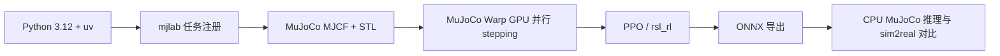

# MicroDuck RL：双足机器人 GPU 仿真

本项目把一个真实的双足机器人强化学习工程接进教程：MicroDuck 约 800 g、约 25 cm 高，使用 14 个 Dynamixel XL330 舵机。策略在 MuJoCo Warp 中并行训练，通过 ONNX 导出后才能进入后续 sim2real 流程。

:::tip[项目状态：已跑通最小闭环]
当前项目已在 NVIDIA RTX 3050 Laptop 4 GiB、Driver 535.309.01（系统报告 CUDA 12.2）上完成依赖安装、任务注册、GPU stepping 和 5 iteration smoke train。兼容分支将 x86_64 Linux 的 Torch 固定为 `2.7.1+cu126`，无需升级宿主机驱动。
:::

:::info[本章范围]
本章只要求创建独立环境并完成 64 个并行环境、5 个 iteration 的 GPU smoke test。完整步态训练、W&B checkpoint 管理和真机部署属于后续扩展。
:::

## 你会学到什么

- 为什么双足机器人训练需要 GPU 并行环境，而不是只在单个 MuJoCo 窗口里调参；
- 如何把 MJCF 机器人、BAM 执行器模型、观测、奖励和 PPO runner 注册成 mjlab 任务；
- 如何用 smoke test 提前发现 CUDA、显存、任务注册、观测维度和 NaN 问题；
- 为什么导出 ONNX 时必须保留训练期的观测归一化。

## 项目背景与岗位映射

MicroDuck 是一个小型、低成本的双足平台，适合把“机器人模型 → 并行仿真 → 强化学习 → 部署接口”串成可展示的项目。它的价值不在于用几行代码调用 PPO，而在于把执行器非线性、接触动力学、观测布局、奖励项和部署约束放进同一条可回归的工程链路。

| 项目环节 | 工程能力 | 可迁移到岗位的关键词 |
| --- | --- | --- |
| MJCF / STL 资产 | 机器人结构、碰撞和初始姿态检查 | 机器人建模、仿真资产 |
| BAM 执行器 | 电机力矩、摩擦和饱和近似 | 执行器建模、sim2real |
| mjlab + MuJoCo Warp | GPU 并行 stepping 和任务管理 | Isaac Lab / mjlab / GPU 仿真 |
| PPO + 61D observation | 观测、奖励、domain randomization | locomotion RL、训练稳定性 |
| ONNX 导出 | 固化 normalizer 和推理接口 | 部署、边缘推理、模型交付 |

## 系统链路



## 环境位置

代码位于仓库的 `codes/practices/humanoid/microduck-rl/`，这是一个独立的 `uv` 项目，不要和 CS123 四足课程共用虚拟环境。两者的 MuJoCo、RL 框架和 CUDA 依赖版本不同。

```bash
cd codes/practices/humanoid/microduck-rl
UV_HTTP_TIMEOUT=600 uv sync --locked
```

首次同步会下载 Torch、CUDA runtime、Warp、mjlab 和 MuJoCo 等大型 wheel。安装过程较慢是正常现象；磁盘和网络缓存应提前预留空间。

兼容当前 Driver 535 的分支使用以下组合：

| 组件 | x86_64 Linux 实测值 |
| --- | --- |
| Python | 3.12.13 |
| Torch | 2.7.1+cu126 |
| Torch CUDA runtime | 12.6 |
| Warp | 1.12.0 |
| mjlab / MuJoCo Warp | 1.3.0 / 3.8.1 |
| GPU | NVIDIA RTX 3050 Laptop 4 GiB |

## GPU smoke test

先确认 MicroDuck 任务已注册：

```bash
uv run list-envs | grep MicroDuck
```

然后运行最小训练：

```bash
uv run train Mjlab-Velocity-Flat-MicroDuck \
  --env.scene.num-envs 64 \
  --agent.max_iterations 5
```

如果没有 W&B API key，使用离线模式即可完成本地验证：

```bash
WANDB_MODE=offline uv run train Mjlab-Velocity-Flat-MicroDuck \
  --env.scene.num-envs 64 \
  --agent.max_iterations 5
```

验收时至少记录以下信息：

| 检查项 | 通过标准 |
| --- | --- |
| CUDA 初始化 | Torch / Warp 找到 GPU，无 driver 初始化错误 |
| 环境构建 | 任务注册成功，MJCF 和网格资产加载成功 |
| stepping | 5 个 iteration 正常结束 |
| 数值稳定性 | 无 NaN / Inf，观测维度保持 61D |
| 资源 | 显存没有持续溢出，记录每轮耗时 |

Smoke test 通过只说明“训练管线能跑”，不代表策略已经学会走路。完整训练前需要逐步增加 `num-envs`，并观察显存、吞吐和 episode reward。

### 实测结果

以下结果来自兼容分支 `feat/microduck-rl-cuda122`（commit `6904111`），复测时间为 2026-08-31：

| 检查项 | 实测结果 |
| --- | --- |
| 任务注册 | `list-envs` 找到 `Mjlab-Velocity-Flat-MicroDuck` |
| Torch CUDA | `cuda_available=True`，识别 RTX 3050，CUDA 张量求和 `1024.0` |
| Warp CUDA | 初始化成功，识别 `cuda:0` / `sm_86` |
| GPU stepping | 64 个并行环境，设备 `cuda:0` |
| 训练迭代 | 5/5 完成，累计 7,680 steps，退出码 `0` |
| 每轮耗时 | 4.40s、4.21s、3.85s、4.03s、4.23s |
| 数值检查 | 无 NaN、Inf、OOM 或 CUDA error |
| 产物 | `model_4.pt`（约 4.7 MiB）和 ONNX（约 776 KiB） |

首次启动会看到 `CUDA Graphs disabled: driver 12.2 < 12.4`。这是预期的兼容性降级：MuJoCo Warp 关闭 CUDA Graphs，但普通 GPU stepping 和训练迭代仍可运行。

### Demo：播放 checkpoint 或 ONNX

Smoke checkpoint 可以用于验证“训练产物能被 viewer 加载”。在有桌面显示会话的开发机上执行：

```bash
RUN_DIR="$(find logs/rsl_rl/velocity -mindepth 1 -maxdepth 1 -type d -printf '%T@ %p\n' | sort -nr | head -1 | cut -d' ' -f2-)"
uv run play Mjlab-Velocity-Flat-MicroDuck \
  --checkpoint-file "$RUN_DIR/model_4.pt" \
  --num-envs 1
```

如果只想验证部署侧 ONNX 接口，可以运行：

```bash
RUN_DIR="$(find logs/rsl_rl/velocity -mindepth 1 -maxdepth 1 -type d -printf '%T@ %p\n' | sort -nr | head -1 | cut -d' ' -f2-)"
uv run scripts/infer_policy.py \
  --walking "$RUN_DIR/$(basename "$RUN_DIR").onnx" \
  --new-cmd-obs
```

这两个 demo 的定位是“加载、推理和仿真链路验证”。5 iteration checkpoint 训练步数很少，不能把 viewer 中的动作当作已经收敛的行走策略；要展示稳定步态，需要更长训练并固定 checkpoint 来源。训练产生的 `.pt`、ONNX 和 W&B offline run 默认留在本地，不提交到教程仓库，以避免二进制和实验日志膨胀。

### 回归测试

项目还提供 CPU 可运行的配置不变量、奖励函数和 NaN 防护测试：

```bash
uv run --with pytest pytest tests/ -q
```

兼容分支最近一次结果为 `154 passed, 1 skipped`；跳过项是仅针对 linux-aarch64 + GPU 的实机检查。单元测试不替代 GPU smoke train，二者分别覆盖“逻辑回归”和“运行时闭环”。

## 当前开发机注意事项

当前开发机是 RTX 3050 Laptop 4 GiB，Driver 535.309.01，系统报告 CUDA 12.2。兼容分支已将 x86_64 Torch 调整为 CUDA 12.6 用户态组件；如果在其他机器上出现 `insufficient driver`、Warp 初始化失败或显存不足，应把错误原文记录下来，不要直接修改任务奖励。CUDA Graphs 被禁用属于已知限制，不等同于 GPU smoke 失败。

没有 checkpoint 时不能直接运行训练结果播放；应先完成 smoke test，或在后续记录中补充公开 checkpoint / ONNX 的来源。

## 代码实战与练习

1. 把 `--env.scene.num-envs` 从 64 调到 128，比较每轮耗时和显存变化。
2. 找到 [`microduck_velocity_env_cfg.py`](https://github.com/datawhalechina/dive-into-embodied-ai/blob/master/codes/practices/humanoid/microduck-rl/src/mjlab_microduck/tasks/microduck_velocity_env_cfg.py)，标出观测、奖励、命令和 domain randomization 的入口。
3. 运行 `pytest` 后，任选一个失败断言，说明它保护的是哪一个 sim2real 或部署不变量。
4. 解释为什么训练完成后要通过 `scripts/export.py` 导出 ONNX，而不是手动把 `.pt` checkpoint 转成推理模型。

## 项目交付与面试追问

简历可以这样描述：

> 基于 MuJoCo Warp / mjlab 搭建 MicroDuck 双足机器人 GPU 强化学习环境，完成 MJCF 资产、BAM 执行器、61D 观测、奖励与 domain randomization 注册；在 Driver 535 机器上通过 Torch cu126 兼容分支完成 64 环境 PPO smoke train，并导出 ONNX 推理模型。

面试中建议准备以下追问：

- 为什么 Torch cu130 在 Driver 535 上初始化失败，而 cu126 可以工作？
- CUDA Graphs 被禁用后，哪些能力仍然可验证，哪些性能结论不能直接外推？
- 为什么 actor 是 61D 而 critic 是 76D？哪些信息只能给 critic？
- 为什么 ONNX 必须携带训练期 observation normalizer？
- 5 iteration smoke train 与完整 locomotion 收敛之间还缺哪些实验？

## 上游与许可证

本集成基于 [pollen-robotics/microduck_rl](https://github.com/pollen-robotics/microduck_rl) 的 `develop` 分支 commit `d424a0c`。代码保留 Apache-2.0 许可证；3D 模型文件按上游说明使用 CC BY-SA-NC。完整源项目说明保存在代码目录的 `UPSTREAM_README.md`。
