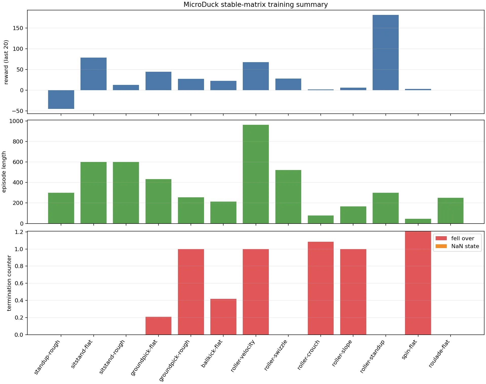

# MicroDuck RL：让小黄鸭学会走路、起身和翻滚

先看结果，再拆训练过程。



这张图展示能从 TensorBoard 汇总出的训练指标；18 个模式的最终 checkpoint 和回放状态，以后面的结果表为准。

这不是一段手工编排的动作序列。上面的每个 checkpoint 都经过 PPO 训练，再由同一个离屏评估脚本回放成视频。小黄鸭在仿真里可以走路、从地上站起来、捡东西、踢球，也可以切换到轮式底盘滑行。

:::tip[这次实验做到哪一步了]

- **18/18 个任务**完成独立训练，并生成了可加载的 checkpoint；
- **18/18 个任务**完成 200 帧离屏回放，回放结果和统计文件保存在 `logs/mode_matrix_stable/`；
- 重点动作已经整理成 GIF 和 MP4，下面可以直接播放；
- 这里的“稳定”指固定命令、单环境、约 4 秒的仿真回放通过，不等同于多 seed 鲁棒性，更不等同于真机安全验证。

:::

## 先看小黄鸭会什么

### 走路：Velocity

速度跟踪是最基础、也最能看出训练质量的模式。策略接收期望速度，输出 14 个舵机的目标位置，小黄鸭需要一边保持身体直立，一边把实际速度跟上命令。


[下载 Velocity MP4](./figs/microduck-velocity-flat.mp4) · [粗糙地面版本](./figs/microduck-velocity-rough.gif)

### 起身：StandUp / Roller StandUp

起身不是“把关节角度插值一遍”这么简单。机器人要先利用身体和脚的接触找到支撑，再把重心抬回可站立区域。滚轮版的起身还要处理被动轮和更窄的支撑面。


[下载 StandUp MP4](./figs/microduck-standup-flat.mp4)


[下载 Roller StandUp MP4](./figs/microduck-roller-standup.mp4)

### 做事：GroundPick / BallKick

这两个任务比单纯走路更像“机器人动作”：它要在完成目标的同时保持身体不要失稳。GroundPick 需要靠近并降低头部，BallKick 则需要把踢球动作和支撑脚的稳定性配合起来。


[下载 GroundPick MP4](./figs/microduck-groundpick-flat.mp4)


[下载 BallKick MP4](./figs/microduck-ballkick-flat.mp4)

### 玩起来：Spin / Roulade

Spin 是原地旋转，Roulade 是翻滚。它们的目标不是“走得更远”，所以会使用不同的命令和奖励配方；沿用走路策略的权重，通常只会得到一个很别扭的局部最优。


[下载 Spin MP4](./figs/microduck-spin-flat.mp4)


[下载 Roulade MP4](./figs/microduck-roulade-flat.mp4)

## 这个项目到底在做什么

MicroDuck 是 Pollen Robotics 的小型双足机器人，约 800 g、约 25 cm 高，腿部和身体使用 Dynamixel XL330 舵机。它的体型很小，但训练链路并不小：需要把 3D 资产、执行器特性、接触动力学、观测、奖励和部署接口放到同一个可复现工程里。

这也是它适合放进 Dive into 教程的原因：读者可以从一个很具体的“小黄鸭”出发，看清楚强化学习机器人项目中每一层是怎么接起来的。

| 层次 | 在 MicroDuck 里对应什么 |
| --- | --- |
| 机器人模型 | MJCF、STL 网格、关节限位和碰撞几何 |
| 执行器 | BAM（电机力矩、摩擦、饱和等非理想因素的近似） |
| 仿真 | MuJoCo + MuJoCo Warp，多个环境并行 stepping |
| 学习算法 | PPO / rsl_rl |
| 策略接口 | 61D actor observation → 14D 舵机动作 |
| 交付形式 | PyTorch checkpoint、ONNX 推理模型、离屏回放 |

## 训练不是拿视频当真值

视频是训练后的**结果展示**，不是训练标签。每个仿真步里，环境知道机器人当前的姿态、速度、接触和命令；策略根据观测输出动作，物理引擎推进一小步，然后环境给出奖励和是否结束的信号。


每个模式都是一条独立的 PPO 训练任务。共享的是机器人模型、观测和动作接口；最终网络权重不共享。这样做的原因很实际：走路希望持续跟踪速度，起身希望完成一个阶段动作，踢球希望在短时间内产生冲击，翻滚则允许身体主动接触地面，它们的目标并不相同。

### 奖励函数怎么把动作“塑形”出来

奖励不是一句“做得像人就加分”，而是几类可测量的量加起来。不同任务会删减或调整其中一些项。

| 奖励 / 终止信号 | 直观含义 | 典型用途 |
| --- | --- | --- |
| 速度或方向跟踪 | 实际速度接近期望命令 | Velocity、滚轮速度 |
| 姿态与站立高度 | 身体保持可控姿态，不塌腰、不钻地 | 走路、起身 |
| 目标动作进度 | 头部下探、回到站立位、球的位移等 | GroundPick、BallKick、StandUp |
| 足端接触与步态 | 交替支撑、抬脚、落脚更自然 | 双足行走 |
| 动作变化与力矩 | 少抖动、少用不必要的力 | 几乎所有任务 |
| `fell_over` / `nan_state` | 跌倒或数值异常，直接结束 episode | 安全边界与数值保护 |

例如速度模式里，策略不能只“躺着不动”：躺着可能让某些姿态项变好，但速度跟踪、存活时间、足端接触和跌倒终止会一起把这个投机解压下去。滚轮模式则会换成 `wheel_speed`、`heading_hold` 等更适合轮式运动的项。

## 从 smoke test 到正式训练

### 开发机和兼容性

本次正式训练使用 `dev1-docker` 上的 8 张 RTX 4090。宿主机 Driver 535.98，系统报告 CUDA 12.2；没有升级驱动，而是使用 CUDA 12.6 的用户态 Torch wheel。

| 组件 | 本次使用版本 |
| --- | --- |
| Python | 3.12.13 |
| PyTorch | 2.7.1 + cu126 |
| Warp | 1.12.0 |
| mjlab | 1.3.0 |
| MuJoCo Warp | 3.8.1 |
| GPU | 8 × NVIDIA RTX 4090，单卡约 24.6 GiB |

Driver 535 下会看到 `CUDA Graphs disabled`。这意味着少了一项性能优化，不意味着 CUDA stepping 或 PPO 训练不可用。要迁移到其他机器，先跑 smoke test，不要直接照搬吞吐和训练时间。

### 第一步：5 个 iteration 的闭环检查

```bash
cd codes/practices/humanoid/microduck-rl
UV_HTTP_TIMEOUT=600 uv sync --locked

uv run list-envs | grep MicroDuck

WANDB_MODE=offline uv run train Mjlab-Velocity-Flat-MicroDuck \
  --env.scene.num-envs 64 \
  --env.seed 42 \
  --agent.seed 42 \
  --agent.max-iterations 5
```

这个阶段只看四件事：任务能否注册、MJCF 和网格能否加载、GPU 是否能正常 stepping、是否出现 NaN / Inf / OOM。5 个 iteration 的 checkpoint 只能证明管线通了，不能拿来宣传“学会走路”。

### 第二步：分阶段训练 18 个任务

训练脚本把任务串行跑，先从 smoke checkpoint 续训，再按每个任务的目标轮数继续训练。串行是为了控制单卡显存和日志数量；并不是 18 个模式共享一个 PPO 网络。

```bash
cd codes/practices/humanoid/microduck-rl
./scripts/train_stable_matrix_stage1.sh
./scripts/train_stable_matrix_stage2.sh
```

训练完成后生成回放和汇总图：

```bash
./scripts/evaluate_stable_matrix.sh
uv run python scripts/summarize_training_matrix.py
```

最后一步会使用实际 mjlab 环境读取每个任务的 checkpoint，固定命令渲染 200 帧，并记录 `done_count`、躯干最低高度和直立度代理指标。教程里嵌入的 GIF/MP4 都来自这一步，不是从训练日志里截一段画面。

## 训练结果：18 个模式各自有一份策略

下表里的“轮数”是最终 checkpoint 的 iteration；“回放”表示该 checkpoint 已经被离屏脚本加载并生成视频。`ok` 是工程验收状态，不代表在所有随机地形、所有速度和真机上都稳定。

| 模式 | 任务 ID | checkpoint | 回放 |
| --- | --- | ---: | :---: |
| 平地走路 | `Velocity-Flat` | 3000 | ✅ |
| 粗糙地面走路 | `Velocity-Rough` | 3000 | ✅ |
| 平地速度 + 起立 | `VelStand-Flat` | 2500 | ✅ |
| 粗糙地面速度 + 起立 | `VelStand-Rough` | 2500 | ✅ |
| 平地起身 | `StandUp-Flat` | 4000 | ✅ |
| 粗糙地面起身 | `StandUp-Rough` | 4000 | ✅ |
| 平地坐下 / 起立 | `SitStand-Flat` | 2500 | ✅ |
| 粗糙地面坐下 / 起立 | `SitStand-Rough` | 2500 | ✅ |
| 平地拾取 | `GroundPick-Flat` | 2000 | ✅ |
| 粗糙地面拾取 | `GroundPick-Rough` | 2000 | ✅ |
| 平地踢球 | `BallKick-Flat` | 1500 | ✅ |
| 轮式速度 | `Roller-Velocity` | 5000 | ✅ |
| 轮式转向 / Swizzle | `Roller-Swizzle` | 3000 | ✅ |
| 轮式蹲伏 | `Roller-Crouch` | 1500 | ✅ |
| 轮式坡面 | `Roller-Slope` | 1500 | ✅ |
| 轮式起身 | `Roller-StandUp` | 4000 | ✅ |
| 原地旋转 | `Spin` | 3000 | ✅ |
| 翻滚 | `Roulade` | 6000 | ✅ |

完整素材都在本页的 `figs/` 目录。想快速浏览时，优先看上面的 7 个重点动作；想逐个检查时，可以直接下载对应 MP4：

<details>
<summary>展开完整回放索引</summary>

| 模式 | GIF | MP4 |
| --- | --- | --- |
| Velocity Flat | [播放](./figs/microduck-velocity-flat.gif) | [下载](./figs/microduck-velocity-flat.mp4) |
| Velocity Rough | [播放](./figs/microduck-velocity-rough.gif) | [下载](./figs/microduck-velocity-rough.mp4) |
| VelStand Flat / Rough | [Flat](./figs/microduck-velstand-flat.gif) · [Rough](./figs/microduck-velstand-rough.gif) | [Flat](./figs/microduck-velstand-flat.mp4) · [Rough](./figs/microduck-velstand-rough.mp4) |
| StandUp Flat / Rough | [Flat](./figs/microduck-standup-flat.gif) · [Rough](./figs/microduck-standup-rough.gif) | [Flat](./figs/microduck-standup-flat.mp4) · [Rough](./figs/microduck-standup-rough.mp4) |
| SitStand Flat / Rough | [Flat](./figs/microduck-sitstand-flat.gif) · [Rough](./figs/microduck-sitstand-rough.gif) | [Flat](./figs/microduck-sitstand-flat.mp4) · [Rough](./figs/microduck-sitstand-rough.mp4) |
| GroundPick Flat / Rough | [Flat](./figs/microduck-groundpick-flat.gif) · [Rough](./figs/microduck-groundpick-rough.gif) | [Flat](./figs/microduck-groundpick-flat.mp4) · [Rough](./figs/microduck-groundpick-rough.mp4) |
| BallKick | [播放](./figs/microduck-ballkick-flat.gif) | [下载](./figs/microduck-ballkick-flat.mp4) |
| Roller Velocity | [播放](./figs/microduck-roller-velocity.gif) | [下载](./figs/microduck-roller-velocity.mp4) |
| Roller Swizzle | [播放](./figs/microduck-roller-swizzle.gif) | [下载](./figs/microduck-roller-swizzle.mp4) |
| Roller Crouch | [播放](./figs/microduck-roller-crouch.gif) | [下载](./figs/microduck-roller-crouch.mp4) |
| Roller Slope | [播放](./figs/microduck-roller-slope.gif) | [下载](./figs/microduck-roller-slope.mp4) |
| Roller StandUp | [播放](./figs/microduck-roller-standup.gif) | [下载](./figs/microduck-roller-standup.mp4) |
| Spin | [播放](./figs/microduck-spin-flat.gif) | [下载](./figs/microduck-spin-flat.mp4) |
| Roulade | [播放](./figs/microduck-roulade-flat.gif) | [下载](./figs/microduck-roulade-flat.mp4) |

</details>

## 如何自己播放一个 checkpoint

有桌面显示会话时，可以直接打开 viewer：

```bash
cd codes/practices/humanoid/microduck-rl
uv run play Mjlab-Velocity-Flat-MicroDuck \
  --checkpoint-file logs/rsl_rl/mode_matrix_stable/<run>/model_3000.pt \
  --num-envs 1
```

没有 `DISPLAY` 时，用同一套 mjlab 环境离屏渲染：

```bash
MUJOCO_GL=egl PYOPENGL_PLATFORM=egl \
uv run python scripts/render_mjlab_checkpoint.py \
  Mjlab-Velocity-Flat-MicroDuck \
  --checkpoint logs/rsl_rl/mode_matrix_stable/<run>/model_3000.pt \
  --mp4 /tmp/microduck-velocity.mp4 \
  --gif /tmp/microduck-velocity.gif \
  --frames 200 --lin-vel-x 0.15
```

训练日志、checkpoint 和 W&B offline run 不放进教程仓库；页面只保留精选的演示素材和复现脚本。这样仓库不会被几十 GB 的实验中间文件拖慢，读者也能清楚地区分“代码”“模型”和“展示结果”。

## 这次迁移改了什么

原项目是一个面向研究和真机实验的工程，直接放进教程会有两个问题：读者不知道先看什么，训练结果也容易被误读成“只要跑通命令就能稳定走路”。这次集成主要做了几件事：

1. 保留上游的 MJCF、BAM、任务注册和训练脚本，不把核心逻辑改写成玩具环境；
2. 增加 CUDA 12.2 / Driver 535 的兼容组合，使用 Torch cu126 用户态 runtime，避免要求升级宿主机驱动；
3. 修复滚轮起立任务的 articulated joint → servo joint 索引映射，补上 CPU 配置和奖励回归测试；
4. 增加两阶段训练、离屏评估、回放统计和跨模式汇总图；
5. 把教程叙事改成“先看视频，再看训练闭环，最后自己跑”，同时明确仿真候选策略与真机稳定性之间的边界。

## 继续玩：从小黄鸭迁移到二次元娃娃

如果要把项目做成一个会走、会做动作、还能和人互动的二次元娃娃，建议按下面的顺序迁移，而不是一开始就换掉全部模型：

1. **先换外观**：保留 MicroDuck 的腿部自由度和控制接口，只替换头部、外壳和材质，确认质量、碰撞和质心没有被破坏；
2. **再换身体比例**：重新标定关节限位、质量、惯量、脚底尺寸和执行器力矩上限；
3. **重新做动作库**：走路、起身、挥手、鞠躬、转身等动作分别定义命令与奖励，继续采用“一种技能一份策略”的方式；
4. **最后接感知和交互**：把视觉目标、语音或高层行为树作为命令生成器，不要把摄像头像素直接塞进第一版 locomotion 策略；
5. **sim2real 小步落地**：先低速、吊绳或保护架测试，再做地面摩擦、舵机延迟、编码器偏置和电池电压的校准。

这条路线的商业价值也比较清晰：同一套仿真和训练基础设施可以服务于教育套件、展厅互动机器人、IP 角色玩具和小型服务机器人；真正需要重新训练的，通常是身体比例、执行器和动作目标，而不是从零重写整套工具链。

## 练习题

- 把 Velocity 的 `--lin-vel-x` 从 `0.15` 改成 `-0.1`，观察后退时的步态是否仍然稳定；
- 在 `microduck_velocity_env_cfg.py` 中找到 `pose`、`upright`、`action_rate_l2`，解释每一项防止了哪种投机动作；
- 给 GroundPick 增加一个“目标没有被抬起就不算完成”的终止或奖励项，再跑一次短训练；
- 比较同一个 checkpoint 的 viewer 回放和 `render_mjlab_checkpoint.py` 回放，确认二者使用的是同一套观测和执行器链路。

## 代码和上游

- 教程代码：[codes/practices/humanoid/microduck-rl（仓库网页）](https://github.com/datawhalechina/dive-into-embodied-ai/tree/master/codes/practices/humanoid/microduck-rl)
- 上游项目：[pollen-robotics/microduck_rl](https://github.com/pollen-robotics/microduck_rl)
- 上游版本：`develop` 分支，commit `d424a0c`
- 许可证：代码 Apache-2.0；3D 模型按上游说明使用 CC BY-SA-NC

最后提醒一次：页面上的 GIF 是训练后 checkpoint 的固定场景回放，适合演示和教程复现；要把策略装上真实机器人，还需要多 seed、更多地形和速度范围、硬件限位、低速保护以及 sim2real 验证。
