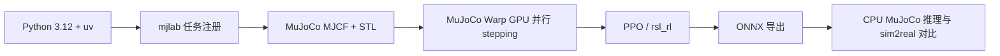

# MicroDuck RL：双足机器人 GPU 仿真

本项目把一个真实的双足机器人强化学习工程接进教程：MicroDuck 约 800 g、约 25 cm 高，使用 14 个 Dynamixel XL330 舵机。策略在 MuJoCo Warp 中并行训练，通过 ONNX 导出后才能进入后续 sim2real 流程。

:::info[本章范围]
本章只要求创建独立环境并完成 64 个并行环境、5 个 iteration 的 GPU smoke test。完整步态训练、W&B checkpoint 管理和真机部署属于后续扩展。
:::

## 你会学到什么

- 为什么双足机器人训练需要 GPU 并行环境，而不是只在单个 MuJoCo 窗口里调参；
- 如何把 MJCF 机器人、BAM 执行器模型、观测、奖励和 PPO runner 注册成 mjlab 任务；
- 如何用 smoke test 提前发现 CUDA、显存、任务注册、观测维度和 NaN 问题；
- 为什么导出 ONNX 时必须保留训练期的观测归一化。

## 系统链路



## 环境位置

代码位于仓库的 `codes/practices/humanoid/microduck-rl/`，这是一个独立的 `uv` 项目，不要和 CS123 四足课程共用虚拟环境。两者的 MuJoCo、RL 框架和 CUDA 依赖版本不同。

```bash
cd codes/practices/humanoid/microduck-rl
UV_HTTP_TIMEOUT=600 uv sync --locked
```

首次同步会下载 Torch、CUDA runtime、Warp、mjlab 和 MuJoCo 等大型 wheel。安装过程较慢是正常现象；磁盘和网络缓存应提前预留空间。

## GPU smoke test

先确认 MicroDuck 任务已注册：

```bash
uv run list-envs | grep MicroDuck
```

然后运行最小训练：

```bash
uv run train Mjlab-Velocity-Flat-MicroDuck \
  --env.scene.num-envs 64 \
  --agent.max_iterations 5
```

验收时至少记录以下信息：

| 检查项 | 通过标准 |
| --- | --- |
| CUDA 初始化 | Torch / Warp 找到 GPU，无 driver 初始化错误 |
| 环境构建 | 任务注册成功，MJCF 和网格资产加载成功 |
| stepping | 5 个 iteration 正常结束 |
| 数值稳定性 | 无 NaN / Inf，观测维度保持 61D |
| 资源 | 显存没有持续溢出，记录每轮耗时 |

Smoke test 通过只说明“训练管线能跑”，不代表策略已经学会走路。完整训练前需要逐步增加 `num-envs`，并观察显存、吞吐和 episode reward。

## 当前开发机注意事项

当前开发机是 RTX 3050 Laptop 4 GiB，Driver 535.309.01，系统报告 CUDA 12.2。上游锁文件使用 CUDA 12.8 系列组件，因此如果出现 `insufficient driver`、Warp 初始化失败或显存不足，应把错误原文记录下来，不要直接修改任务奖励。

没有 checkpoint 时不能直接运行训练结果播放；应先完成 smoke test，或在后续记录中补充公开 checkpoint / ONNX 的来源。

## 练习

1. 把 `--env.scene.num-envs` 从 64 调到 128，比较每轮耗时和显存变化。
2. 找到 `src/mjlab_microduck/tasks/microduck_velocity_env_cfg.py`，标出观测、奖励、命令和 domain randomization 的入口。
3. 解释为什么训练完成后要通过 `scripts/export.py` 导出 ONNX，而不是手动把 `.pt` checkpoint 转成推理模型。

## 上游与许可证

本集成基于 [pollen-robotics/microduck_rl](https://github.com/pollen-robotics/microduck_rl) 的 `develop` 分支 commit `d424a0c`。代码保留 Apache-2.0 许可证；3D 模型文件按上游说明使用 CC BY-SA-NC。完整源项目说明保存在代码目录的 `UPSTREAM_README.md`。
