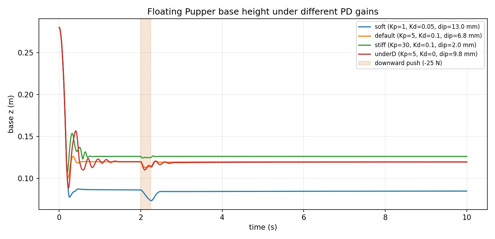
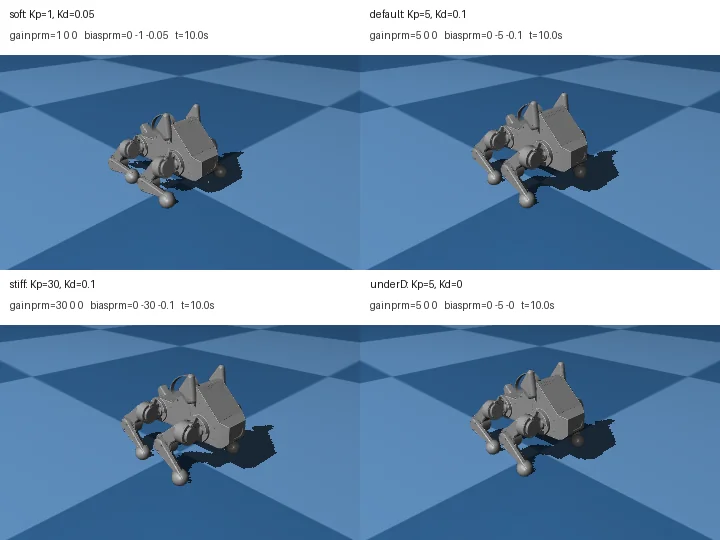

import Figure from '@site/src/components/Figure';

# 4. 搭建四足机器人

本章我们开始在 MuJoCo 里搭建四足机器人 Pupper v3 的 MJCF 模型，并理解它的结构组成和相关参数。

## 本章目标

- 说清楚 Pupper v3 的运动学结构：1 个 `base_link` + 4 条对称的 3-DoF 腿，共 12 个驱动关节
- 在 [pupper_v3_fixed.xml](https://github.com/datawhalechina/dive-into-embodied-ai/blob/master/codes/practices/quadruped/cs123/4.quadruped-mjcf/models/pupper_v3_fixed.xml) 里把 MJCF 两层结构（worldbody 内 5 元素 + 外部并列块，详见 [§3.1 MJCF 元素一览](/docs/foundations/simulation/mjcf-element)）一一指认出来
- 用 [view_pupper_v3_fixed.py](https://github.com/datawhalechina/dive-into-embodied-ai/blob/master/codes/practices/quadruped/cs123/4.quadruped-mjcf/view_pupper_v3_fixed.py) 在本机跑通 viewer，看到机器人摆出 `home` keyframe 的姿态
- 理解 `<general biastype="affine">` 是怎么把 Kp/Kd 内嵌进 actuator 的，能改 `gainprm` / `biasprm` 看刚度变化
- 知道 fixed 模型与 floating 模型的唯一差别就是 `<freejoint/>`，并能在 floating 模型上让它"站住"

## 前置阅读

- 第 1 章 [执行器与 PD 控制](/docs/practices/quadruped/cs123/pid-control)
- 第 2 章 [正运动学](/docs/practices/quadruped/cs123/forward-kinematics)
- 第 3 章 [逆运动学](/docs/practices/quadruped/cs123/inverse-kinematics)
- [仿真与可视化 · MuJoCo 快速上手](/docs/foundations/simulation/mujoco)
- [仿真与可视化 · MJCF 元素一览](/docs/foundations/simulation/mjcf-element)
- [配套代码](https://github.com/datawhalechina/dive-into-embodied-ai/tree/master/codes/practices/quadruped/cs123/4.quadruped-mjcf)

## 4.1 Pupper 结构

Pupper v3 的骨架主要包括一个机身（`torso`）和四条结构对称的腿，每条腿是一条 3 段嵌套的串联链，从髋部往下数三个转动关节（HAA / HFE / KFE），如[图 1](#fig-overall-structure) 所示：

<Figure
  id="fig-overall-structure"
  src={require('./figs/quadruped-overall-structure.webp').default}
  caption="Pupper v3 总体结构：1 个机身 + 4 条结构对称的腿，单腿 3 关节（HAA / HFE / KFE）"
  width={800}
/>

每条腿三个关节，从髋部到足端依次是：

| 缩写 | 关节名 | 旋转轴方向 | 直观作用 |
| --- | --- | --- | --- |
| HAA | hip abduction/adduction | 沿身体前后向（roll 轴） | 把腿往身体外掰 / 往内收 |
| HFE | hip flexion/extension | 沿身体左右向（pitch 轴） | 抬腿前后摆 |
| KFE | knee flexion/extension | 同 HFE 平行 | 弯小腿、调节足端高度 |

四条腿按"前左 / 前右 / 后左 / 后右"通常缩写成 **FL / FR / RL / RR**。机器人在仿真里通常以 floating base 的方式建模——机身有 6 个**被动**自由度（位置 3 + 朝向 3），再加上四条腿各 3 个驱动关节，总自由度如式 $\eqref{eq:dof-total}$ 所示：

$$
\begin{equation}\label{eq:dof-total}
\underbrace{6}_{\text{torso 浮动 base}} + \underbrace{4 \times 3}_{\text{12 个驱动关节}} = 18 \text{ DoF}
\end{equation}
$$

> **被动 base 的含义**：机器人不能自己飞，机身这 6 个自由度没有 actuator，完全靠四条腿与地面接触间接受力。这点在写 PD 控制时要小心：`data.qpos` 前几维是 base 状态，不要当成关节角去 P 控制（[§4.5](/docs/practices/quadruped/cs123/quadruped-mjcf#45-让-pupper-站起来) 会展开具体索引）。

## 4.2 搭建 Pupper 仿真模型

[pupper_v3_fixed.xml](https://github.com/datawhalechina/dive-into-embodied-ai/blob/master/codes/practices/quadruped/cs123/4.quadruped-mjcf/models/pupper_v3_fixed.xml) 在 `<mujoco>` 根节点下并列挂着几个顶层模块：

```text
<mujoco>
  ├── <compiler>   编译选项: 弧度制, mesh 搜索目录
  ├── <option>     物理求解参数: 摩擦锥, impratio
  ├── <asset>      STL mesh 和纹理的注册表
  ├── <default>    joint / geom / actuator 的模板参数
  ├── <sensor>     IMU 等虚拟传感器
  ├── <actuator>   12 路位置伺服, ctrl 顺序在这里定
  ├── <keyframe>   存档姿态, mj_resetDataKeyframe 一键恢复
  └── <worldbody>  物理树: base_link + 4 条腿, 每条 3 段
```

`<worldbody>` 是物理骨架本体（[§4.2.2](/docs/practices/quadruped/cs123/quadruped-mjcf#422-搭运动学树)），`<asset>` / `<default>` / `<actuator>` / `<keyframe>` / `<sensor>` 分别承担资源注册（[§4.2.3](/docs/practices/quadruped/cs123/quadruped-mjcf#423-加载-mesh)）、默认参数（[§4.2.4](/docs/practices/quadruped/cs123/quadruped-mjcf#424-设置默认值)）、电机接口（[§4.2.5](/docs/practices/quadruped/cs123/quadruped-mjcf#425-装位置伺服)）、初始姿态（[§4.2.6](/docs/practices/quadruped/cs123/quadruped-mjcf#426-录初始姿态)）、传感器读数（[§4.2.7](/docs/practices/quadruped/cs123/quadruped-mjcf#427-读-imu)）；`<compiler>` 和 `<option>` 是编译与求解器选项，通常按默认值即可。

### 4.2.1 fixed 与 floating

打开配套代码目录，能看到本章准备了两份 MJCF：

- [pupper_v3_fixed.xml](https://github.com/datawhalechina/dive-into-embodied-ai/blob/master/codes/practices/quadruped/cs123/4.quadruped-mjcf/models/pupper_v3_fixed.xml)：把 `base_link` 焊在世界里，只留 12 个关节，方便先把腿单独调通。
- [pupper_v3_floating.xml](https://github.com/datawhalechina/dive-into-embodied-ai/blob/master/codes/practices/quadruped/cs123/4.quadruped-mjcf/models/pupper_v3_floating.xml)：在 `base_link` 上加一行 `<freejoint name="world_to_body"/>`，机身有 6 个被动 DoF，会受重力作用。

两者真正的差异只有这一行 freejoint，自由度总数因此不同：

$$
\text{fixed: } 4\times3 = 12\,\text{DoF}\qquad
\text{floating: } \underbrace{6}_{\text{base freejoint}} + \underbrace{4\times3}_{12\,\text{关节}} = 18\,\text{DoF}
$$

先用 fixed 这份把每一块搭通——少了 freejoint 干扰，问题二分起来更直接；fixed 站得稳了再补 freejoint 改 floating（[§4.4](/docs/practices/quadruped/cs123/quadruped-mjcf#44-加-freejoint-改-floating)）。

**关节命名规则**（"位置 + 编号"）和限位：

| §4.1 关节 | 命名（按右腿） | 直观作用 | fixed.xml 限位（rad） |
| --- | --- | --- | --- |
| 第 1 轴（HAA） | `leg_<front\|back>_r_1` | 髋外展/内收 | `[-1.22, 2.51]`（左腿镜像 `[-2.51, 1.22]`） |
| 第 2 轴（HFE） | `leg_<front\|back>_r_2` | 髋俯仰 | `[-0.42, 3.14]`（左腿镜像 `[-3.14, 0.42]`） |
| 第 3 轴（KFE） | `leg_<front\|back>_r_3` | 膝关节 | `[-2.79, 0.71]`（左腿镜像 `[-0.71, 2.79]`） |

四条腿对应 `front_r / front_l / back_r / back_l`，actuator 块里 12 个驱动器也是这个顺序——后面写 PD / RL 时，12 维数组一律按它对齐。整棵运动学树长这样：

```
                   base_link  (fixed | freejoint)
         ┌──────────┬─────────┴──────────┬──────────┐
   front_r_1   front_l_1            back_r_1    back_l_1   ← HAA
        │           │                   │           │
   front_r_2   front_l_2            back_r_2    back_l_2   ← HFE
        │           │                   │           │
   front_r_3   front_l_3            back_r_3    back_l_3   ← KFE
        │           │                   │           │
   foot_site   foot_site            foot_site   foot_site
```

每条腿末端挂 `leg_<...>_3_foot_site`——读足端位置 / 做 IK / 检测触地都靠它；机身上额外挂 `body_imu_site`，[§4.2.7](/docs/practices/quadruped/cs123/quadruped-mjcf#427-读-imu) 的 sensor 块就是从这里读 IMU。

### 4.2.2 搭运动学树

骨架放在 `<worldbody>` 里。这里最容易卡住的一点是：MJCF 不像 URDF 那样写一堆 `parent` / `child`，它更直接，**谁写在谁里面，谁就是谁的子节点**。所以读 MJCF 的时候，不要一上来盯着数字看，先看缩进。

把 `<body>` 暂时理解成"一段刚体 + 一个局部坐标系"，这段代码的骨架大概就是这样：

```text
worldbody
└── base_link                 机身，fixed 版本里固定在世界坐标中
    └── leg_front_r_1         前右腿第 1 段，对应 HAA
        └── leg_front_r_2     前右腿第 2 段，对应 HFE
            └── leg_front_r_3 前右腿第 3 段，对应 KFE
                └── foot_site 足端标记点
```

下面这段截自 fixed.xml 的"机身 + 前右腿髋部"。它刚好把 [§3.1.2](/docs/foundations/simulation/mjcf-element#312-worldbody-内5-个搭骨架的元素) 里那 5 个元素串在了一起：

```xml
<worldbody>
  <body name="base_link" pos="0 0 0.13">
    <inertial pos="0.025 0 0.015" mass="1.506"
              diaginertia="0.00854 0.0085 0.00236"/>
    <geom type="box" size="0.045 0.064 0.130" class="collision"/>
    <geom type="mesh" mesh="BodyV4v70_001" group="1"
          contype="0" conaffinity="0"/>

    <body name="leg_front_r_1" pos="0.075 -0.0835 0"
          quat="0.707105 0.707108 0 0">
      <inertial pos="0 0 0" mass="0.18"
                diaginertia="7.4e-5 5.8e-5 4.8e-5"/>
      <joint name="leg_front_r_1" axis="0 0 1" range="-1.22 2.51"/>
      <geom type="mesh" mesh="LegAssemblyForFlangedv26_001"
            group="1" contype="0" conaffinity="0"/>
      <!-- ... 嵌套 leg_front_r_2 / leg_front_r_3, 末端挂 <site name="..._foot_site"/> ... -->
    </body>
  </body>
</worldbody>
```

这段 XML 真正要读的东西不多。

`base_link` 是机身。`pos="0 0 0.13"` 表示它在世界坐标系里离地 `0.13 m`。fixed 模型里没有 `<freejoint/>`，所以这个机身会固定在这里，不会像 floating 模型那样受重力掉下来。

`leg_front_r_1` 写在 `base_link` 里面，所以它是机身的子 body。`pos="0.075 -0.0835 0"` 是髋部安装点：`x` 为正，说明在机身前面；`y` 为负，说明在右侧。后面三条腿也是同一个套路，只是把这个根位置镜像到左边或后面。

`joint` 写在 `leg_front_r_1` 里面，意思也很直接：这段 body 可以相对父 body 转动。`range="-1.22 2.51"` 是关节限位，单位是弧度。`inertial` 则是这段腿的质量和惯量；仿真里它转起来轻不轻、受力后加速快不快，都跟这里有关。`geom` 负责形状，不过 Pupper 这里把"看起来的形状"和"碰撞用的形状"拆开了，后面马上说。

真正容易读错的是 `axis`。`axis="0 0 1"` 不是世界坐标系的 Z 轴，而是**当前 body 局部坐标系**里的 Z 轴。偏偏 `leg_front_r_1` 上还有一个 `quat="0.707105 0.707108 0 0"`，它会先把这个局部坐标系转一下，再让 joint 绕局部 Z 轴转。所以判断关节到底朝哪个方向转，不能只看 `axis`，还得把 body 上的 `quat` 一起看。

套到前右腿上，可以这么想：

```text
base_link 坐标系
  └─ pos 把髋部平移到机身右前方
     └─ quat 先旋转髋部局部坐标系
        └─ joint axis="0 0 1" 在这个旋过的局部坐标系里定义转轴
```

#### quat 单独拆一下

`quat` 是 quaternion（四元数）的缩写，用来描述**这段 body 的局部坐标系相对父 body 转了多少**。它不是关节角，也不会被电机控制；模型加载时它就固定在那里，相当于装配机器人时先把这段零件拧到某个朝向。

MuJoCo 里的 `quat` 顺序是 `(w, x, y, z)`。如果暂时不想背四元数，可以只记这个读法：

$$
q = (w, x, y, z)
  = \left(\cos\frac{\theta}{2},\; u_x\sin\frac{\theta}{2},\; u_y\sin\frac{\theta}{2},\; u_z\sin\frac{\theta}{2}\right)
$$

这里 $\theta$ 是旋转角度，$u=(u_x,u_y,u_z)$ 是绕哪根轴转。比如：

```xml
quat="0.707105 0.707108 0 0"
```

这四个数基本就是 `(0.7071, 0.7071, 0, 0)`，也就是：

```text
w ≈ cos(45°)
x ≈ sin(45°)
y = 0
z = 0
```

所以它表示"绕 X 轴转 90°"。为什么是 90°？因为四元数里存的是半角，`45° × 2 = 90°`。

<Figure
  id="fig-mjcf-quat-axis"
  src={require('./figs/mjcf-quat-axis.svg').default}
  caption="pos 先把 body 挂到父坐标系里的某个位置，quat 再把 body 的局部坐标系转过去；axis=0 0 1 说的是旋转后的局部 Z 轴，不是世界 Z 轴。"
  width={1000}
/>

这也是为什么 fixed.xml 里很多 joint 都写 `axis="0 0 1"`，但实际看起来并不是都绕同一个方向转：它们所在 body 的 `quat` 不一样，局部 Z 轴已经被提前摆到不同方向了。

Pupper 这份模型有几处实现细节，读代码时顺手记住就行：

- 12 个关节都是 `hinge`，也就是单轴转动。每个 `<joint>` 里只写 `axis` 和 `range`，`armature` / `damping` / `frictionloss` 这些通用参数放到 [§4.2.4](/docs/practices/quadruped/cs123/quadruped-mjcf#424-设置默认值) 的 `<default>` 里统一兜底。
- 精细 STL mesh 只负责渲染，不参与碰撞，所以会看到 `contype="0" conaffinity="0" group="1"`。真正做碰撞的是另一套简化几何体：机身用 `box`，大腿用 `cylinder`，足端用 `sphere`。这样仿真快很多，足端 sphere 也能给接触检测一个稳定的点。
- `<inertial>` 不是装饰项。这里的质量和惯量来自 CAD，`1.506 + 4×(0.18 + 0.186 + 0.05) ≈ 3.17 kg`，和实物量级能对上。以后如果改了腿长、换了 mesh，却忘了同步改惯量，仿真出来的动作就会明显不对劲。
- 12 个关节的 `axis` 都写成 `0 0 1`，不是因为它们真的都绕世界 Z 轴转，而是靠各级 body 的 `quat` 把局部坐标系提前转好了。看着某个关节方向不对时，先回头查这段 body 以及祖先 body 的 `quat`，不要只盯着 `axis`。

所以读一条腿时，顺序很朴素：先看 body 嵌套，知道谁连着谁；再看 `pos` / `quat`，知道这段东西挂在哪里、坐标系有没有转过；然后看 joint，知道它怎么动；最后再管 `geom` 和 `inertial`。四条腿是**完全对称**的，看懂前右这一条就够了，剩下三条只是把根 body 的 `pos` 镜像到 `(±x, ±y, 0)`，并把关节限位左右翻一下。

### 4.2.3 加载 mesh

**mesh**（网格）就是用一堆三角面片拼出来的 3D 外壳，常见文件格式是 `.stl` / `.obj`。Pupper 的机身、髋部、大腿、小腿这些精细外观，都不是靠 box / cylinder 手搓出来的，而是直接加载 CAD 导出的 STL。

但在 MJCF 里，STL 文件不能直接塞进 `<worldbody>`。它要走一条引用链：

```text
STL 文件
  └─ <compiler meshdir="..."> 告诉 MuJoCo 去哪个目录找
     └─ <asset><mesh name="..." file="..."/> 给 STL 起一个模型内的名字
        └─ <geom type="mesh" mesh="..."/> 把这个 mesh 真正挂到某个 body 上
```

所以看到 `<geom type="mesh" mesh="BodyV4v70_001"/>` 时，要反着查：它不是在找 `BodyV4v70_001` 这个文件，而是在找 `<asset>` 里叫 `BodyV4v70_001` 的 mesh；再由那个 `<mesh>` 去指向真正的 `BodyV4v70_001.stl`。

fixed.xml 里相关配置大概是这样：

```xml
<compiler angle="radian" meshdir="meshes/stl/" autolimits="true"/>

<asset>
  <texture type="skybox" builtin="gradient" .../>
  <texture name="grid" type="2d" builtin="checker" .../>
  <material name="grid" texture="grid" .../>

  <mesh name="BodyV4v70_001" file="BodyV4v70_001.stl"/>
  <mesh name="LegAssemblyForFlangedv26_001" file="LegAssemblyForFlangedv26_001.stl"/>
  <!-- 有些左右/前后对称零件会用 scale 做镜像或翻转 -->
  <mesh name="LegAssemblyForFlangedv26_010" file="LegAssemblyForFlangedv26_010.stl"
        scale="1 -1 1"/>
  <!-- ... 共 13 块 mesh ... -->
</asset>
```

然后在 `<worldbody>` 里引用它：

```xml
<body name="base_link" pos="0 0 0.13">
  <geom type="box" class="collision" .../>
  <geom type="mesh" mesh="BodyV4v70_001"
        group="1" contype="0" conaffinity="0" density="0"/>
</body>
```

这里有一个很重要的习惯：**mesh 通常只负责好看，不负责碰撞**。Pupper 里机身会同时挂两个 geom：一个简化的 `box` 做碰撞，一个精细的 `mesh` 做渲染。腿上也是类似，碰撞用 cylinder / sphere，视觉用 STL。原因很现实：STL 三角面太多，拿它做接触检测又慢又容易抖；简化几何体虽然不精细，但稳定很多。

几个参数顺手拆一下：

- `meshdir="meshes/stl/"`：STL 文件搜索目录。这个路径是相对 XML 文件解析的，所以从别的工作目录启动 viewer，一般也不会找错。
- `name="BodyV4v70_001"`：模型内部用的名字，后面的 `<geom mesh="...">` 引用它。
- `file="BodyV4v70_001.stl"`：真正的 STL 文件名，位于 `meshdir` 指定的目录下。
- `scale="1 -1 1"`：按 `(x, y, z)` 三个方向缩放。某一维写 `-1` 就是沿那一维镜像，左右腿这种对称结构经常这么处理。
- `group="1"`：viewer 里的显示分组。这里约定视觉 mesh 放在 group 1，简化碰撞体放在 group 3，调试时可以在 viewer 里分组开关。
- `contype="0" conaffinity="0"`：关闭碰撞。两个值都为 0 的 mesh 只显示，不和地面、腿、机身发生接触。
- `density="0"`：不要让这个视觉 mesh 再额外贡献质量。质量已经写在 `<inertial>` 里了，如果 mesh 又按密度算一遍，整机质量就会被重复算。

所以这小节最容易犯的错，不是 XML 语法，而是把"视觉模型"和"物理模型"混在一起。视觉上看见的是 STL，物理上参与碰撞和质量计算的，主要是 `class="collision"` 的简化 geom 加上 `<inertial>`。以后模型看起来没问题但一碰地就抖，优先查碰撞 geom；模型直接看不见，才去查 `meshdir` / `<asset><mesh>` / `<geom mesh="...">` 这条引用链。

### 4.2.4 设置默认值

`<default>` 可以先理解成"模板"。MJCF 里很多元素会重复出现：12 个 joint、很多个 geom、12 个 actuator。如果每个地方都手写一遍 `damping`、`forcerange`、碰撞参数，文件会又长又容易漏。`<default>` 就是把这些共性先写好，后面的元素没单独覆盖时，就自动继承这一份。

fixed.xml 里这段默认值主要管四类东西：

```xml
<default>
  <general forcerange="-3 3" forcelimited="true"
           biastype="affine"
           gainprm="5.0 0 0"
           biasprm="0 -5.0 -0.1"/>

  <!-- 默认 geom 不参与碰撞: 视觉网格走这条 -->
  <geom condim="6" contype="0" conaffinity="0"/>

  <!-- collision class: 显式写 class="collision" 才打开碰撞 -->
  <default class="collision">
    <geom group="3" contype="0" conaffinity="1"
          solimp="0.015 1 0.015"
          friction="0.8 0.02 0.01"/>
  </default>

  <!-- 关节默认: 带限位的 hinge + armature + 阻尼 + 摩擦损失 -->
  <joint armature="0.0016" type="hinge"
         damping="0.01" frictionloss="0.01"
         limited="true"/>
</default>

<option cone="elliptic" impratio="100"/>
```

可以按这个继承关系读：

```text
<default>
  <general .../>               -> 后面 12 个 actuator/general 都继承
  <geom contype="0" .../>      -> 普通 geom 默认不碰撞，视觉 mesh 走这条
  <default class="collision">  -> 只有 class="collision" 的 geom 走这条
  <joint .../>                 -> 后面 12 个 hinge joint 都继承
</default>
```

这里最反直觉的是 geom。它默认写成 `contype="0" conaffinity="0"`，意思是**普通 geom 先不参与碰撞**。所以视觉 mesh 什么都不用额外写，天然只显示不碰撞。真正要碰撞的 box / cylinder / sphere 会显式写 `class="collision"`，于是改走里面那份 `group="3" contype="0" conaffinity="1"`。这和上一节的思路对上了：视觉归视觉，碰撞归碰撞。

几个参数也别硬背，按作用分就行：

- `general forcerange="-3 3"`：位置伺服输出的力矩最多到 `±3 N·m`。控制器算出来再大，也会被夹住。
- `gainprm` / `biasprm`：给 `<general>` actuator 用，下一节会展开成 PD 公式。
- `joint type="hinge"`：后面没写 `type` 的 joint 都是单轴转动关节。
- `limited="true"`：关节限位生效，具体上下限来自每个 `<joint range="...">`。
- `armature="0.0016"`：给关节加一点等效转子惯量。没有它，理想关节太"轻"，PD 一拉容易抖。
- `damping="0.01"` / `frictionloss="0.01"`：一点阻尼和库仑摩擦，作用是把纯理想关节变得更像真实电机和传动。
- `friction="0.8 0.02 0.01"`：碰撞摩擦参数，三个数大致对应滑动、滚动/横向、自旋摩擦。这里主要影响脚和地面接触时滑不滑。
- `solimp="0.015 1 0.015"`：接触求解参数。可以先粗略理解成"接触别硬到一碰就炸"，后面真正调地面接触时再细看。
- `<option cone="elliptic" impratio="100"/>`：这不属于 default，而是全局求解器选项。腿足机器人接触多，打开椭圆摩擦锥、提高 `impratio`，接触通常会稳一些。

一句话概括：`<default>` 不是在创建新零件，它只是给后面那些 joint / geom / actuator 提前写好默认参数。

### 4.2.5 装位置伺服

`<joint>` 只说明"这个 body 能绕哪个轴动"，不等于它有电机。没有 `<actuator>` 的话，关节就是被动铰链，`data.ctrl` 的长度也会是 0，Python 里写控制量根本没地方写。

fixed.xml 里给 12 个关节各接了一个 `<general>` actuator：

```xml
<actuator>
  <general joint="leg_front_r_1" name="leg_front_r_1"/>
  <general joint="leg_front_r_2" name="leg_front_r_2"/>
  <general joint="leg_front_r_3" name="leg_front_r_3"/>

  <general joint="leg_front_l_1" name="leg_front_l_1"/>
  <!-- ... 共 12 个, 顺序: front_r / front_l / back_r / back_l -->
</actuator>
```

注意这 12 行本身很短，因为真正的参数都继承自上一节的 `<default><general>`。也就是说：

```text
<actuator><general joint="leg_front_r_1" .../>
  只负责说明：这一路电机接到哪个 joint 上

<default><general gainprm="..." biasprm="..." .../>
  负责说明：这一路电机按什么公式出力、力矩上限是多少
```

`<general>` 比 `<position>` / `<motor>` 更底层一点，但这里用它实现的就是位置伺服。MuJoCo 会按下面这个结构算力矩：

```text
force = gain * ctrl + bias(qpos, qvel)
```

`biastype="affine"` 表示 bias 是 `qpos` 和 `qvel` 的线性函数。把这里的参数代进去：

```xml
gainprm="5.0 0 0"
biasprm="0 -5.0 -0.1"
```

就得到：

$$
\tau = 5 \cdot u\;+\;0 + (-5)\,q + (-0.1)\,\dot q
\;=\;\underbrace{5}_{K_p}\bigl(u - q\bigr)\;-\;\underbrace{0.1}_{K_d}\,\dot q
$$

这里的 `u` 就是 `data.ctrl[i]`，也就是你写进去的目标关节角；`q` 是当前关节角；`\dot q` 是当前关节速度。所以这一路 actuator 的意思很直白：

```python
data.ctrl[i] = target_angle  # 目标关节角，单位 rad
```

然后 MuJoCo 内部自动算：

```text
关节还没到目标角 -> Kp 给它推过去
关节速度太快     -> Kd 给它刹一下
力矩超过 ±3      -> forcerange 把它截断
```

这里不要再在 Python 里手写一遍 `tau = Kp*(target-q) - Kd*qvel`，否则就变成"外面算 PD，里面又算一次 PD"，调参会很乱。[§4.6](/docs/practices/quadruped/cs123/quadruped-mjcf#46-调-gainprm-与-biasprm) 改的就是 `gainprm` / `biasprm`，等价于改这个内置 PD 的 `Kp` / `Kd`。

还有一个小细节：`ctrl` 的顺序跟 `<actuator>` 里的顺序一致，不是自动按名字排序。这里是：

```text
front_r_1, front_r_2, front_r_3,
front_l_1, front_l_2, front_l_3,
back_r_1,  back_r_2,  back_r_3,
back_l_1,  back_l_2,  back_l_3
```

后面写站立、步态、RL action 时，12 维数组都要按这个顺序对齐。

### 4.2.6 录初始姿态

`<keyframe>` 是一组"存档姿态"。它不会让机器人自己动，也不是动画轨迹；它只是把某一刻的 `qpos`、`ctrl` 等状态记下来，方便脚本一键恢复。

```xml
<keyframe>
  <key name="home" qpos="0 0 0 0 0 0 0 0 0 0 0 0"
                   ctrl="0 0 0 0 0 0 0 0 0 0 0 0"/>
</keyframe>
```

fixed 模型没有 floating base，所以 `qpos` 只有 12 维，正好对应 12 个关节角。这里全部写 0，意思是每个 hinge 都放在自己的零位。这个零位不一定等于你脑子里想象的"所有腿笔直向下"，因为 body 的 `quat` 和 STL 的装配方向已经提前定好了；但它是这份模型约定的 home 参考姿态。

`ctrl` 也写 0，意思是位置伺服的目标角也是 0。这样脚本调用：

```python
home_id = mujoco.mj_name2id(model, mujoco.mjtObj.mjOBJ_KEY, "home")
mujoco.mj_resetDataKeyframe(model, data, home_id)
mujoco.mj_forward(model, data)
```

之后，`qpos` 和 `ctrl` 是一致的，伺服不会一上来就产生一大股纠偏力矩。`mj_forward` 只负责把当前状态下的 body 位姿、site 位姿、传感器前向量算出来；它不推进时间。

floating 模型的 keyframe 会长一些：`qpos` 前 7 维是 base 位姿 `(x, y, z, qw, qx, qy, qz)`，后面才是 12 个关节角。注意这里又会遇到四元数：base 姿态也是 `(qw, qx, qy, qz)`，不是欧拉角。

`<keyframe>` 可以有很多个。比如后面调站立时，可以加一个 `<key name="crouch" qpos="..."/>`，脚本里按名字切过去：

```python
crouch_id = mujoco.mj_name2id(model, mujoco.mjtObj.mjOBJ_KEY, "crouch")
mujoco.mj_resetDataKeyframe(model, data, crouch_id)
```

调模型时这很省事，比每次在 Python 里手写一长串初始角要稳。

### 4.2.7 读 IMU

传感器要先有一个"挂点"。fixed.xml 在机身上放了一个 `site`：

```xml
<site name="body_imu_site" pos="0.09 0 0.032"/>
```

`site` 没质量，也不碰撞。它就是一个标记点：告诉 MuJoCo，IMU 大概装在机身的哪个位置、朝向跟哪个 body 走。后面的 `<sensor>` 块就引用这个 site：

```xml
<sensor>
  <framequat   name="body_quat" objtype="site" objname="body_imu_site"/>
  <gyro        name="body_gyro" site="body_imu_site"/>
  <accelerometer name="body_acc" site="body_imu_site"/>

  <framequat   objtype="site" objname="body_imu_site" name="orientation"/>
  <framepos    objtype="site" objname="body_imu_site" name="global_position"/>
  <framelinvel objtype="site" objname="body_imu_site" name="global_linvel"/>
  <frameangvel objtype="site" objname="body_imu_site" name="global_angvel"/>
</sensor>
```

这里有两类读数，别混在一起：

- `body_quat` / `orientation`：site 在世界坐标系里的朝向，都是四元数，4 维。这里两个名字读到的是同一个 site 的姿态，只是保留了两个别名，方便后面代码统一接口。
- `body_gyro`：site 的角速度，3 维，比较像真实 IMU 里的陀螺仪。
- `body_acc`：site 的加速度，3 维，比较像真实 IMU 里的加速度计。
- `global_position` / `global_linvel` / `global_angvel`：仿真器直接给的全局真值。真实机器人上通常拿不到这么干净的全局位置和速度，但调试控制器时很好用。

Python 里可以直接按名字读：

```python
quat = data.sensor("body_quat").data          # shape: (4,)
gyro = data.sensor("body_gyro").data          # shape: (3,)
vel  = data.sensor("global_linvel").data      # shape: (3,)
```

这里没有配置 `noise`，所以这些传感器读数是理想值，不是带噪声的实物 IMU。以后如果要做更接近真机的 sim2real，再给 sensor 加噪声、bias、延迟也不迟。本章先用干净读数，把模型和控制链路跑通。

到这里，`worldbody` 负责骨架和几何，外面的 `<compiler>` / `<asset>` / `<default>` / `<actuator>` / `<keyframe>` / `<sensor>` 负责资源、默认参数、电机、初始姿态和读数。fixed.xml 的主体就拼齐了。

## 4.3 在 viewer 中查看模型

### 4.3.1 安装环境

参考[codes/practices/quadruped/cs123/README.md](https://github.com/datawhalechina/dive-into-embodied-ai/blob/master/codes/practices/quadruped/cs123/README.md) 安装环境：

```bash
# 创建一个叫 mujoco 的 Conda 环境，并指定 Python 3.12
conda create -n mujoco python=3.12

# 进入刚创建的环境
conda activate mujoco

# 安装本课程 CS123 四足章节需要的依赖
pip install -r codes/practices/quadruped/cs123/requirements.txt
```

注意：MuJoCo 3.x 在 macOS 上跑交互式 viewer 必须用 `mjpython`，Linux / Windows 用 `python` 即可。

### 4.3.2 启动 viewer

fixed.xml 已经搭好，用 Python 加载它并打开 viewer，核心流程就三步：加载模型、应用 home keyframe、开渲染循环。配套代码里的 [view_pupper_v3_fixed.py](https://github.com/datawhalechina/dive-into-embodied-ai/blob/master/codes/practices/quadruped/cs123/4.quadruped-mjcf/view_pupper_v3_fixed.py) 也是这三步，只是外面多包了一层路径处理、相机设置和报错提示。

先看最小流程，知道 MuJoCo API 在干什么；再回头看完整脚本，就不会觉得它突然多出一堆函数。

**加载模型 + 应用 home keyframe：**

```python
# 导入 MuJoCo Python API
import mujoco

# 从 MJCF 文件编译出静态模型 MjModel
# 这里的路径是相对当前运行目录的：codes/practices/quadruped/cs123/4.quadruped-mjcf
model = mujoco.MjModel.from_xml_path("models/pupper_v3_fixed.xml")

# 为这个模型创建一份运行时状态 MjData
data  = mujoco.MjData(model)

# 找到 <key name="home"> 在模型里的内部 id
home_id = mujoco.mj_name2id(model, mujoco.mjtObj.mjOBJ_KEY, "home")

# 把 data.qpos / data.ctrl 等状态一次性重置到 home keyframe
mujoco.mj_resetDataKeyframe(model, data, home_id)

# 根据当前 qpos 计算所有 body / geom / site 的世界位姿
# 注意：这里只做正运动学刷新，不推进物理时间
mujoco.mj_forward(model, data)
```

`from_xml_path` 把 fixed.xml 编译成静态 `MjModel`；`MjData` 给它配一份运行时状态。`mj_name2id` 拿 [§4.2.6](/docs/practices/quadruped/cs123/quadruped-mjcf#426-录初始姿态) 那个 `<key name="home">` 的内部 id，`mj_resetDataKeyframe` 把 `qpos` / `ctrl` 都设成 keyframe 里的值；最后一次 `mj_forward` 让正运动学算出每个 body 的世界位姿——viewer 渲染就有数据了。这一步**不调 `mj_step`**，机器人只是被摆到 home pose、不演化动力学。

完整脚本里这一段被包进 `_load_model(path)`，写法稍微稳一点：

```python
_DIR = pathlib.Path(__file__).parent
MODEL_PATH = _DIR / "models" / "pupper_v3_fixed.xml"

def _load_model(path: pathlib.Path) -> tuple[mujoco.MjModel, mujoco.MjData]:
    # 先把路径展开成绝对路径，避免从别的目录运行时找不到 XML
    model_path = path.expanduser().resolve()

    # 编译 MJCF，并创建运行时 data
    model = mujoco.MjModel.from_xml_path(str(model_path))
    data = mujoco.MjData(model)

    # 优先使用 <key name="home">；如果 XML 里没有这个 key，就退回默认 reset
    home_id = mujoco.mj_name2id(model, mujoco.mjtObj.mjOBJ_KEY, "home")
    if home_id >= 0:
        mujoco.mj_resetDataKeyframe(model, data, home_id)
    else:
        mujoco.mj_resetData(model, data)

    # 刷新一次正运动学，让 viewer 打开时立刻有正确位姿
    mujoco.mj_forward(model, data)
    return model, data
```

这一版和上面的最小代码做的是同一件事，只是多了两个工程细节：`MODEL_PATH` 相对脚本文件本身，不依赖你在哪个目录启动；`home_id >= 0` 兜底，避免以后改 XML 时删掉 home keyframe 就直接崩掉。

**打开 viewer 进渲染循环：**

```python
# time 用来控制刷新频率，避免循环跑满 CPU
import time

# viewer 模块负责打开 MuJoCo 的交互式窗口
import mujoco.viewer

# launch_passive 只打开 viewer，不自动推进仿真
# model / data 还是由当前脚本自己维护
with mujoco.viewer.launch_passive(model, data) as viewer:
    # viewer 窗口没关闭时一直刷新
    while viewer.is_running():
        # 根据当前关节角重新计算机器人姿态
        # 这里仍然不调用 mj_step，所以机器人不会自己动起来
        mujoco.mj_forward(model, data)

        # 把最新的 model/data 同步到 viewer 窗口
        viewer.sync()

        # 大约 60 Hz 刷新，足够流畅，也不会占满 CPU
        time.sleep(1.0 / 60.0)
```

`launch_passive` 比 `launch` 灵活一档：物理推进留给脚本控制，viewer 只负责显示。这个循环每帧只调 `mj_forward`、**不调 `mj_step`**——机器人静止，但拖动 viewer 的关节滑块时姿态会立刻刷新到屏幕（关节角变 → 正运动学重算 → sync 推到 GUI）。等到 [§4.5](/docs/practices/quadruped/cs123/quadruped-mjcf#45-让-pupper-站起来) 让 Pupper "站起来"才把 `mj_step` 接上、真正推进物理。

完整脚本里还有一个 `_configure_viewer(viewer)`：

```python
def _configure_viewer(viewer: mujoco.viewer.Handle) -> None:
    # 相机看向机身附近
    viewer.cam.lookat[:] = [0.0, 0.0, 0.10]

    # 视角距离和朝向；只影响打开窗口时看到的画面，不影响物理
    viewer.cam.distance = 0.65
    viewer.cam.azimuth = 135
    viewer.cam.elevation = -22
```

这段只调相机，不改模型。删掉它模型照样能加载，只是 viewer 打开时视角可能没那么舒服。

完整脚本的 `main()` 大致就是把这些小块串起来：

```python
def main() -> int:
    model_path = MODEL_PATH.resolve()
    model, data = _load_model(model_path)

    # 打印模型规模，方便立刻确认 fixed 模型是不是 12 维
    print(f"Loaded: {model_path}", flush=True)
    print(f"  nq={model.nq}, nv={model.nv}, nu={model.nu}, nbody={model.nbody}", flush=True)
    print("Opening viewer. Close the window to exit.", flush=True)

    try:
        with mujoco.viewer.launch_passive(model, data) as viewer:
            _configure_viewer(viewer)
            while viewer.is_running():
                # fixed viewer 只刷新正运动学，不推进动力学
                mujoco.mj_forward(model, data)
                viewer.sync()
                time.sleep(1.0 / 60.0)
    except RuntimeError as exc:
        # macOS 上如果误用 python 而不是 mjpython，给一个更明确的提示
        if sys.platform == "darwin" and "mjpython" in str(exc):
            print("\nOn macOS, run the interactive viewer with mjpython:", file=sys.stderr)
            print(f"  mjpython {pathlib.Path(__file__)}", file=sys.stderr)
            return 2
        raise

    return 0
```

所以这节页面里的代码不是另一份实现，而是把 `view_pupper_v3_fixed.py` 拆开讲：先解释最小 API，再解释完整脚本为什么要多写这些包装。

**跑起来：**

```bash
# 进入 Lab 4 的代码目录
cd codes/practices/quadruped/cs123/4.quadruped-mjcf

# macOS 上打开交互式 viewer 要用 mjpython
mjpython view_pupper_v3_fixed.py     # macOS

# Linux / Windows 通常直接用 python 即可
# 或 python view_pupper_v3_fixed.py  # Linux / Windows
```

正常情况下会先在终端打印一行模型规模，然后弹出 viewer 窗口：

```
Loaded: .../models/pupper_v3_fixed.xml
  nq=12, nv=12, nu=12, nbody=14
Opening viewer. Close the window to exit.
```

`nq=nv=nu=12` 直接对应"12 个关节角 / 12 个角速度 / 12 路控制"——fixed 模型没有 freejoint，所以这三个数恰好相等；`nbody=14` 是 1 个 worldbody + 1 个 base_link + 12 段腿（4 条 × 3 段）。

viewer 窗口如[图 2](#fig-viewer-home-pose) 所示：

<Figure
  id="fig-viewer-home-pose"
  src={require('./figs/lab4_viewer_home_pose.webp').default}
  caption="MuJoCo viewer 中的 Pupper v3 fixed 模型"
  width={800}
/>

## 4.4 加 freejoint 改 floating

fixed 模型已经能把结构看清楚了，下一步才把机身放开，让它真的受重力影响。这个版本叫 floating，因为 `base_link` 不再焊在世界坐标里，而是通过一个 `<freejoint/>` 变成 6 DoF 自由刚体。

仓库里已经放了一份改好的 [pupper_v3_floating.xml](https://github.com/datawhalechina/dive-into-embodied-ai/blob/master/codes/practices/quadruped/cs123/4.quadruped-mjcf/models/pupper_v3_floating.xml)，可以直接对照。为了方便动手，[pupper_v3_fixed.xml](https://github.com/datawhalechina/dive-into-embodied-ai/blob/master/codes/practices/quadruped/cs123/4.quadruped-mjcf/models/pupper_v3_fixed.xml) 里也预留了 Lab 4.4 的注释开关：想临时把 fixed 改成 floating，只需要改两处。

第一处，在 `base_link` 的 `<inertial>` 后面打开这行：

```xml
<body name="base_link" pos="0 0 0.13" gravcomp="0">
  <inertial .../>

  <!-- Lab 4.4 实验：打开下面这一行，base_link 就从 fixed 变成 floating。
       记得同时把 keyframe 里的 home qpos 切到 floating 版本。
  <freejoint name="world_to_body" />
  -->

  <geom .../>
</body>
```

也就是把注释里的这一行挪出来：

```xml
<freejoint name="world_to_body" />
```

第二处，切换 `home` keyframe。fixed 版的 `qpos` 只有 12 个关节角；一旦加了 `<freejoint/>`，`qpos` 前面会多出 7 维 base 位姿，所以原来的 12 维 home 就不够长了。

`pupper_v3_fixed.xml` 里已经把 floating 版 `home` 放在注释里了。做实验时，把上面的 fixed `home` 注释掉，再打开下面这条 floating `home`：

```xml
<key name="home"
     qpos="0 0 0.28  1 0 0 0  0.0 0.0 0.0  0.0 0.0 0.0  0.0 0.0 0.0  0.0 0.0 0.0"
     ctrl="0.0 0.0 0.0  0.0 0.0 0.0  0.0 0.0 0.0  0.0 0.0 0.0"/>
```

这串 `qpos` 看起来长，其实分成三段就清楚了：

```text
0 0 0.28        -> base 的世界位置 (x, y, z)，先把机身放到 0.28 m 高
1 0 0 0         -> base 的姿态四元数，单位姿态，不旋转
后面 12 个 0    -> 四条腿的 12 个关节角
```

`ctrl` 仍然是 12 维，因为 actuator 还是只驱动 12 个腿部关节。freejoint 是被动的，没有电机，所以不会出现在 `ctrl` 里。

配套代码里给了一份 [view_pupper_v3_floating.py](https://github.com/datawhalechina/dive-into-embodied-ai/blob/master/codes/practices/quadruped/cs123/4.quadruped-mjcf/view_pupper_v3_floating.py)：主循环用 `mj_step` 推进物理（不是 [§4.3](/docs/practices/quadruped/cs123/quadruped-mjcf#43-在-viewer-中查看模型) 那个 fixed 脚本里的 `mj_forward`），所以会演化重力和接触，能看到机身从 `z=0.28 m` 落下、四脚触地、再被位置伺服把关节拉回目标角的全过程——这就是 [§4.5](/docs/practices/quadruped/cs123/quadruped-mjcf#45-让-pupper-站起来)"站住"的物理基础。

```bash
cd codes/practices/quadruped/cs123/4.quadruped-mjcf
mjpython view_pupper_v3_floating.py    # macOS
# 或 python view_pupper_v3_floating.py # Linux / Windows
```

要练自己动手切 freejoint，把脚本里的 `MODEL_PATH` 改成 `pupper_v3_fixed.xml`，再按本节开头那两处把 fixed.xml 改成 floating（打开 `<freejoint/>` 那行 + 切到 floating 版 `home` keyframe），跑同一条命令即可。

> **macOS 上不要走 `mjpython -m mujoco.viewer --mjcf=...`**：mjpython 启动时为了拿 GUI 主线程已经 import 过一次 `mujoco.viewer`，再用 `-m` 通过 runpy 跑第二次会撞出 `RuntimeError: Caught an unknown exception!`（错在 `_Simulate(...)`，与 XML 内容无关）。脚本入口 `mjpython script.py` 绕开这个问题。Linux / Windows 不依赖 `mjpython`，`python -m mujoco.viewer --mjcf=models/pupper_v3_floating.xml` 仍然可用。

> **为什么先 fixed 后 floating**：fixed 模型把"6 自由度浮动"这个变量摁住，剩下的不稳全归到关节 PD 或惯量参数上，调试可观测。fixed 站得住、关节范围对，再换 floating 看接触和重力——出问题更容易二分到具体环节。这是腿足建模时的通用工程顺序。

下面给一张"哪儿写错都会让 Pupper 站不住"的速查表，按调试顺序排（floating 模型才会出现这些症状，fixed 模型只会卡在第一行）：

| 症状 | 多半是哪里写错 | 怎么自检 |
| --- | --- | --- |
| 启动就坐地、膝盖支不住 | `forcerange="-3 3"` 把伺服 ±3 N·m 截了；或 `gainprm` 第 1 项 Kp 太小 | 把 fixed 模型也跑一遍：fixed 都撑不住关节角，就是力矩不够 |
| 站住了但高频抖动 | `armature="0.0016"` 被改没了，或 `biasprm` 第 3 项 Kd 太小 | 把 dt 调到 0.5 ms，抖动消失 → 接触/数值；不消失 → PD |
| 站住但慢慢往一侧倒 | 某个 body 的 `<inertial pos>` 不对，或 mass 比例失衡 | 在 viewer 里勾出 body inertial 可视化，逐段对照 CAD |
| 一施力就滑、走不动 | 足端 sphere 的 friction 太低 | 把 `class="collision"` 默认 friction 第一维从 0.8 调到 1.5 |
| 仿真直接 NaN | `<inertial>` 缺失或惯量负值 / 关节 limits 互斥 | 跑 `mujoco.mj_printData`，看哪个 body 的 `M` 矩阵里有 inf |

## 4.5 让 Pupper 站起来

[§4.4](/docs/practices/quadruped/cs123/quadruped-mjcf#44-加-freejoint-改-floating) 把 freejoint 加上之后，机器人会从 0.28 m 落下。要让它"站住"——也就是落地后维持目标关节角——只需要做两件事：

1. **应用 home keyframe**：`mj_resetDataKeyframe` 一次，把 `qpos` 设到带 base 高度的 19 维状态、`ctrl` 设到 12 个初始目标角。
2. **每步循环 step**：因为 [§4.2.5](/docs/practices/quadruped/cs123/quadruped-mjcf#425-装位置伺服) 的 `<general>` 已经把 PD 内嵌进 actuator，**不需要在 Python 里再写 PD**——`ctrl` 给到目标关节角，伺服自己把 12 个关节拉过去，足端球落地后摩擦撑住机身。

[§4.4](/docs/practices/quadruped/cs123/quadruped-mjcf#44-加-freejoint-改-floating) 的 [view_pupper_v3_floating.py](https://github.com/datawhalechina/dive-into-embodied-ai/blob/master/codes/practices/quadruped/cs123/4.quadruped-mjcf/view_pupper_v3_floating.py) 已经把这两件事都跑通了——Pupper 落地后会被 PD 拉到 home keyframe 的 12 个目标角（全 0），稳稳站在地上，base z 稳在 0.18 m 附近。看起来反直觉的是：12 个关节角都是 0，怎么不是"四脚直伸贴地"？这要回到 [§4.2.2](/docs/practices/quadruped/cs123/quadruped-mjcf#422-搭运动学树) 那条 quat 规则——Pupper 的 mesh 和各级 body 的 `quat` 都是按"关节角 0 = 膝盖屈、机身托起"装配的，全 0 ctrl 落在屈膝站姿上，是仓库里写死的"home 即站姿"约定。

那 §4.5 在 §4.4 基础上还要做什么？两件事：每帧**显式**把伺服目标写一遍 `data.ctrl`（保持目标不被任何外部代码意外改写——[§5](/docs/practices/quadruped/cs123/gait-control) 真正写步态时就会在循环里改它）、记录 `data.qpos[2]` 时间序列作为站住的客观判据。配套代码 [stand_pupper_v3_floating.py](https://github.com/datawhalechina/dive-into-embodied-ai/blob/master/codes/practices/quadruped/cs123/4.quadruped-mjcf/stand_pupper_v3_floating.py)，相对 floating 脚本真正不同的就这几行：

```python
import numpy as np

# Pupper 的 mesh + body quat 已经按"关节角 0 = 屈膝站姿"装配, 这里直接复刻 home pose;
# 想换姿态把这 12 个数改掉就行——actuator 顺序是 front_r 1/2/3, front_l 1/2/3,
# back_r 1/2/3, back_l 1/2/3, 左腿 HFE/KFE 限位与右腿镜像 (§4.2.1 表)。
STAND_POSE = np.zeros(12)

heights = []
with mujoco.viewer.launch_passive(model, data) as viewer:
    while viewer.is_running():
        data.ctrl[:] = STAND_POSE          # 每帧覆盖伺服目标
        mujoco.mj_step(model, data)
        heights.append(data.qpos[2])       # 记录 base z, 下一节判稳定性用
        viewer.sync()
        time.sleep(model.opt.timestep)
```

跑：

```bash
cd codes/practices/quadruped/cs123/4.quadruped-mjcf
mjpython stand_pupper_v3_floating.py    # macOS
# 或 python stand_pupper_v3_floating.py # Linux / Windows
```

**容易栽跟头的索引细节**（floating 模型独有，fixed 模型没有这层麻烦）：

- `qpos` 长 19、`qvel` 长 18——四元数 4 维但角速度只有 3 维。**关节角是 `qpos[7:]`，关节角速度是 `qvel[6:]`**，写错会读成 base 的位置 / 速度，PD 立刻抖飞。
- `ctrl` 的长度 = `<actuator>` 的个数 = 12，**不包括 base**。`data.ctrl[:] = STAND_POSE` 就是写 12 个目标关节角。
- `<freejoint>` 的 6 个 base DoF **没有 actuator**——机器人不能自己飞，base 完全靠四条腿与地面的接触力间接受控。

### 怎样算"站住了"

肉眼看视频不够客观。判 pass 的标准是后期 base z 的稳定性，`stand_pupper_v3_floating.py` 在 viewer 关闭时会自动打印一行：

```python
samples_per_second = int(round(1.0 / model.opt.timestep))    # dt=2 ms 时是 500
tail = np.array(heights[-samples_per_second:])
print(f'final z={tail[-1]:.3f} m, last-1s std={np.std(tail) * 1000:.2f} mm')
```

默认参数下读数大致是 `final z ≈ 0.18 m, last-1s std < 1 mm`——四条 PD 拉直的腿撑住机身，base 稳定在膝盖屈曲对应的高度。如果看到 `std` 远超 5 mm，多半就掉进 [§4.4](/docs/practices/quadruped/cs123/quadruped-mjcf#44-加-freejoint-改-floating) 速查表里的某种情况了；[§4.6](/docs/practices/quadruped/cs123/quadruped-mjcf#46-调-gainprm-与-biasprm) 就是用来调 `gainprm` / `biasprm` 把它压回 5 mm 以内的。

## 4.6 调 gainprm 与 biasprm

[§4.2.5](/docs/practices/quadruped/cs123/quadruped-mjcf#425-装位置伺服) 推过：`<general biastype="affine">` 的力矩公式是

$$
\tau = \underbrace{\text{gainprm}_0}_{K_p}\bigl(u - q\bigr) \;+\; \underbrace{\text{biasprm}_2}_{-K_d}\,\dot q
$$

实战模型默认：

```xml
<general forcerange="-3 3" forcelimited="true"
         biastype="affine"
         gainprm="5.0 0 0"
         biasprm="0 -5.0 -0.1"/>
```

也就是 `Kp = 5`、`Kd = 0.1`。这里的 XML 片段只是告诉你参数从哪里来；实验时不用反复改 XML。更干净的做法是：每次加载模型后，在 Python 里直接改编译后的 `model.actuator_gainprm` / `model.actuator_biasprm`，跑完这一组就丢掉，下一个实验重新加载一份干净模型。

这样有两个好处：原始 MJCF 不会被改乱；四组参数可以一次跑完，结果也更容易横向比较。

四组典型对照：

| 实验 | `gainprm` | `biasprm` | 预期现象 |
| --- | --- | --- | --- |
| `soft` | `1 0 0` | `0 -1 -0.05` | Kp = 1，关节伺服跟不上 home pose，腿被自重压塌；fixed 模型也撑不到目标角 |
| `default` | `5 0 0` | `0 -5 -0.1` | 站住、足端微抖；这是仓库里写死的值 |
| `stiff` | `30 0 0` | `0 -30 -0.1` | Kp = 30，刚度提高 6 倍——位置跟得紧，但 dt = 2 ms 上明显高频抖动 |
| `underD` | `5 0 0` | `0 -5 0` | Kd = 0，纯 P 控制；落地时反复弹跳，base z 波动十几毫米 |

### 用脚本一次扫四组

仓库里已经放好了脚本：

```text
codes/practices/quadruped/cs123/4.quadruped-mjcf/gain_sweep_quick.py
```

它每次都从同一份 `pupper_v3_floating.xml` 加载模型，然后在内存里改 actuator 参数，不会写回 XML 文件。先直接跑：

```bash
cd codes/practices/quadruped/cs123/4.quadruped-mjcf
python gain_sweep_quick.py
```

脚本默认会在第 2 秒给 `base_link` 一个很短的向下扰动。原因很简单：如果机器人只是自由落地然后静止站着，几组参数最后都可能看起来差不多；加一个可重复的下压扰动后，`Kp` 太小、`Kd` 不足、刚度偏高这些差异会在曲线和动图里直接露出来。

运行完会得到四类结果：

```text
outputs/gain_sweep_summary.csv    # 每组 Kp/Kd、gainprm/biasprm、final z、push dip
outputs/gain_sweep_base_z.png     # 四条 base z 曲线放在同一张图里
outputs/gain_sweep_effects.png    # 四组参数最后一帧的 2x2 对比图
outputs/gain_sweep_effects.gif    # 四组参数同步播放的 2x2 动图
```

读结果时先看三个数：

- `final z`：最后的机身高度。太低说明腿撑不起来，可能是 `Kp` 太小或力矩上限太低。
- `last-1s std`：最后 1 秒机身高度的标准差。越大说明越抖；本章先用 `< 5 mm` 当作稳定线。
- `push_dip`：第 2 秒被向下压以后，base 最多又下沉了多少毫米。这个数越大，说明这组参数抗扰动越弱。

终端里会打印一张表，格式大概是这样：

```text
case      Kp     Kd     final_z(m)   last_1s_std(mm)   push_dip(mm)   gainprm        biasprm
soft      1.00   0.05       0.085             0.01          12.97     1 0 0         0 -1 -0.05
default   5.00   0.10       0.120             0.00           6.79     5 0 0         0 -5 -0.1
stiff    30.00   0.10       0.126             0.00           1.97     30 0 0        0 -30 -0.1
underD    5.00   0.00       0.120             0.00           9.75     5 0 0         0 -5 -0
```

<div align="center">



*脚本生成的 `gain_sweep_base_z.png`：橙色竖带是第 2 秒的向下扰动。`soft` 本身站高最低，被压后下沉最大；`stiff` 下沉最少；`underD` 和 `default` 最终高度接近，但扰动后的下沉更明显。*

</div>

这里不要只盯着最后一行数字。`gain_sweep_base_z.png` 会把第 2 秒下压扰动也标出来，你能看到 `soft` 的站高本来就低、扰动后又沉下去一截；`stiff` 下沉最少，但过高的 `Kp` 在更复杂动作里容易带来接触抖动；`underD` 的最终高度和 `default` 接近，但被压以后下沉更多，说明缺少阻尼时恢复过程更松。`gain_sweep_effects.gif` 则直接把四组仿真放在一起看，最容易把曲线和机器人姿态对应起来。

<div align="center">


*脚本生成的 `gain_sweep_effects.gif`：四组参数从同一初始高度下落、接触地面、被短暂下压，再恢复到各自的平衡高度。这个动图适合用来把上面的曲线和机器人姿态对应起来。*

</div>

<div align="center">



*脚本生成的 `gain_sweep_effects.png`：同一时刻的 2×2 静帧对比。最终姿态里，`soft` 明显更矮，`stiff` 把机身撑得更高。*

</div>

脚本里真正改参数的核心只有这几行：

```python
model.actuator_gainprm[:, :] = 0.0
model.actuator_biasprm[:, :] = 0.0
model.actuator_gainprm[:, 0] = kp       # gainprm = "Kp 0 0"
model.actuator_biasprm[:, 1] = -kp      # biasprm 第 2 项 = -Kp
model.actuator_biasprm[:, 2] = -kd      # biasprm 第 3 项 = -Kd
```

也就是说，你想加一组新实验，不需要改 XML，只要打开 `gain_sweep_quick.py`，在 `CASES` 里多放一个 `GainCase("name", kp, kd, "...")`，重新运行脚本即可。

如果你想单独看某一组的实时效果，用同一个脚本打开 viewer：

```bash
# macOS
mjpython gain_sweep_quick.py --viewer soft
mjpython gain_sweep_quick.py --viewer default
mjpython gain_sweep_quick.py --viewer stiff
mjpython gain_sweep_quick.py --viewer underD

# Linux / Windows
python gain_sweep_quick.py --viewer stiff
```

viewer 模式也会在第 2 秒施加同样的下压扰动。只想看不加扰动的自由落体站立过程，就加 `--no-push`：

```bash
python gain_sweep_quick.py --viewer default --no-push
```

如果你的机器没有可用的 MuJoCo offscreen renderer，批量脚本可能生成不了 PNG / GIF。这时先跑纯数值版：

```bash
python gain_sweep_quick.py --no-render
```

> **不要把 Kp 调到 100+**：`forcerange="-3 3"` 会把伺服力矩夹掉，输出实际饱和——观感上跟 stiff 类似但原因不同。需要更大刚度时一并放宽 `forcerange`，并把 `armature` 从 0.0016 提一点（比如 0.005），数值积分才稳得住。

[§5](/docs/practices/quadruped/cs123/gait-control) 我们要在"站着"的基础上让它"走起来"——届时 gainprm / biasprm 的较优参数会随步态频率再做一次微调。

## 项目拆解

[§4.5](/docs/practices/quadruped/cs123/quadruped-mjcf#45-让-pupper-站起来) 和 [§4.6](/docs/practices/quadruped/cs123/quadruped-mjcf#46-调-gainprm-与-biasprm) 调的是一只已经搭好的 Pupper。这里往前推一步：直接看一条完整工程链路，怎样从同一份 `skeleton.xml` 派生出 `original` / `long-leg` / `heavy` 三只变体，再分别求站姿、扫描 PD 参数，并把结果画成可观察的图。

### 从哪个文件开始

这个 Lab 的代码在：

```text
codes/practices/quadruped/cs123/exercises/lab_4_urdf_surgery/
```

先认清几个文件：

| 文件 | 作用 |
| --- | --- |
| `starter.py` | 本节主脚本：完整实现 + 关键注释，直接从这里学习修改过程 |
| `make_artifacts.py` | 生成教程中的观察图：heatmap、三联静帧、base z 曲线 |
| `shared/models/skeleton.xml` | 三只变体共用的骨架，Lab 里不要复制整棵 body 树 |
| `tests.py` | 可选数值检查：想深入时再看，不作为本节学习要求 |

阅读时建议把 `starter.py` 折叠到这几个函数：`make_variant()`、`find_stand_pose()`、`_pd_step()`、`find_stable_pd_gains()`。其余渲染、画图、pickle 保存代码先当成基础设施。

### 代码主线

整个 Lab 可以按这条流水线理解。注意：这里每一步都已经在 `starter.py` 里写好，学习重点是看懂"为什么要这么改"。

```text
make_variant()
  写出 original / long-leg / heavy 三份 MJCF
  ↓
find_stand_pose()
  给每份模型求 12 维站姿关节角
  ↓
find_stable_pd_gains()
  扫 Kp/Kd 网格，选 base z 最稳的一格
  ↓
make_artifacts.py
  画出 heatmap、三只 Pupper 并排图、base z 曲线
```

### 改动 1：生成三份 MJCF

入口是：

```python
def make_variant(name: str, *, leg_scale: float = 1.0, torso_mass_scale: float = 1.0) -> Path:
    ...
```

不要复制 `skeleton.xml` 里的整棵 body 树。正确做法是写一个很短的变体 XML，在 `<include file="../../shared/models/skeleton.xml"/>` 前面注入几组 `default class`。`skeleton.xml` 里的 thigh / calf / foot / torso 都已经预留了 `variant_*` class，等你从外面塞参数。

这一关主要改这些量：

- `variant_thigh` / `variant_calf` 的 `fromto`：腿长变了，capsule 的长度要跟着变。
- `variant_thigh` / `variant_calf` 的 `mass`：这里按 `leg_scale` 近似线性缩放。
- `variant_torso` 的 `mass`：heavy 通过 `torso_mass_scale` 改身体质量。
- `variant_foot` 的 `pos`：小腿变长后，foot site 和 foot sphere 也要跟到新的小腿末端。
- `variant_ballast`：heavy 背上的深灰小盒只是视觉标记，不要把 torso 画成一个巨大白盒。

`starter.py` 里的实现可以读成"先算参数，再把参数注入 MJCF default"：

```python
thigh_len = THIGH_LEN * spec.leg_scale
calf_len = CALF_LEN * spec.leg_scale
thigh_mass = THIGH_MASS * spec.leg_scale
calf_mass = CALF_MASS * spec.leg_scale
torso_mass = TORSO_MASS * spec.torso_mass_scale

xml = f"""<mujoco model="{spec.key}">
  <compiler angle="radian" meshdir="../../shared/models/meshes/" autolimits="true"/>
  <default>
    <!-- 腿长变化只写在 default 里；真正的 body 树仍由 skeleton.xml 提供。 -->
    <default class="variant_thigh">
      <geom type="capsule" fromto="0 0 0 0 0 -{_fmt(thigh_len)}"
            size="0.013" mass="{_fmt(thigh_mass)}"/>
    </default>
    <default class="variant_calf">
      <geom type="capsule" fromto="0 0 0 0 0 -{_fmt(calf_len)}"
            size="0.011" mass="{_fmt(calf_mass)}"/>
    </default>

    <!-- foot 的 geom 和 site 必须一起移到新的 calf 末端，否则视觉腿长和接触点会错开。 -->
    <default class="variant_foot">
      <geom type="sphere" pos="0 0 -{_fmt(calf_len)}" size="{_fmt(FOOT_RADIUS)}"/>
      <site pos="0 0 -{_fmt(calf_len)}" size="0.015"/>
    </default>
  </default>
  <include file="../../shared/models/skeleton.xml"/>
</mujoco>
"""
```

写完 XML 后立刻执行 `mujoco.MjModel.from_xml_path(str(path))`，把"能否编译"作为第一道检查。MJCF 路径、class 名、`fromto` 数字有一个写错，都会在这里尽早暴露。

### 改动 2：腿变长后重新求站姿

入口是：

```python
def find_stand_pose(model: mujoco.MjModel, leg_scale: float = 1.0) -> np.ndarray:
    ...
```

输出必须是 12 维：

```text
FL_HAA, FL_HFE, FL_KFE,
FR_HAA, FR_HFE, FR_KFE,
RL_HAA, RL_HFE, RL_KFE,
RR_HAA, RR_HFE, RR_KFE
```

这里不需要上复杂优化器。把一条腿先看成二维链就够了：固定 `HAA = 0`，在一组 `HFE / KFE` 网格里搜索，让 foot 的高度接近目标站高，同时不要让 foot 在 x 方向偏太远。找到一条腿的 `(0, HFE, KFE)` 后，复制到四条腿上。

long-leg 的站姿不能直接复用 original。腿变长后，如果还用原来的 HFE/KFE，foot 会落在不合适的位置，base 高度也会变。

`starter.py` 里用的是一个很朴素的网格搜索：

```python
thigh_len, calf_len = _foot_geometry_lengths(model)
target_z = -0.14 * max(1.0, min(float(leg_scale), 1.5))
hfe_grid = np.linspace(0.18, 1.20, 220)
kfe_grid = np.linspace(-2.30, -0.25, 260)

best_score = np.inf
best = (0.70, -1.40)
for hfe in hfe_grid:
    for kfe in kfe_grid:
        x, z = _leg_xz(float(hfe), float(kfe), thigh_len, calf_len)
        # 第一项管足端高度，第二项避免 foot 在 x 方向偏得太远，
        # 第三项只是轻微偏好一个自然弯腿姿态，防止选到奇怪折叠解。
        score = (z - target_z) ** 2 + 0.25 * x**2 + 0.002 * (hfe - 0.70) ** 2
        if score < best_score:
            best_score = score
            best = (float(hfe), float(kfe))

haa_hfe_kfe = np.array((0.0, best[0], best[1]), dtype=float)
stand_pose = np.tile(haa_hfe_kfe, len(LEG_ORDER))
```

这段代码故意没有引入优化库。Lab 的重点不是"求全局最优站姿"，而是让你看到：MJCF 几何一改，控制前的初始姿态也必须跟着重算。

### 改动 3：扫描 PD 参数

入口是：

```python
def find_stable_pd_gains(
    model: mujoco.MjModel,
    stand_pose: np.ndarray,
    kp_grid: np.ndarray = KP_GRID,
    kd_grid: np.ndarray = KD_GRID,
) -> tuple[float, float, np.ndarray]:
    ...
```

要扫的网格是：

```python
KP_GRID = [10, 30, 60, 120]
KD_GRID = [0.5, 1, 2, 5]
```

每一格都跑 6 秒站立，控制律写成：

```python
tau = Kp * (qd - q) + Kd * (0 - qdot)
```

这里要特别注意索引：floating 模型的 `qpos` 前 7 维是 base，`qvel` 前 6 维是 base。PD 只能作用在后面的 12 个关节上，不能把 base 的位置和速度拿去做关节 PD。

`starter.py` 把这件事拆成两层。第一层 `_pd_step()` 只负责"取 12 个关节、算 torque、写 ctrl"：

```python
qpos_ids, qvel_ids = _joint_qpos_qvel_ids(model, prefix)
q = data.qpos[qpos_ids]
qdot = data.qvel[qvel_ids]

# stand_pose 是 12 维关节目标，不包含 floating base。
tau = gains.kp * (stand_pose - q) + gains.kd * (0.0 - qdot)

data.ctrl[:] = 0.0
data.ctrl[: len(tau)] = np.clip(tau, -MAX_TORQUE, MAX_TORQUE)
```

第二层 `find_stable_pd_gains()` 扫 4x4 参数表：

```python
for i, kd in enumerate(kd_grid):
    for j, kp in enumerate(kp_grid):
        trace = simulate_stand(
            model,
            stand_pose,
            PDGains(kp=float(kp), kd=float(kd)),
            seconds=6.0,
            base_height=base_height,
            disturbance=True,
        )
        z_std[i, j] = trace.last_second_z_std
```

这里用最后 1 秒 `base z` 的标准差做颜色值。只看最终高度不够，因为有些参数会让机器人"趴得很稳"，但那不是站住；`base z` 的抖动更能说明这组 PD 参数是不是有抗扰动余量。

### 怎么运行

命令从 `codes/practices/quadruped/cs123/exercises/` 目录运行：

```bash
cd codes/practices/quadruped/cs123/exercises

# 直接运行完整 starter：生成三只变体，求站姿，扫描 PD，并打印每只的最佳 Kp/Kd
uv run python lab_4_urdf_surgery/starter.py

# 生成下方三张观察图，图片会写到 lab_4_urdf_surgery/portfolio/
uv run python lab_4_urdf_surgery/make_artifacts.py
```

正常输出大致是：

```text
original: Kp=120, Kd=1, z_std=0.03 mm
long-leg: Kp=120, Kd=1, z_std=0.03 mm
heavy: Kp=120, Kd=1, z_std=0.03 mm
```

这些数字不需要背。它们只是在告诉你：三只机器人虽然身体参数不同，但脚本已经分别走完"变体 MJCF -> 站姿 -> PD 扫描"这条链路。

### 运行后看什么

第一张图是三只 Pupper 的结构对比。左边是原版，中间是 `long-leg`，右边是 `heavy`。重点看两处：`long-leg` 的 thigh/calf 真的变长了；`heavy` 背上的深灰小盒只是视觉提示，真实质量变化写在 torso 的 `mass` 里。

<Figure
  id="fig-lab4-pupper-zoo"
  src={require('./figs/lab4_pupper_zoo.webp').default}
  caption="三只 Pupper 变体的站姿对比：original、long-leg、heavy。"
  width={900}
/>

第二张图是 `Kp/Kd` heatmap。每个小格子代表一组 PD 参数，颜色表示最后 1 秒 `base z` 的抖动。颜色越浅，说明这组参数下机身高度越稳定。这里不是为了选一个"唯一正确答案"，而是为了看到身体参数变化后，较优参数区域会跟着移动。

<Figure
  id="fig-lab4-pd-heatmap"
  src={require('./figs/lab4_pd_heatmap.webp').default}
  caption="三只 Pupper 的 PD 参数扫描：颜色是最后 1 秒 base z 标准差。"
  width={900}
/>

第三张图把三只 Pupper 在最佳 PD 下的 `base z` 画在一起。它回答的是另一个问题：不是"最后有没有站住"，而是"站住之后有没有持续抖"。

<Figure
  id="fig-lab4-stand-z"
  src={require('./figs/lab4_stand_z_vs_t.webp').default}
  caption="三只 Pupper 调好 PD 后的 base z 时间曲线。"
  width={760}
/>

如果你只想理解原理，看到这里就够了。想继续深入时，再去读 `starter.py` 的完整实现，或者改 `VARIANTS`、`KP_GRID`、`KD_GRID`、`target_z` 重新生成这些图。

完整脚本见 [`exercises/lab_4_urdf_surgery/`](https://github.com/datawhalechina/dive-into-embodied-ai/tree/master/codes/practices/quadruped/cs123/exercises/lab_4_urdf_surgery)。

## 参考资料

- CS123 Lab 4: [Pupper Assembly](https://github.com/cs123-stanford/cs123-stanford-2023/blob/main/docs/schedule/labs/fall-23/lab-4.rst)
- [mujoco_menagerie · MuJoCo 官方维护的标准模型库（含多款四足、机械臂、人形）](https://github.com/google-deepmind/mujoco_menagerie)
- MuJoCo 文档 · [MJCF Reference](https://mujoco.readthedocs.io/en/stable/XMLreference.html)
- MuJoCo 文档 · [Modeling overview](https://mujoco.readthedocs.io/en/stable/modeling.html)
