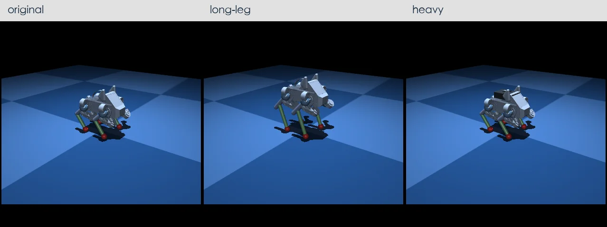

# 4. 搭建四足机器人


原课程这一章是把实物 Pupper 拧螺丝装起来。在仿真版课程里，我们做的事情等价：**把 Pupper 四足的 URDF 一段一段描述清楚**，导入 MuJoCo，让它第一次在仿真里站起来。装配这件事，从手上搬到了键盘上。

## 本章目标

- 看懂 URDF 的 `link`、`joint`、`inertial`、`collision`、`visual` 五件套
- 能读懂 Pupper 官方 URDF，手动改一处参数并观察变化
- 能把 URDF 转成 MuJoCo MJCF，或直接用 MuJoCo 的 URDF 支持
- 让四足在 MuJoCo 里保持"站姿"不倒（纯被动稳定 + PD 维持各关节初始角度）

## 前置阅读

- 第 1–3 章（PD / FK / IK）
- [ROS · URDF 建模与状态发布](/docs/foundations/ros2-basics/urdf_and_rsp)
- [仿真与可视化 · MuJoCo 快速上手](/docs/foundations/simulation/mujoco)

## 章节大纲

1. 四足机器人的总体结构（12 关节 = 4 条腿 × 3 DoF）
2. URDF 五件套速览
3. 读懂 Pupper 的 URDF：link 命名 / joint 轴向 / mesh
4. URDF → MJCF：`compile` 工具、手改注意点
5. 惯量、摩擦、关节 limits：为什么一不小心机器人就摔
6. 初始姿态 + 关节 PD：让它站起来
7. 实验：把 `kp` / `kd` 调成过软或过硬，观察崩坏模式

## 4.1 四足机器人的总体结构

Pupper 这一类小型四足，骨架可以一句话描述：**一个 torso（躯干） + 4 条结构相同的腿**。每条腿三个旋转关节，从根到末端依次是：

| 缩写 | 关节名 | 旋转轴 | 直观作用 |
| --- | --- | --- | --- |
| HAA | hip abduction/adduction | 沿身体前后向（roll 轴） | 把腿往身体外掰 / 往内收 |
| HFE | hip flexion/extension | 沿身体左右向（pitch 轴） | 抬腿前后摆 |
| KFE | knee flexion/extension | 同 HFE 平行 | 弯小腿、调节足端高度 |

四条腿按"前左 / 前右 / 后左 / 后右"通常缩写成 **FL / FR / RL / RR**。整个机器人的关节自由度合计：

$$
\underbrace{6}_{\text{torso 浮动 base}} + \underbrace{4 \times 3}_{\text{12 个驱动关节}} = 18 \text{ DoF}
$$

注意：**浮动 base 的 6 个自由度不被驱动**（机器人不能自己飞），它们通过四条腿与地面接触间接受力。这一点在写 PD 控制时要小心——`data.qpos` 前 7 维（位置 3 + 四元数 4）是 base 的状态，**不要**把它们当成关节角去 P 控制。

```
              torso (base, freejoint)
        ┌────────┴────────┐
       hip       (FL/FR/RL/RR 各 3 个关节)
        │
       thigh
        │
        calf
        │
       foot (toe / 触地 site)
```

## 4.2 URDF 五件套速览

URDF 是 ROS 时代留下的机器人描述格式，本质是一棵带 `<link>` 节点和 `<joint>` 边的树。一个能跑的机器人最少需要这五件套：

```xml
<robot name="pupper">
  <!-- 1. link: 一段刚体 -->
  <link name="torso">
    <!-- 2. inertial: 质量与惯量,仿真物理的核心 -->
    <inertial>
      <origin xyz="0 0 0"/>
      <mass value="1.2"/>
      <inertia ixx="0.01" iyy="0.02" izz="0.02"
               ixy="0" ixz="0" iyz="0"/>
    </inertial>
    <!-- 3. visual: 渲染用几何/网格 -->
    <visual>
      <geometry><mesh filename="meshes/torso.stl"/></geometry>
    </visual>
    <!-- 4. collision: 碰撞用几何,一般比 visual 简化 -->
    <collision>
      <geometry><box size="0.18 0.10 0.05"/></geometry>
    </collision>
  </link>

  <!-- 5. joint: 父 link 到子 link 的连接 -->
  <joint name="leg_FL_hip_joint" type="revolute">
    <parent link="torso"/>
    <child  link="leg_FL_hip"/>
    <origin xyz="0.10 0.05 0" rpy="0 0 0"/>
    <axis   xyz="1 0 0"/>
    <limit lower="-0.8" upper="0.8" effort="3" velocity="20"/>
  </joint>
</robot>
```

每件的常见坑：

- **`<inertial>` 没写或写错**：仿真要么直接 NaN，要么"机器人质量等于 0"飞天。一个朴素自检：把所有 link 的 `mass` 求和，应当和实物秤出来的质量在 ±10% 以内。
- **`<visual>` 和 `<collision>` 不一致**：常见做法是 visual 用精细 mesh，collision 用 box / capsule / sphere 替代——前者好看，后者**碰撞检测快 10 倍以上**。但替代几何不能比 visual 小很多，否则机器人会"卡进地板"。
- **`<joint>` 缺 `<limit>`**：`type="revolute"` 没有 `<limit>` 在 URDF 标准里是非法的；缺了之后多数加载器会报错或默默给 0 effort，机器人会"瘫"。
- **`<axis>`**：URDF 里的轴是**子 link 坐标系下**的方向。如果你看着 URDF 想"这关节怎么转的方向反了"，多半是 `<origin rpy="...">` 把子坐标系旋了一下，记得把这两行一起读。

## 4.3 读懂 Pupper 的 URDF

[Stanford Pupper URDF](https://github.com/stanfordroboticsclub/StanfordQuadruped) 是一份典型的小型四足描述。先看命名约定：

```
torso
├── leg_FL_hip   ← HAA 关节(绕 x)
│   └── leg_FL_thigh   ← HFE 关节(绕 y)
│       └── leg_FL_lower   ← KFE 关节(绕 y)
│           └── toe_FL   ← 末端 site,IK 和接触检测都挂在这里
├── leg_FR_*
├── leg_RL_*
└── leg_RR_*
```

四条腿的 URDF 结构是**完全对称**的：每条腿三个 link + 三个 joint，所以看懂一条腿就够了。剩下的工作量大部分是写一个 `xacro` 或 Python 脚本，把"FL"换成"FR/RL/RR"批量生成——很多 URDF 仓库会用 xacro 宏来避免重复。

读 URDF 的实操步骤：

```bash
# 1. clone 下来
git clone https://github.com/stanfordroboticsclub/StanfordQuadruped
cd StanfordQuadruped

# 2. 找到 urdf
find . -name '*.urdf'

# 3. 在 MuJoCo viewer 里直接打开看
python -m mujoco.viewer --mjcf=pupper.urdf
```

第 3 步如果能弹出窗口、机器人按你想的姿态站着，就算装配成功一半了。看不到 mesh 多半是 **`<mesh filename="...">` 路径写的是 `package://...`**（ROS 风格），MuJoCo 不认这个 scheme，需要替换成相对/绝对路径。

## 4.4 URDF → MJCF：`compile` 工具与手改注意点

MuJoCo 直接吃 URDF 是可行的，但**默认接触参数和默认积分器配置都不太适合腿足机器人**。生产做法是先把 URDF 编译成 MJCF（MuJoCo 自己的 XML 格式），再手动调一调。

### 用 `mjcf` 命令行工具

MuJoCo 安装包自带一个编译器：

```bash
./bin/compile pupper.urdf pupper.xml
```

这一步会把所有 URDF 节点翻译成 MJCF 节点，并把 `<mesh>` 路径校正成相对编译器工作目录的路径。生成的 `pupper.xml` 大约长这样：

```xml
<mujoco model="pupper">
  <compiler angle="radian" meshdir="meshes/"/>

  <default>
    <joint armature="0.01" damping="0.1"/>
    <geom friction="0.8 0.05 0.001" solref="0.005 1"/>
  </default>

  <worldbody>
    <geom name="floor" type="plane" size="2 2 0.1" rgba="0.8 0.9 0.8 1"/>
    <body name="torso" pos="0 0 0.3">
      <freejoint/>
      <inertial pos="0 0 0" mass="1.2" diaginertia="0.01 0.02 0.02"/>
      <geom mesh="torso" type="mesh"/>
      <body name="leg_FL_hip" pos="0.10 0.05 0">
        <joint name="leg_FL_hip_joint" axis="1 0 0" range="-0.8 0.8"/>
        ...
      </body>
    </body>
  </worldbody>

  <actuator>
    <motor joint="leg_FL_hip_joint" ctrlrange="-3 3"/>
    ...
  </actuator>
</mujoco>
```

### 转换后必须手改的几处

URDF 里没法表达、必须在 MJCF 阶段补上的：

1. **`<freejoint/>`**：URDF 没有"浮动 base"概念，编译出的 torso 默认是固定的。必须在 torso 顶上手加一行 `<freejoint/>`，否则机器人就贴在原点动不了。
2. **`<actuator>`**：URDF 的 `<joint>` 只描述运动学，不带"驱动"。MJCF 必须为每个驱动关节加 `<motor>`（或 `<position>` / `<velocity>`），否则 `data.ctrl` 长度为 0，PD 写了也没用。
3. **接触参数**：URDF 的 `friction` 只支持各向同性，腿足机器人需要在 `<default><geom>` 里把 `friction` 写成"切向 / 横向 / 自旋"三元组，并把 `solref`、`solimp` 调到偏柔，避免接触刚度过大导致积分器爆。
4. **`armature`**：电机转子转动惯量。不写的话仿真步长 `dt=2ms` 上腿摇晃很容易发散——经验值 `0.005~0.02`。

## 4.5 惯量、摩擦、关节 limits：为什么一不小心机器人就摔

让 Pupper 站不起来的失败模式 90% 落在这三类参数上。按"调试顺序"排：

| 症状 | 多半是哪里写错 | 怎么自检 |
| --- | --- | --- |
| 一启动就"坐"地、膝盖支不住 | `<actuator effort>` / `Kp` 太小，或 thigh/calf 的初始角让重心落在足端外 | 把 base 临时锁死，看 PD 能不能维持住关节角；不能维持就是力矩不够 |
| 站住了但抖得像帕金森 | `armature` 缺失 / `Kd` 太小 / `solref` 太硬（接触刚度过大） | 把 `dt` 从 2ms 调到 0.5ms，抖动消失 → 是接触/数值；不消失 → 是 PD |
| 站住了但慢慢往一侧倒 | 重心偏移：某个 link 的 `<inertial origin>` 写错位置，或者 `mass` 比例失衡 | 把所有 link 的 `mass` 加起来对一下实物总重；逐个 link 把 `<origin>` 拿到 viewer 里可视化 |
| 一施力就滑、走不动 | 足端 `friction` 太低（默认 0.8 在地毯上够用、在塑料地板上不够） | 把 friction 设到 1.5，再走一遍；走得动就是摩擦的锅 |
| 仿真直接 NaN | 缺 `<inertial>` 或惯量负值 / 关节 limits 互斥 | 跑 `mj_printData`，看哪个 body 的 `M` 矩阵里有 inf |

> **经验法则**：第一次接入 URDF 时，**先把 `<freejoint/>` 屏蔽**（让 base 固定在空中），用 4.6 节那条 PD 回路先把 12 个关节稳定到目标姿态。能稳定后再放开 freejoint 看会朝哪边倒——这一步能把"参数错"和"控制器没调好"分开，省下大量盲调时间。

## 4.6 初始姿态 + 关节 PD：让它站起来

四足要"站住"，本质是两件事一起做对：

1. **选一组合理的关节角**，让四个足端落在 torso 投影下方，重心落在四足支撑多边形里。
2. **给每个关节挂一个 PD 控制器**，让它维持在这组角度。

第一步的经验值（hip 平、thigh 微抬、calf 弯成 ~90°）：

```python
import mujoco
import numpy as np

model = mujoco.MjModel.from_xml_path('pupper.xml')
data  = mujoco.MjData(model)

# 顺序: FL_hip, FL_thigh, FL_calf, FR_*, RL_*, RR_*
stand_pose = np.array([
    0.0,  0.7, -1.4,   # FL
    0.0,  0.7, -1.4,   # FR
    0.0,  0.7, -1.4,   # RL
    0.0,  0.7, -1.4,   # RR
])

# 浮动 base: 让 torso 在地面上方 0.18 m, 朝向单位四元数
# qpos 布局: [base_xyz(3), base_quat(4), 12 个关节角]
data.qpos[:7]  = [0, 0, 0.18, 1, 0, 0, 0]
data.qpos[7:] = stand_pose

Kp = np.full(12, 30.0)
Kd = np.full(12, 1.0)

for _ in range(5000):
    q  = data.qpos[7:]            # 12 个关节角
    dq = data.qvel[6:]            # 跳过 base 的 6 个浮动速度
    data.ctrl[:] = Kp * (stand_pose - q) - Kd * dq
    mujoco.mj_step(model, data)
```

两个**容易栽跟头的索引细节**：

- `qpos` 比 `qvel` **多一个**——因为四元数有 4 个分量但角速度只有 3 个。所以是 `qpos[7:]` 配 `qvel[6:]`，一不小心写错就会"PD 引用错索引"，机器人开局就抖飞。
- `ctrl` 的长度 = `<actuator>` 的数量 = 12，**不**包括 base。直接 `data.ctrl[:] = ...` 写 12 个数即可。

### 怎样算"站住了"

录一段 10 秒视频是组队任务的硬指标，但**判定 pass 的客观方法**是看 `torso.z` 在仿真后期是否稳定：

```python
heights = []
for k in range(5000):
    ...  # 同上
    heights.append(data.qpos[2])   # base z

# 后 1 秒(500 步)内 z 的标准差 < 1 mm 就算稳了
import numpy as np
print(f'last 1s std = {np.std(heights[-500:])*1000:.2f} mm')
```

## 4.7 实验：把 `Kp` / `Kd` 调成过软或过硬

四组对照可以一次性把 PD 增益对腿足系统的影响看清楚：

| `Kp` | `Kd` | 现象 | 原因 |
| --- | --- | --- | --- |
| 5 | 1.0 | 腿支不住身体，开局直接坐下 | 关节力矩 ∝ Kp·Δθ，太小就抵不过自重力矩 |
| 30 | 1.0 | 稳定站立，足端轻微微调 | 经验甜点 |
| 200 | 1.0 | 高频抖动，足端"打鼓"，长期可能 NaN | Kp 太大 → 系统刚度过高，与仿真步长形成离散震荡 |
| 30 | 0.05 | 周期性弹跳、上下晃 | Kd 太小,阻尼不足 |
| 30 | 20.0 | 黏滞,响应迟缓,推一下要好几秒回来 | Kd 太大,接近过阻尼 |

把这四组写成一个小脚本批量跑：

```python
configs = [
    ('soft',   5,    1.0),
    ('good',   30,   1.0),
    ('stiff',  200,  1.0),
    ('underD', 30,   0.05),
    ('overD',  30,   20.0),
]

for name, kp, kd in configs:
    mujoco.mj_resetData(model, data)
    data.qpos[:7]  = [0, 0, 0.18, 1, 0, 0, 0]
    data.qpos[7:] = stand_pose

    Kp = np.full(12, kp); Kd = np.full(12, kd)
    heights = []
    for _ in range(5000):
        q, dq = data.qpos[7:], data.qvel[6:]
        data.ctrl[:] = Kp * (stand_pose - q) - Kd * dq
        mujoco.mj_step(model, data)
        heights.append(data.qpos[2])

    z_std = np.std(heights[-500:]) * 1000
    print(f'{name:>7s}: final z={heights[-1]:.3f} m, last-1s std={z_std:.2f} mm')
```

期望输出大致是：

```
   soft: final z=0.05 m, last-1s std=0.50 mm    # 趴了,但稳
   good: final z=0.18 m, last-1s std=0.30 mm    # 漂亮地站着
  stiff: final z=0.18 m, last-1s std=8.00 mm    # 站着但抖
 underD: final z=0.18 m, last-1s std=15.00 mm   # 蹦
  overD: final z=0.17 m, last-1s std=0.20 mm    # 不抖但反应慢
```

这一组数据放进组队学习任务的 50 字实验笔记里，**比单纯录视频更有说服力**。第 5 章我们要在"站着"的基础上让它"走起来"——届时 `Kp` / `Kd` 的甜点会随步态频率再做一次微调。

## 组队学习任务

§4.6 让原版 Pupper 站住、§4.7 看了 5 组 `Kp/Kd` 的崩坏模式。在迈向 Ch5 让它走起来之前，组队 Lab 4 先让你**主动改 MJCF**：把 thigh + calf 同比例拉长 1.5 倍做一只 long-leg，把 torso 质量 ×2 做一只 heavy。改完之后 §4.6 的 `stand_pose` 和 §4.7 的 `Kp/Kd` 都不再通用，你得在三只 Pupper 上各重做一遍——腿越长重心越高，身越沉甜点 `Kp` 越大。

<div align="center">



*三只 Pupper 并排：左 original、中 long-leg（thigh + calf × 1.5，比原版高 ~10 cm，绿色腿段是 §4.4 那个 `fromto` 在 MJCF 里直接拉长出来的）、右 heavy（torso 质量从 1.5 kg 加到 3 kg，背上那块深灰小盒就是配重的视觉标记）。每只都用自己 4×4 `(Kp, Kd)` heatmap 选出来的甜点站着——脚边红球是 foot site 上的接触点，能看到 long-leg 把整个 base 抬高了一截。这张静帧就是评分点之一：三只都站住、最后 1 秒 base z 标准差 < 5 mm。*

</div>

要做的四件事：

- [ ] 写 `make_variant()`：从 `shared/models/skeleton.xml` 注入 `default class`，吐出 `pupper_v3.xml` / `pupper_longleg.xml` / `pupper_heavy.xml`——三份变体 `<include>` 同一棵骨架，不复制 body 树
- [ ] 写 `find_stand_pose()`：把单腿当二维链，搜 HFE/KFE 让 foot 落在 `stand_height`（HAA 保持 0）；腿长变了，pose 自动跟着变
- [ ] 写 `pd_sweet_spot()`：$K_p \in \{10,30,60,120\}$、$K_d \in \{0.5,1,2,5\}$ 的 4×4 grid，每格跑 6 秒带 2 N 正弦扰动，挑最后 1 秒 base z 标准差最小的那格
- [ ] 用每只 Pupper 的甜点 `(Kp, Kd)` 各跑一次到稳定，offscreen `Renderer` 拼出三只并排的 `pupper_zoo.png`——就是上面那张 teaser

完整 starter / 测试 / 交付清单（含 Stretch：三只调好后的 base z 时间序列叠图）见 [`team_learning/lab_4_urdf_surgery/`](https://github.com/robots-hub/cs123-simulation/tree/main/team_learning/lab_4_urdf_surgery)（cs123-simulation 私有仓库，组员请确认 GitHub 账号已加权限）。

## 参考资料

- CS123 Lab 4: [Pupper Assembly](https://github.com/cs123-stanford/cs123-stanford-2023/blob/main/docs/schedule/labs/fall-23/lab-4.rst)
- [Stanford Pupper URDF 仓库](https://github.com/stanfordroboticsclub/StanfordQuadruped)
- MuJoCo 文档 · [URDF support](https://mujoco.readthedocs.io/en/stable/modeling.html#urdf-extensions)
