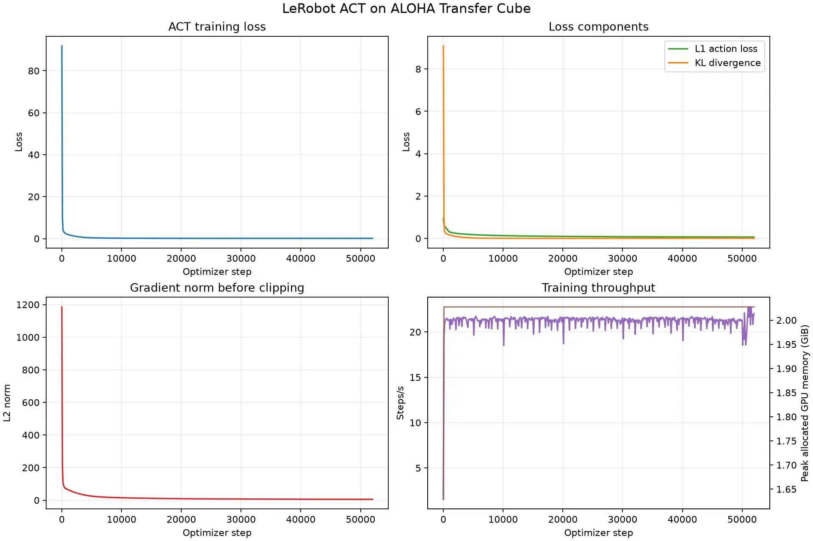

# ACT 双臂操作训练实战：从数据到成功 GIF

本教程在单张 NVIDIA RTX 4080 SUPER 上，使用 LeRobot 0.6.1 和 ALOHA Transfer Cube 仿真数据训练 ACT（Action Chunking with Transformers）。最终的 50,000-step checkpoint 在 20 个 MuJoCo 回合中成功 10 次，实测成功率为 **50%**。


上图是成功回合的完整 8 秒 rollout。对应的 [MP4 视频](./figs/act_50k_success.mp4) 也可单独下载。

:::tip[AMD ROCm 版本]

使用 AMD GPU 的读者可以直接进入 [Radeon R9700 上的 10k 实测教程](/docs/practices/amd/vla-act)。
该版本提供独立的 ROCm 依赖锁、BF16 快速训练配置、20 回合评测、曲线和成功视频。
:::

## 你将完成什么

这次实验走通一条完整、可复现的模仿学习链路：

1. 从 Hugging Face 下载 50 个 ALOHA 人类示教 episode；
2. 用 ACT 同时预测未来 100 帧动作，也就是 2 秒动作块；
3. 在 CUDA 上训练 CVAE + Transformer 策略；
4. 持续记录 CSV 指标并自动生成训练曲线；
5. 定期保存模型、优化器和随机数状态；
6. 在 MuJoCo 中执行 20 个完整回合；
7. 将成功回合转换为可嵌入教程的 GIF。

ACT 本身不接收语言指令，因此它更准确地说是一条连续动作模仿学习基线，而不是通用语言条件 VLA。它仍然是学习 VLA 动作头、action chunking 和机器人数据管线的理想起点。

## 实验结果

本教程页面中的结果来自一次真实本机运行，不是预填示例：

| 项目 | 实测结果 |
| --- | ---: |
| GPU | NVIDIA RTX 4080 SUPER 16GB |
| 数据 | 50 episodes / 20,000 frames / 50Hz |
| 训练步数 | 50,000 optimizer steps |
| Batch size | 8 |
| 动作块长度 | 100 frames |
| 混合精度 | bfloat16 AMP |
| 50k 用时 | 2,354 秒，约 39 分 14 秒 |
| 稳定吞吐 | 约 21.3 step/s |
| PyTorch 峰值分配显存 | 约 2.03GiB |
| 50k L1 action loss | 0.0631 |
| 20 回合成功率 | **10/20，50%** |
| 平均最大 reward | 2.8 / 4.0 |
| 平均累计 reward | 161.6 |

一次评估曾恰好得到失败回合，最大 reward 只有 2；扩展到 10 回合时为 60%，最终 20 回合为 50%。这说明机器人策略不能靠一个“看起来不错”的视频下结论，至少应报告多回合成功率。

## 项目文件

训练代码位于：

```text
codes/practices/vla/act/
├── train_act.py
├── pyproject.toml
├── uv.lock
└── README.md
```

核心脚本是 [`train_act.py`](../../../../codes/practices/vla/act/train_act.py)。它是教学用 PyTorch 循环，保留了数据特征推导、预处理、前向/反向传播和保存过程，便于理解 LeRobot 如何连接这些组件。

## 1. 准备环境

从仓库根目录进入实验目录，用锁文件创建 Python 3.12 隔离环境：

```bash
cd codes/practices/vla/act
uv sync --frozen
```

环境包含：

- `lerobot[aloha,training]==0.6.1`
- PyTorch + CUDA
- MuJoCo 与 `gym-aloha`
- Matplotlib，用于生成本地训练曲线
- `httpx[socks]`，用于兼容通过 SOCKS 代理访问 Hugging Face 的机器

首次运行需要下载数据；之后会复用 Hugging Face 本地缓存。

先确认 GPU 可用：

```bash
uv run python - <<'PY'
import torch

print("CUDA available:", torch.cuda.is_available())
print("GPU:", torch.cuda.get_device_name(0))
PY
```

## 2. 先跑两个 step

不要一开始就启动数小时实验。先只加载第 0 个 episode：

```bash
uv run python train_act.py \
  --episodes 0 \
  --steps 2 \
  --batch-size 2 \
  --device cuda \
  --amp \
  --log-every 1 \
  --plot-every 1 \
  --output-dir outputs/act_smoke
```

这个命令依次验证：

- Hugging Face 元数据和视频下载；
- PyAV 视频解码；
- LeRobot processor；
- CUDA 前向与反向传播；
- checkpoint、CSV 和 WebP 保存。

两个 step 绝对不足以学会任务，冒烟测试的成功标准只是进程退出码为 0。

## 3. 理解训练配置

脚本从数据集元数据自动得到输入和输出：

```text
inputs:  observation.images.top, observation.state
outputs: action
```

每个样本包含一路 480×640 顶视 RGB、14 维双臂状态和 14 维动作。默认 `chunk_size=100`，在 50Hz 数据上对应未来 2 秒：

$$
\hat{a}_{t:t+99} = \pi_\theta(o_t, s_t, z)
$$

训练时使用 CVAE 潜变量吸收示教中的多模态性，总损失近似为：

$$
\mathcal{L}=\mathcal{L}_{L1}+10\,\mathcal{L}_{KL}
$$

LeRobot 0.6.1 的 ACT 默认使用学习率 `1e-5` 的 AdamW，没有额外学习率调度器。本教程保持官方预设不变。

## 4. 正式训练到 50k

下面是本页结果对应的配置。`--max-hours 2` 是安全上限；本机在约 39 分钟时先达到 50,000 steps，因此按 step 正常结束。

```bash
mkdir -p outputs/act_aloha_transfer_50k

uv run python -u train_act.py \
  --steps 50000 \
  --batch-size 8 \
  --num-workers 4 \
  --chunk-size 100 \
  --device cuda \
  --amp \
  --max-hours 2 \
  --log-every 100 \
  --plot-every 1000 \
  --save-every 10000 \
  --output-dir outputs/act_aloha_transfer_50k \
  2>&1 | tee outputs/act_aloha_transfer_50k/train.log
```

训练目录会产生：

```text
outputs/act_aloha_transfer_50k/
├── model.safetensors
├── config.json
├── policy_preprocessor.json
├── policy_postprocessor.json
├── metrics.csv
├── training_curves.webp
├── run_summary.json
├── training_state/
└── checkpoints/
    ├── step_010000/
    ├── step_020000/
    ├── ...
    ├── step_050000/
    └── last -> step_050000
```

其中 checkpoint 不只保存模型，还包含优化器、当前 step 和随机数状态，因此可以真正续训，而不是只加载权重重新开始。

## 5. 阅读训练曲线



这次运行有几个清晰阶段：

- 前 1,000 steps：KL 和总损失快速下降，L1 从约 0.96 降至 0.32；
- 10,000 steps：L1 约 0.135，已经得到第一个可恢复 checkpoint；
- 20,000 steps：L1 约 0.095；
- 30,000 steps：L1 约 0.080；
- 50,000 steps：L1 约 0.063，仍比 30k 有明显改善。

图中的梯度范数是裁剪前数值。脚本默认将更新梯度裁剪到 10.0，因此早期曲线远高于 10 不表示优化器真的按该幅度更新。

后期总 loss 会因为 KL 项重新平衡而轻微波动，不能只用总 loss 选择模型。最终判断必须来自环境 rollout。

## 6. 中途断点续训

如果训练被停止，可以从最近 checkpoint 继续：

```bash
uv run python -u train_act.py \
  --steps 50000 \
  --batch-size 8 \
  --num-workers 4 \
  --device cuda \
  --amp \
  --max-hours 1 \
  --log-every 100 \
  --plot-every 1000 \
  --save-every 10000 \
  --resume-from outputs/act_aloha_transfer_50k/checkpoints/last \
  --output-dir outputs/act_aloha_transfer_50k \
  2>&1 | tee -a outputs/act_aloha_transfer_50k/train.log
```

`--steps` 是恢复后的总目标，不是额外训练量；`--max-hours` 是这次启动允许使用的墙钟时间。

## 7. MuJoCo 中间评估

训练到 10k、30k 或 50k 后都可以中间评估。先跑 1 回合检查渲染链路：

```bash
MUJOCO_GL=egl uv run lerobot-eval \
  --policy.path=outputs/act_aloha_transfer_50k/checkpoints/step_050000 \
  --env.type=aloha \
  --env.task=AlohaTransferCube-v0 \
  --eval.n_episodes=1 \
  --eval.batch_size=1 \
  --output_dir=outputs/eval_act_50k_smoke
```

正式报告使用 20 回合：

```bash
MUJOCO_GL=egl uv run lerobot-eval \
  --policy.path=outputs/act_aloha_transfer_50k/checkpoints/step_050000 \
  --env.type=aloha \
  --env.task=AlohaTransferCube-v0 \
  --eval.n_episodes=20 \
  --eval.batch_size=1 \
  --output_dir=outputs/eval_act_50k_20ep
```

本机实测汇总：

```text
avg_sum_reward: 161.6
avg_max_reward: 2.8
pc_success:     50.0
n_episodes:     20
```

reward 4 表示完成右臂抓取、抬起、交给左臂的完整流程。评估视频保存在：

```text
outputs/eval_act_50k_20ep/videos/aloha_0/
```

:::note[LeRobot 0.6.1 的并行评估问题]

在本实验环境中，`--eval.batch_size` 大于 1 时，异步 worker 可能因为没有自动注册 `gym_aloha` 而报 `Namespace gym_aloha not found`。使用 `--eval.batch_size=1` 顺序评估可以稳定工作，20 回合约需 1 分钟。
:::

## 8. 把成功 MP4 转成 GIF

先从 `eval_info.json` 的 `successes` 与 `video_paths` 中选一个成功回合，再使用 FFmpeg：

```bash
ffmpeg -y \
  -i outputs/eval_act_50k_20ep/videos/aloha_0/eval_episode_6.mp4 \
  -filter_complex \
  "[0:v]fps=12,scale=480:-1:flags=lanczos,split[s0][s1];\
[s0]palettegen=max_colors=128[p];\
[s1][p]paletteuse=dither=sierra2_4a" \
  -loop 0 act_50k_success.gif
```

这里将 50Hz 的 8 秒视频降到 12fps、宽度缩到 480px，并生成 128 色调色板。得到的 GIF 约 1.3MB，适合嵌入文档；原始 MP4 仍应保留，画质更好且体积更小。

## 9. 常见问题

### Hugging Face 请求提示缺少 `socksio`

本项目已显式依赖 `httpx[socks]`。重新同步即可：

```bash
uv sync --frozen
```

### 无显示服务器，MuJoCo 无法启动

Linux 服务器使用 EGL：

```bash
export MUJOCO_GL=egl
```

### 训练 loss 很低，但单次评估失败

这是正常现象。行为克隆训练损失衡量的是示教分布上的动作拟合，而 rollout 会积累闭环误差。不要重复挑一个成功 seed 作为结果，应报告固定配置下的多回合成功率。

### 是否必须训练到 100k

不必须。本机 50k 已达到 20 回合 50% 成功率，足以作为完整教程和基线。是否继续训练应由中途 rollout 决定，而不是机械追求 step 数。若任务目标要求更高成功率，可以从 50k 继续到 75k 或 100k，并用相同 20 个评估回合比较 checkpoint。

## 小结

这次实验最重要的结论不是“loss 降到了多少”，而是建立了一个闭环：

```text
示教数据 → ACT 训练 → CSV/曲线 → 可恢复 checkpoint
       → MuJoCo 多回合评估 → 成功率 + MP4/GIF
```

50k checkpoint 已经能稳定展示方块抓取、抬起与双臂交接，但 50% 成功率也清楚暴露了行为克隆的分布偏移问题。下一步可以比较 temporal ensembling、更多示教数据、不同 chunk size，或引入带在线纠错的数据闭环。
