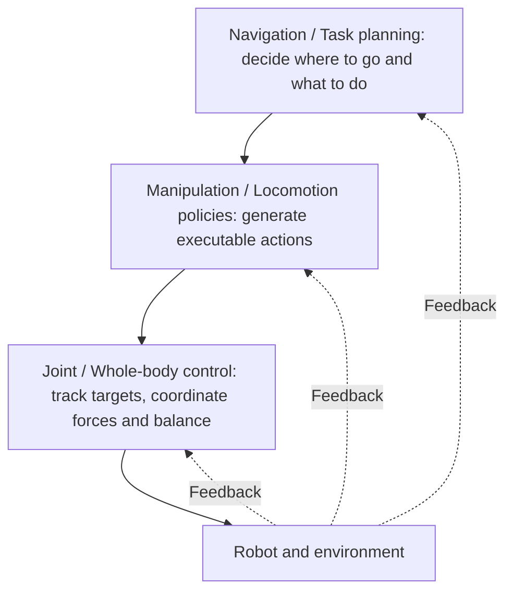

# 5. System paradigms and methods

Once you know the task, the skills, and the body, the next question is: how does a system turn observations into actions? This chapter introduces several ways to organize an embodied system and what each of the main method families is responsible for.

**This chapter answers**

- Which parts make up a robot system?
- What are the strengths and weaknesses of modular and end-to-end designs? Why do systems often use multiple control layers?
- Where do planning and control, reinforcement learning, imitation learning, VLA, and world models fit in a system?

## 5.1 The parts of a robot system \{#system-layers}

Take "put the cup on the table into the box." The robot must see the cup, relate the cup's position to its own body, plan a path, turn the path into joint commands, and finally have its motors execute them. Divided by responsibility, this gives the following layers:

| Layer | Responsibility | Examples |
| --- | --- | --- |
| Perception | Gather information about the environment and the robot itself | Cameras, depth cameras, LiDAR, IMU |
| Modeling | Describe the spatial relationships between the robot and its environment | Robot models (URDF), coordinate transforms, environment maps |
| Planning | Decide what to do and how to move | Task planning, path planning, motion planning |
| Control | Turn goals into commands the motors can execute | Inverse kinematics, trajectory tracking, PID |
| Hardware | Make the robot actually move | Motor drivers, encoders, grippers |
| System | Make all the parts work together | ROS2 communication, time and coordinate management, visualization |

These layers come from the [ROS2 system overview](/docs/foundations/robotics-and-ros2/course_introduction), which walks through each layer with a robot arm example. Learning-based methods do not remove these responsibilities; they change who fulfills them. Some are handled by hand-designed modules, others by models learned from data.

## 5.2 Modular and end-to-end \{#modular-vs-end-to-end}

There are two basic ways to organize an embodied system:

- **Modular pipeline**: split the system into modules such as perception, state estimation, planning, and control, which pass hand-designed intermediate results to each other, such as object poses, maps, and trajectories.
- **End-to-end learning**: use a single model to map observations (images, proprioception, language instructions) directly to actions, and let the model learn its own intermediate representations from data.

| Aspect | Modular pipeline | End-to-end learning |
| --- | --- | --- |
| Intermediate representations | Hand-designed: object poses, maps, trajectories | Learned by the model from data |
| Strengths | Interpretable; each module can be tested and replaced separately; physical models can guarantee precision | Not limited by hand-designed interfaces; can learn behaviors that are hard to write by hand; improves with more data |
| Weaknesses | Information is lost at interfaces, and errors propagate from module to module; new tasks often require redesigning modules | Needs large amounts of data; failures are hard to diagnose, and safety guarantees are hard to provide |
| Examples | The Nav2 navigation stack; MoveIt 2 planning with controllers | Visuomotor policies such as ACT and Diffusion Policy; end-to-end VLA |

Real systems usually sit between the two: learned components replace some modules, or low-level controllers remain beneath a learned policy. The debate over monolithic and hierarchical designs in VLA research continues the same question in the era of large models; see [From LLMs to robot policies](/docs/foundations/vla/vla_landscape).

## 5.3 Layered control \{#hierarchy}

Grasping, manipulation, locomotion, and navigation differ in observations, action spaces, and feedback deadlines. Navigation or task planning sets goals; manipulation or gait policies generate actions; low-level controllers track joint and contact states. New feedback returns to the higher layers.

Lower layers update faster and sit closer to the hardware; higher layers update more slowly and sit closer to the meaning of the task:

| Layer | Typical update rate | Examples |
| --- | --- | --- |
| Navigation / Task planning | As needed, or about once per second | Task decomposition by a language model, global path planning |
| Manipulation / Locomotion policies | A few hertz to tens of hertz | Manipulation policies such as VLA and ACT; gait policies trained with reinforcement learning |
| Joint / Whole-body control | Hundreds to thousands of hertz | Joint PD control, whole-body controllers |

VLA can connect vision and language to manipulation actions. Reinforcement learning (RL) or model predictive control (MPC) can handle motion control, and a whole-body controller (WBC) can coordinate arms, legs, and the body. Systems can also learn a unified whole-body policy.

The benefit of layering is that each layer handles problems on its own timescale: higher layers can "think" slowly, while lower layers must "act" quickly and stably. The cost is that the interfaces between layers need careful design: if an interface is too abstract, the lower layer cannot execute it; if it is too specific, the upper layer loses flexibility.

## 5.4 The main method families \{#methods}

Imitation learning (IL) learns actions from demonstrations; reinforcement learning (RL) improves policies using rewards; VLA connects vision and language to actions; world models predict action outcomes. Planning and control can solve tasks independently or combine with learning methods.

| Family | Core idea | Strengths | Limitations | Learn more |
| --- | --- | --- | --- | --- |
| Planning and control | Compute actions from models such as kinematics and dynamics | Precise, interpretable, and predictable | Needs accurate models; struggles with new objects and complex contacts | [Controllers](/docs/foundations/controllers/intro), [motion planning](/docs/foundations/robotics-and-ros2/moveit2_basics) |
| Reinforcement learning | Learn by trial and error in simulation or the real world, improving the policy with rewards | Tasks that can be trained at scale in simulation, such as legged locomotion | Rewards are hard to design; simulation differs from reality | [Reinforcement learning](/docs/foundations/rl-for-robotics/intro) |
| Imitation learning | Learn actions from human demonstrations | Fine-grained manipulation where rewards are hard to write | Demonstrations are expensive to collect; errors compound once the robot drifts from the demonstrations | [Imitation learning](/docs/foundations/rl-for-robotics/imitation-learning) |
| VLA | Output actions from a vision-language model | Understanding open-ended language instructions and performing many tasks | Needs large amounts of robot data and compute; inference is slow; precision and reliability are still improving | [VLA series](/docs/foundations/vla/vla-intro) |
| World models | Learn to predict how the environment changes in response to actions | Planning, generating training data, evaluating policies | Prediction errors accumulate; physical consistency is hard to guarantee | [World models](/docs/foundations/world-model/intro) |

These families are often combined: imitation learning initializes a policy that reinforcement learning then improves; a VLA makes high-level decisions while controllers handle low-level execution; a world model generates training data for a policy or evaluates it.

## 5.5 How this site organizes knowledge \{#site-framework}

The [foundations](/docs/foundations/intro) organize topics as the "brain," "cerebellum," "senses," and "engineering base." After reading the introduction, use these roles within a system to find specific techniques:

| Foundations | Topics |
| --- | --- |
| Brain: decision making | Reinforcement learning for decisions, VLA, world models |
| Cerebellum: motion control | Reinforcement learning for control, controllers, motion planning |
| Senses: perception | Vision-language models (VLM), sensor calibration and state estimation |
| Engineering base | Simulation tools, ROS2, CAN and MCU communication, mechanical structure, data engineering and imitation learning |

The foundations group imitation learning with data engineering because it depends heavily on collecting and processing demonstrations.

"Brain" and "cerebellum" are memorable metaphors: the brain focuses on understanding tasks and making decisions, and the cerebellum on coordinating movement and executing it stably. They do not correspond to a strict biological division of labor, and they do not mean a system must be split into these modules.

## 5.6 How to read a method \{#reading-a-method}

To understand a method, identify its layer, observations, action outputs, and which component handles execution errors. When reading a paper or reproducing a project, answer these questions in turn:

1. Which layer is it responsible for: task planning, the policy, or low-level control?
2. What does it observe: images, proprioception, language, or maps?
3. What actions does it output, and at what frequency?
4. Where does its training data come from: human demonstrations, simulated interaction, or internet data?
5. Who handles execution errors: does the policy correct itself in closed loop, or does it rely on a low-level controller?
6. Under which conditions was it evaluated: which task, environment, success conditions, and number of trials?

## Summary \{#summary}

- A robot system must handle perception, modeling, planning, control, and execution; learning-based methods change who fulfills these responsibilities.
- Modular systems are interpretable and easy to debug, while end-to-end learning can learn behaviors that are hard to write by hand. Real systems often combine the two and use layered control.
- Planning and control, reinforcement learning, imitation learning, VLA, and world models each suit different problems, and they are often combined.

## Further reading \{#next}

- [6. Key challenges](./6.challenges.md): the open problems these methods still face.
- [Foundations](/docs/foundations/intro): explore each topic by system capability.
- [ROS2 system overview](/docs/foundations/robotics-and-ros2/course_introduction): understand the layers of a robot system through a robot arm example.
